# Customer Problems — Bob Moesta式 Jobs-to-Be-Done 分析

## 1. ターゲットユーザー

小学校低学年（1〜2年生）の子どもたち、およびそのプログラミング学習を支援する**保護者・教師**。

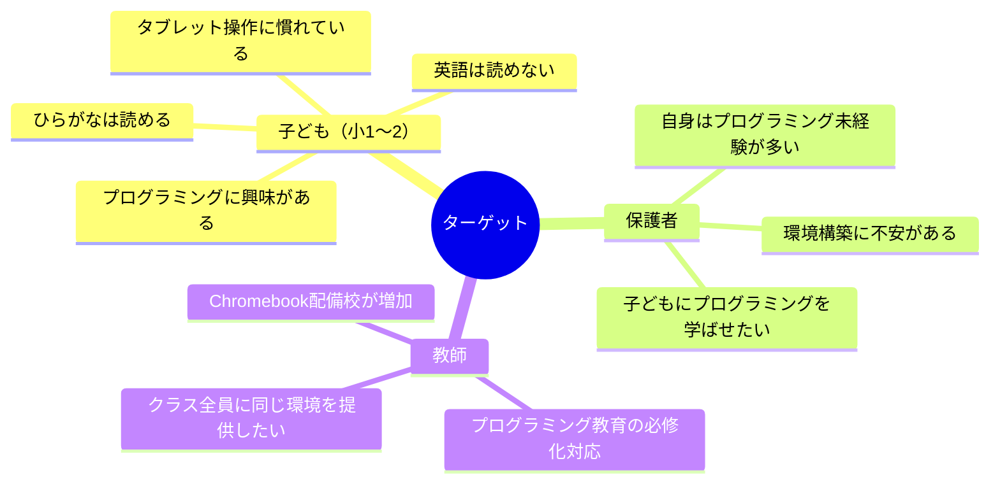

---

## 2. 中心となるJob（JTBD）

> **子どもが「自分でプログラムを書いて動かせた！」という成功体験を得られるようにしたい**

これは子ども自身のJobであると同時に、保護者・教師が「雇いたい」Jobでもある。

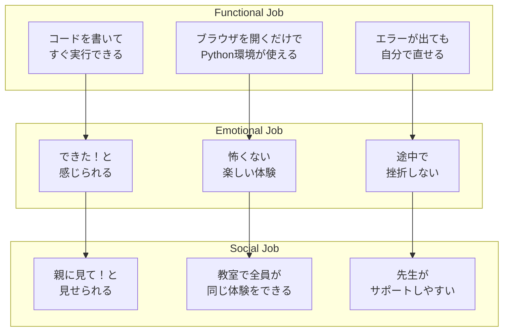

---

## 3. Struggling Moment（もがきの瞬間）

Bob Moestaのフレームワークでは、ユーザーが「今のやり方では限界だ」と感じる具体的な瞬間を特定する。

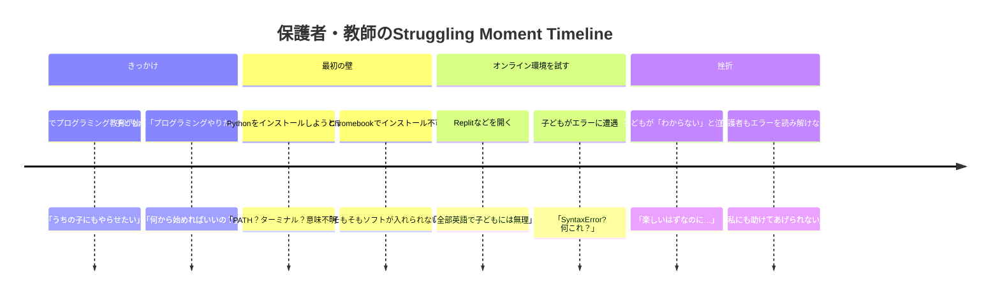

### もがきの瞬間 詳細

| # | Struggling Moment | 誰が | 感情 |
|---|---|---|---|
| SM1 | Pythonインストールで`PATH`設定が必要と知った瞬間 | 保護者 | 「専門的すぎて手に負えない」 |
| SM2 | Chromebookにソフトがインストールできないと気づいた瞬間 | 教師 | 「クラス全員に環境を揃えられない」 |
| SM3 | 英語UIのオンライン環境を子どもに見せた瞬間 | 保護者 | 「これは小1には無理だ」 |
| SM4 | `SyntaxError: unexpected EOF` が表示された瞬間 | 子ども | 「こわい、壊れた？」 |
| SM5 | エラー行番号を見てもコードのどこか分からない瞬間 | 子ども | 「どこを直せばいいの？」 |
| SM6 | `input()`で突然ダイアログが出た瞬間 | 子ども | 「急に出てきた！何これ？」 |
| SM7 | ブラウザを閉じてコードが消えた瞬間 | 子ども | 「全部消えた！パニック！」 |

---

## 4. Four Forces（4つの力）

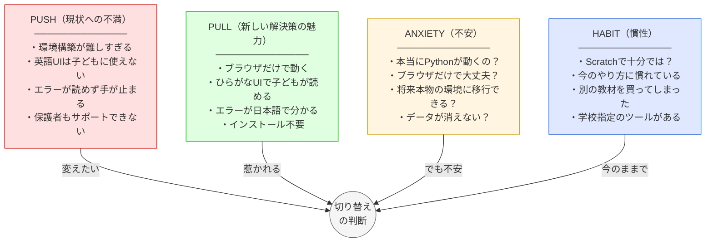

### Push（現状への不満）— なぜ今のやり方を「解雇」したいか

1. **環境構築の壁が高すぎる** — Pythonインストール、PATH設定、ターミナル操作は小学生には不可能。保護者にも煩雑
2. **端末の制約** — タブレットやChromebookにはソフトをインストールできない
3. **英語UI** — 既存オンライン環境のボタン・メニューが全て英語で、子どもが操作できない
4. **英語エラーメッセージ** — `SyntaxError`等は小学生にも保護者にも意味不明
5. **エラー箇所の特定困難** — 行番号が出てもコードとの対応が取れない
6. **input()の分断体験** — promptダイアログがコード実行の流れから唐突
7. **コード消失** — ブラウザを閉じるとコードが消え、子どもがパニックになる

### Pull（新しい解決策への魅力）

1. **ゼロセットアップ** — URLを開くだけで即座にPython環境が使える
2. **ひらがなUI** — 小学1年生でも読めるインターフェース
3. **日本語エラー翻訳** — 何が間違っていて、どう直せばいいか子どもの言葉で伝える
4. **エラー行ハイライト** — エディタ上で問題箇所がピンクに光る
5. **自動保存** — コードが消えない安心感
6. **親しみやすいデザイン** — パステルカラーとマスコットで「楽しそう」と感じる

### Anxiety（切り替えへの不安）

1. 「ブラウザだけで本当にPythonが動くの？」 → **Pyodide（WebAssembly）で本物のPythonが動く**
2. 「将来、本格的な環境に移行するとき困らない？」 → **標準Pythonの構文をそのまま学べる**
3. 「データがブラウザに保存されて消えない？」 → **localStorageで自動保存**
4. 「サーバーに依存して止まらない？」 → **完全クライアントサイド、サーバー不要**

### Habit（現状維持の慣性）

1. 「Scratchで十分では？」 → Scratchはビジュアルプログラミングで、テキストコーディングへの橋渡しが必要
2. 「すでに別の教材を購入済み」 → 本ツールは無料で併用可能
3. 「学校指定のツールがある」 → ブラウザベースなので追加導入が容易

---

## 5. 既存の代替品（Competing Solutions）

子ども・保護者・教師が現在「雇っている」代替品を分析する。

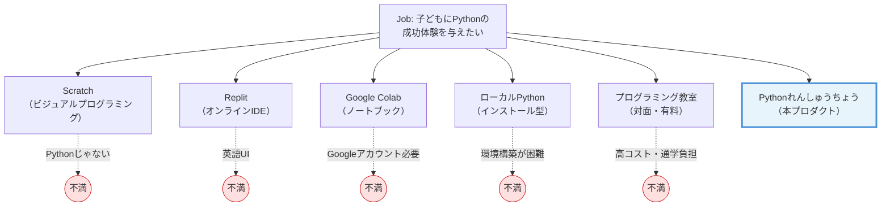

### 代替品の詳細比較

| 代替品 | Jobの達成度 | 子ども向けか | 導入の手軽さ | コスト | 致命的な不満 |
|---|---|---|---|---|---|
| **Scratch** | 中（Pythonではない） | ◎ | ◎ | 無料 | テキストコーディングを学べない |
| **Replit** | 高 | ✕ | ○ | 無料〜有料 | 英語UI、業務用の見た目 |
| **Google Colab** | 高 | ✕ | △ | 無料 | Googleアカウント必要、ノートブック形式が子どもに不向き |
| **ローカルPython** | 最高 | ✕ | ✕ | 無料 | 環境構築が子ども・保護者に不可能 |
| **プログラミング教室** | 高 | ◎ | ◎ | 月1〜2万円 | 高コスト、通学の時間的負担 |
| **Pythonれんしゅうちょう** | 高 | ◎ | ◎ | 無料 | — |

---

## 6. Effort-Impact Matrix（既存代替品）

代替品を「導入の手間（Effort）」と「Jobの達成度（Impact）」で評価する。

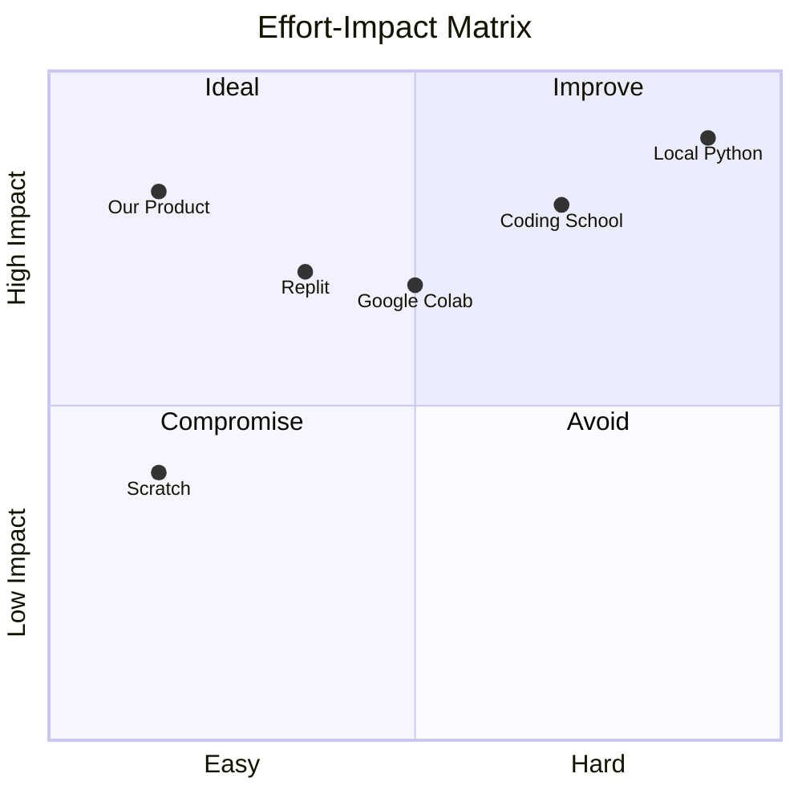

> **凡例**: Our Product = Pythonれんしゅうちょう / Coding School = プログラミング教室 / Local Python = ローカルPython

### マトリクスの読み方

- **左上（理想ゾーン）**: **Pythonれんしゅうちょう** — 導入が最も簡単で、Jobの達成度も高い
- **右上（改善余地あり）**: ローカルPython、プログラミング教室 — Job達成度は高いが、導入コストが大きい
- **左下（妥協ゾーン）**: Scratch — 手軽だが、Pythonを学ぶというJobは達成できない
- **中央**: Replit、Google Colab — そこそこ手軽でJob達成度もあるが、子ども向けではない

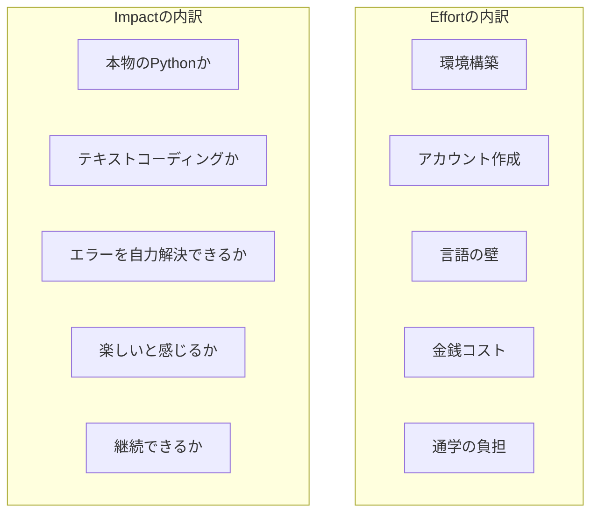

### 代替品ごとのEffort-Impact詳細スコア

| 代替品 | 環境構築 | アカウント | 言語の壁 | 金銭コスト | Effort合計 | 本物Python | テキスト | エラー解決 | 楽しさ | 継続性 | Impact合計 |
|---|---|---|---|---|---|---|---|---|---|---|---|
| **Pythonれんしゅうちょう** | 0 | 0 | 0 | 0 | **0** | ◎ | ◎ | ◎ | ◎ | ○ | **高** |
| **Scratch** | 0 | 0 | 1 | 0 | **1** | ✕ | ✕ | ◎ | ◎ | ◎ | **低** |
| **Replit** | 0 | 2 | 3 | 0 | **5** | ◎ | ◎ | ✕ | ✕ | △ | **中** |
| **Google Colab** | 0 | 3 | 2 | 0 | **5** | ◎ | ◎ | ✕ | ✕ | △ | **中** |
| **プログラミング教室** | 0 | 1 | 0 | 5 | **6** | ◎ | ◎ | ◎ | ◎ | ◎ | **高** |
| **ローカルPython** | 5 | 0 | 2 | 0 | **7** | ◎ | ◎ | ✕ | ✕ | △ | **中** |

---

## 7. Switch Timeline（切り替えのタイムライン）

Bob Moesta式の「切り替え」は一瞬の判断ではなく、段階的に進む。

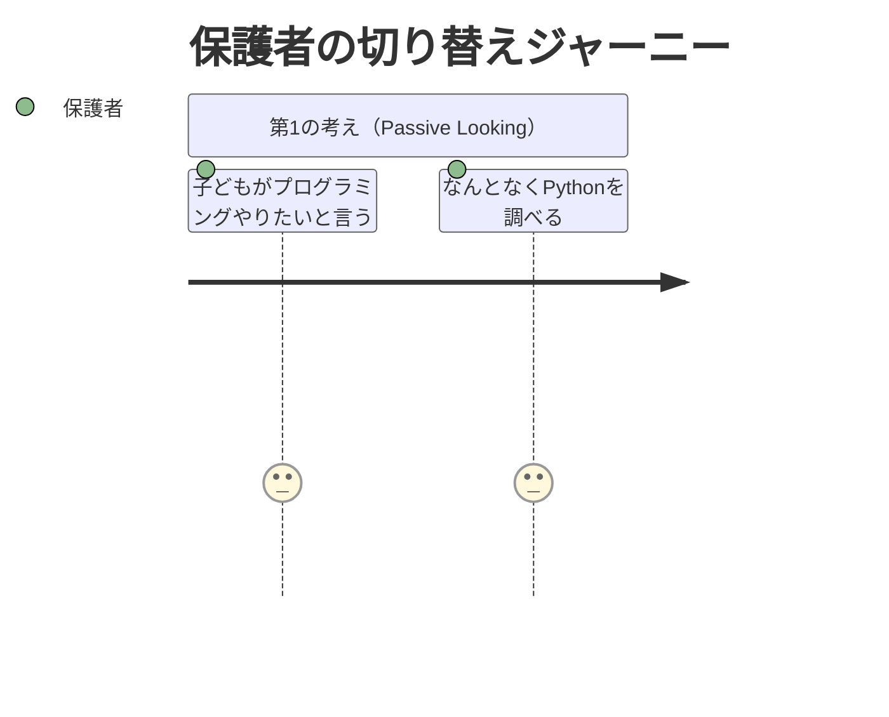
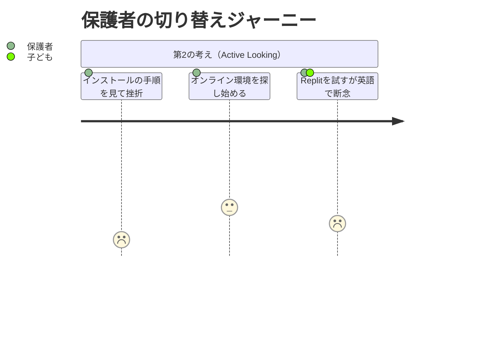
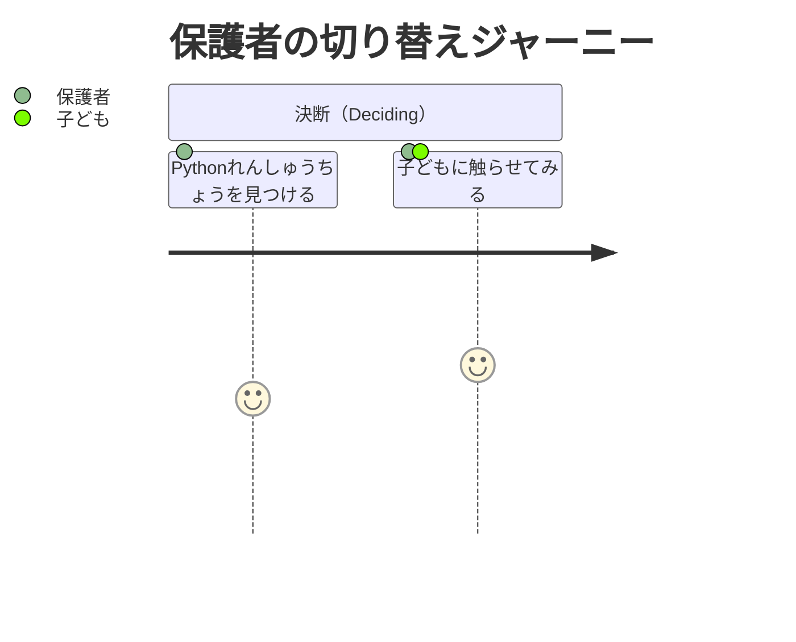
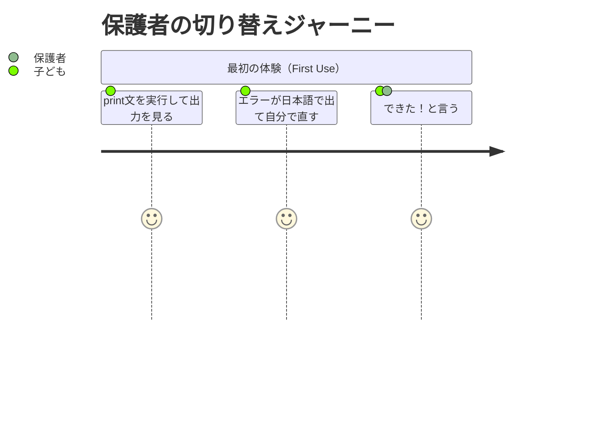

---

## 8. Progress Making Forces（進歩を生む力）

各Struggling Momentに対して、本プロダクトがどのように「進歩」を実現するか。

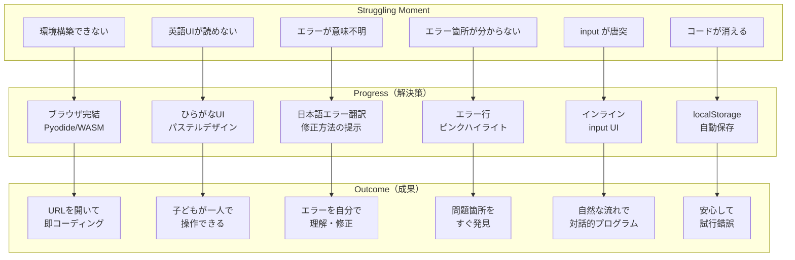

---

## 9. Demand-Side Insight（需要サイドの洞察）

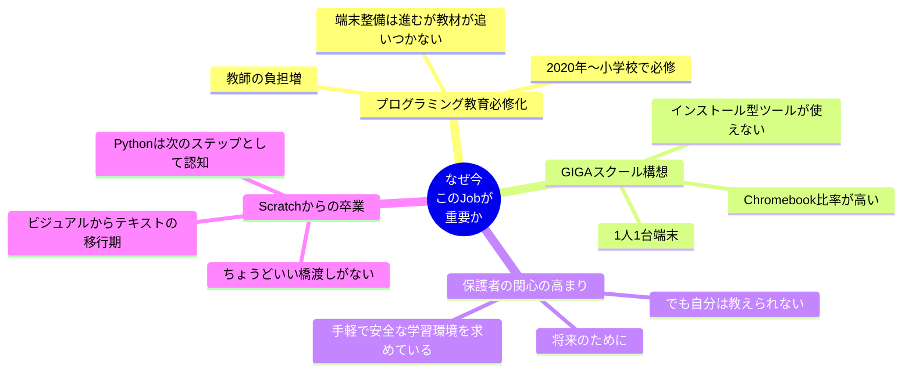

### 切り替えを後押しする3つの問い（Moesta式）

1. **What's pushing you away?**（何が今のやり方から離れさせる？）
   → 環境構築の難しさ、英語の壁、エラーで止まる体験

2. **What's pulling you toward?**（何が新しい解決策に引き寄せる？）
   → ゼロセットアップ、ひらがな、日本語エラー、可愛いデザイン

3. **What's holding you back?**（何が切り替えを躊躇させる？）
   → 「本物のPython？」「データ消えない？」「将来移行できる？」
   → いずれもプロダクトの技術的特性（Pyodide、localStorage、標準Python構文）で解消可能
