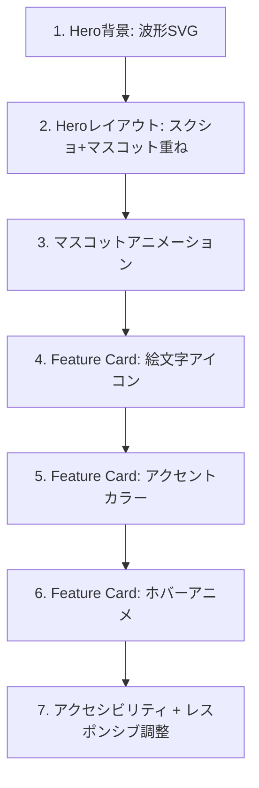

# 設計書

## 概要

LPの画像・ビジュアル要素を7施策で強化する。変更対象は `index.html` と `lp.css` のみ。新規ライブラリ不要。

## 変更対象ファイル

```
index.html  — HTML構造の変更（マスコット配置、スクリーンショット追加、絵文字追加、SVG追加）
lp.css      — スタイル追加（アニメーション、レイアウト、装飾）
```

## コンポーネント設計

### 1. マスコット拡大+アニメーション（A1+A3）

**現状**:
```html

```
```css
.hero-mascot { width: 100px; height: auto; }
```

**変更後**:
```css
.hero-mascot {
  width: 160px;
  height: auto;
  animation: float 3s ease-in-out infinite;
}

@keyframes float {
  0%, 100% { transform: translateY(0); }
  50% { transform: translateY(-10px); }
}
```

**設計判断**:
- サイズ: 100px → 160px。200pxだとモバイルでHeroが縦に長くなりすぎる
- アニメーション: float（ゆっくり上下）を採用。bounceは楽しいが落ち着きがなく保護者向けLPには不適。3秒周期、移動量10px
- `prefers-reduced-motion` メディアクエリでアニメーション無効化に対応する

### 2. Heroにプロダクト画面 — マスコット重ね表示（B1）

**レイアウト**:
```
        Pythonれんしゅうちょう
    ブラウザだけでPythonが動く。
    小学生のためのプログラミング練習帳
  インストール不要。日本語エラー。ぜんぶひらがな。

       ┌──────────────┐
       │  step-run    │
       │  スクリーン   │🐍 ← マスコットが右横からのぞき込む
       │  ショット     │
       └──────────────┘

          [今すぐ試す]
```

**実装方針**:
- `.hero-screenshot-wrapper` を新設し `position: relative` で囲む
- スクリーンショット画像（`step-run.png`）を内部に配置。`max-width: 300px`、角丸+影付き
- マスコット画像を `position: absolute` で右下に配置し、スクリーンショットの端からはみ出す形に
- 既存のHero上部のマスコットは削除し、スクリーンショット横に統合する

**HTML構造**:
```html
<section class="hero">
  <h1>Pythonれんしゅうちょう</h1>
  <p class="hero-catch">...</p>
  <p class="hero-sub">...</p>
  <div class="hero-screenshot-wrapper">
    
    
  </div>
  <a href="/app/" class="cta-btn">今すぐ試す</a>
</section>
```

**CSS**:
```css
.hero-screenshot-wrapper {
  position: relative;
  display: inline-block;
  margin: 20px 0;
}

.hero-screenshot {
  max-width: 300px;
  width: 100%;
  border-radius: 12px;
  box-shadow: 0 4px 20px rgba(0, 0, 0, 0.15);
}

.hero-mascot {
  position: absolute;
  right: -60px;
  bottom: -20px;
  width: 120px;
  height: auto;
  animation: float 3s ease-in-out infinite;
}
```

**モバイル対応**:
- 幅375px以下ではマスコットを `right: -30px; bottom: -10px; width: 80px` に縮小
- スクリーンショットの `max-width` を `80%` に

### 3. Hero背景 — 波形SVG区切り（B4）

**設計**:
- Heroセクションの背景を現在のドットパターンから、上が濃い水色→下が薄い水色のグラデーションに変更
- Heroセクションの直後にSVG波形を配置し、次のセクションとの間に柔らかい区切りを作る

**SVG波形**:
```html
<!-- heroセクションの閉じタグ直後 -->
<div class="hero-wave">
  <svg viewBox="0 0 1440 80" preserveAspectRatio="none">
    <path d="M0,40 C360,80 1080,0 1440,40 L1440,80 L0,80 Z" fill="#e8f4fc"/>
  </svg>
</div>
```

**CSS**:
```css
.hero {
  background: linear-gradient(180deg, #d0e8f5 0%, #e8f4fc 100%);
  /* 既存のドットパターンを上書き */
}

.hero-wave {
  margin-top: -1px; /* 隙間防止 */
}

.hero-wave svg {
  display: block;
  width: 100%;
  height: 60px;
}
```

### 4. Feature Card — 絵文字アイコン（C1）

**各カードの絵文字マッピング**:

| カード | 絵文字 | 理由 |
|---|---|---|
| インストール不要 | 🌐 | ブラウザ/Web |
| ぜんぶひらがな | ✏️ | 書く/学ぶ |
| 日本語エラー | 💬 | メッセージ/会話 |
| コードが消えない | 💾 | 保存 |

**HTML変更**:
```html
<div class="feature-card">
  <span class="feature-icon">🌐</span>
  <h3>インストール不要</h3>
  <p>ブラウザを開くだけ。Chromebookでもタブレットでも使えます。</p>
</div>
```

**CSS**:
```css
.feature-icon {
  font-size: 2rem;
  display: block;
  margin-bottom: 8px;
}
```

### 5. Feature Card — アクセントカラーボーダー（C3）

**パステル4色**:

| カード | カラー | Hex |
|---|---|---|
| インストール不要 | 水色 | #7ec8e3 |
| ぜんぶひらがな | パステル緑 | #a8d8a8 |
| 日本語エラー | パステルピンク | #f5c6d0 |
| コードが消えない | パステル黄 | #f5d99a |

**実装方法**: 各カードに `.feature-card--blue` 等のmodifierクラスを付与し、`border-top: 4px solid <color>` を適用。

```css
.feature-card { border-top: 4px solid transparent; }
.feature-card--blue   { border-top-color: #7ec8e3; }
.feature-card--green  { border-top-color: #a8d8a8; }
.feature-card--pink   { border-top-color: #f5c6d0; }
.feature-card--yellow { border-top-color: #f5d99a; }
```

**代替案として検討したもの**: `nth-child` セレクタを使う方法。HTMLにクラスを追加しなくて済むが、カードの並び順変更時に色がずれるリスクがある。明示的なクラスの方が堅牢。

### 6. Feature Card — ホバーアニメーション（C4）

```css
.feature-card {
  transition: transform 0.2s ease, box-shadow 0.2s ease;
}

.feature-card:hover {
  transform: translateY(-4px);
  box-shadow: 0 6px 20px rgba(0, 0, 0, 0.1);
}
```

**設計判断**:
- 移動量: -4px（控えめ。子ども向けLPだが保護者が閲覧するため派手すぎない方がよい）
- 影: `0 6px 20px rgba(0,0,0,0.1)` で浮遊感を出す
- トランジション: 0.2秒、ease
- モバイル（タッチデバイス）ではhoverが発生しないため、追加対応不要

## アクセシビリティ

```css
@media (prefers-reduced-motion: reduce) {
  .hero-mascot {
    animation: none;
  }
  .feature-card {
    transition: none;
  }
}
```

## テスト戦略

CSS/HTMLのみの変更のため、自動テストではなく目視確認で検証する:

- [ ] モバイル（375px）でレイアウトが崩れないこと
- [ ] タブレット（768px）でfeature-gridが2カラムで正しく表示されること
- [ ] PC（1200px）でHeroのマスコット重ね表示が意図通りに見えること
- [ ] `prefers-reduced-motion` 設定時にアニメーションが停止すること
- [ ] 波形SVGがセクション間に隙間なく表示されること

## 実装の順序



1. **Hero背景の波形SVG** — 他の変更の土台となるセクション分離を先に
2. **Heroレイアウト変更** — マスコット位置が変わるため、アニメより先にレイアウトを確定
3. **マスコットアニメーション** — レイアウト確定後に追加
4. **絵文字アイコン** — HTML変更。独立した変更
5. **アクセントカラー** — CSS追加。独立した変更
6. **ホバーアニメ** — CSS追加。独立した変更
7. **アクセシビリティ+レスポンシブ** — 全変更後にまとめて調整

## パフォーマンス考慮事項

- SVG波形はインラインで記述（外部ファイルリクエストを増やさない）
- CSSアニメーションはGPU合成プロパティ（`transform`）のみ使用し、`top`/`left`等のレイアウトプロパティは使わない
- 新規画像ファイルの追加なし（既存のstep-run.pngとsnake.pngを再利用）
