# アーキテクチャ設計書 — Python Notebook

## テクノロジースタック

### 言語・ランタイム

| 技術 | バージョン | 選定理由 |
|------|-----------|----------|
| Node.js | v22+ | サーバーサイドは静的配信のみのため軽量ランタイムとして最適 |
| JavaScript (ES2020+) | ESM | ブラウザネイティブモジュール対応、TypeScript不要な規模感 |
| Python 3.12 | Pyodide同梱 | ユーザーが実行するターゲット言語、WASM経由でブラウザ内動作 |

### フレームワーク・ライブラリ

| 技術 | バージョン | 用途 | 選定理由 |
|------|-----------|------|----------|
| Pyodide | 2024.0 | ブラウザ内Python実行 | CPython互換のWASMランタイム、サーバーレス実行が可能 |
| CodeMirror | 6.x | コードエディタ | モダンで拡張性が高く、Python構文ハイライト対応 |
| i18next | 26.x | 国際化 | 49言語対応、LanguageDetector + HttpBackendで動的ロード |
| esbuild | 0.27.x | バンドラー | 高速ビルド、ESM出力、設定が最小限 |
| Playwright | 1.58.x | E2Eテスト・スクリーンショット | LP用スクリーンショット自動生成 |

## システム全体像

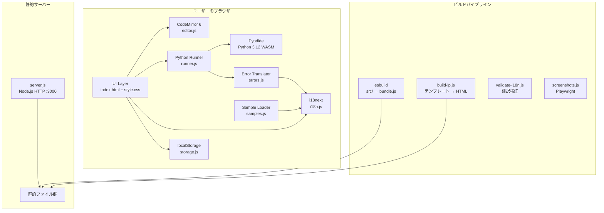

## アーキテクチャパターン

### クライアントサイド完結型アーキテクチャ

本プロジェクトの最大の特徴は**サーバーレス実行**です。Python コードの実行、データ保存、国際化のすべてがブラウザ内で完結します。

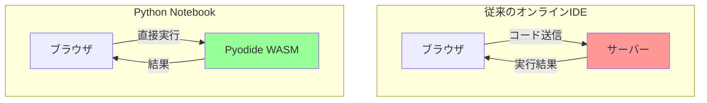

### レイヤードアーキテクチャ

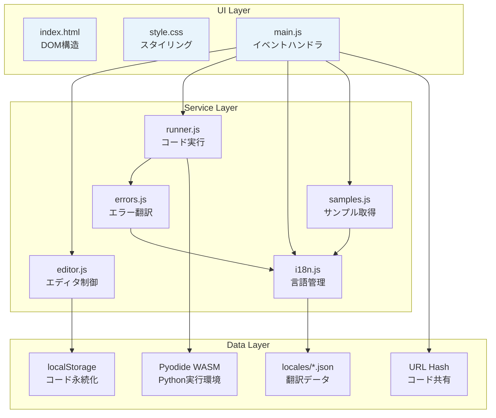

#### 各レイヤーの責務

| レイヤー | 責務 | 許可される操作 | 禁止される操作 |
|---------|------|--------------|--------------|
| UI | ユーザー入力受付、DOM操作 | Service Layer呼び出し | Data Layer直接アクセス |
| Service | ビジネスロジック（実行、翻訳、エディタ制御） | Data Layer呼び出し | DOM操作 |
| Data | データ永続化、外部リソースアクセス | localStorage, fetch, Pyodide | ビジネスロジック実装 |

## モジュール依存関係

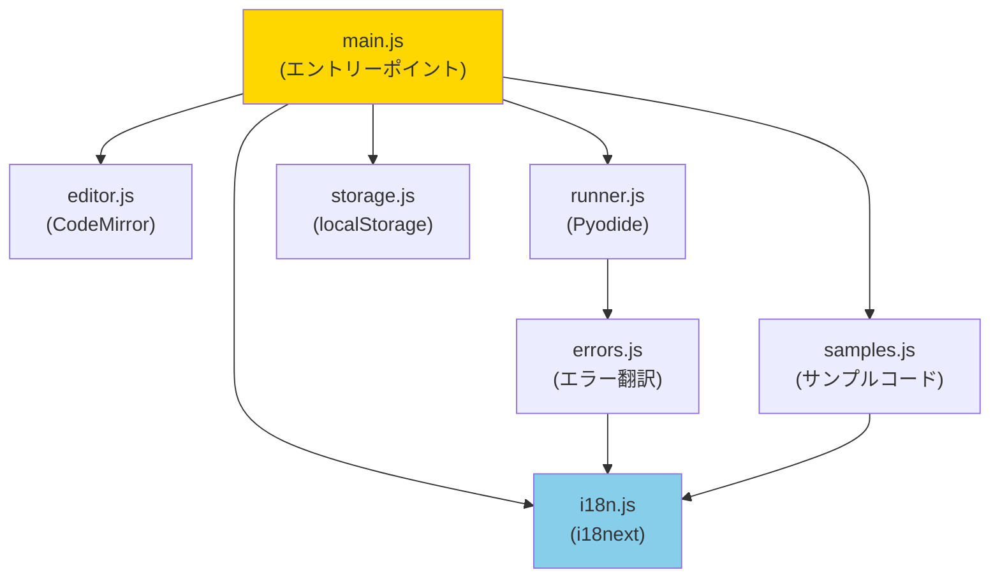

## データフロー

### コード実行フロー

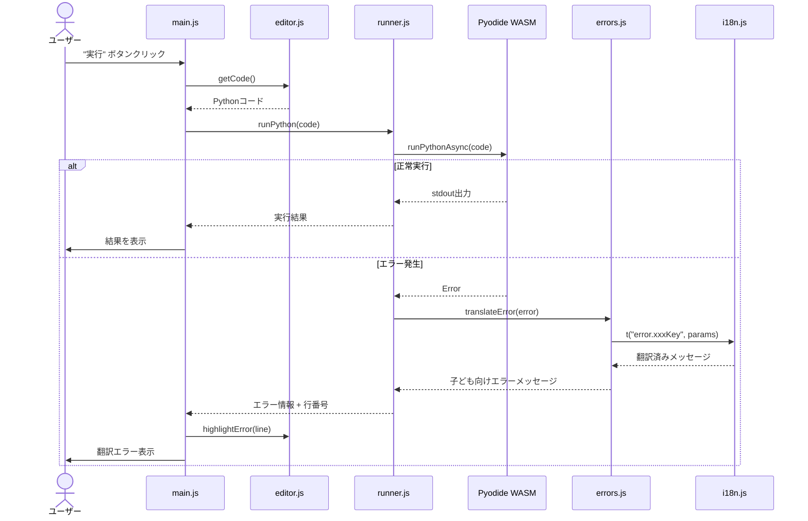

### コード共有フロー

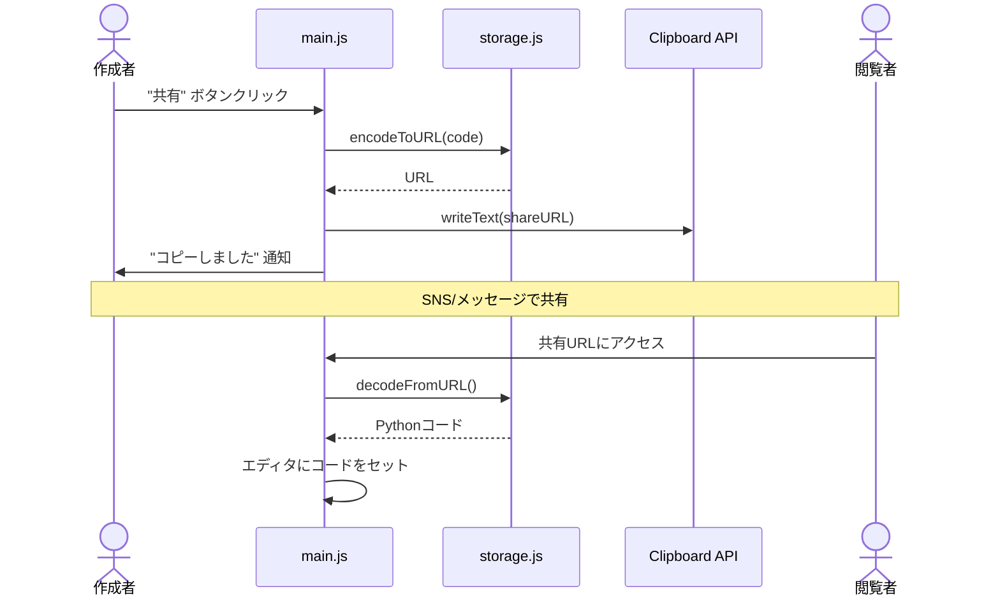

### 言語検出・切替フロー

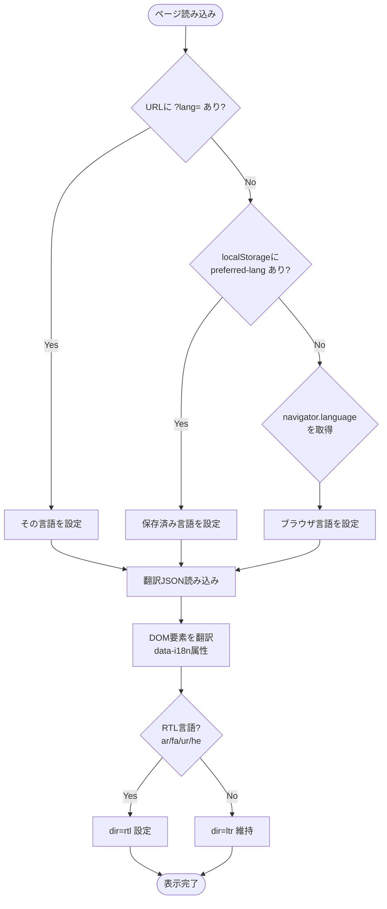

## ビルドパイプライン

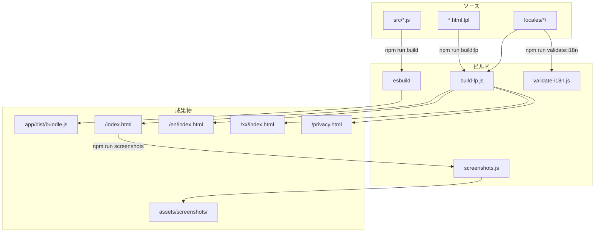

## ディレクトリ構造

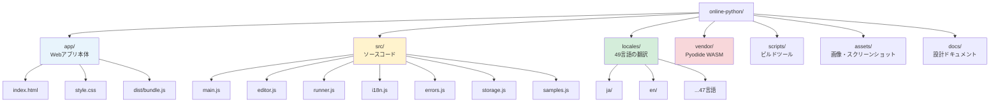

## データ永続化戦略

### ストレージ方式

| データ種別 | ストレージ | キー/形式 | ライフサイクル |
|-----------|----------|----------|--------------|
| ユーザーのコード | localStorage | `python-editor-code` | デバイスごと、永続 |
| 言語設定 | localStorage | `preferred-lang` | デバイスごと、永続 |
| バナー非表示 | localStorage | `bookmark-banner-dismissed` | デバイスごと、永続 |
| 共有コード | URL Hash | `#code=<base64>` | 一時的、URLで共有可能 |
| 翻訳データ | 静的JSON | `/locales/{lang}/*.json` | バージョン管理下 |
| サンプルコード | 静的JSON | `/locales/{lang}/samples.json` | バージョン管理下 |

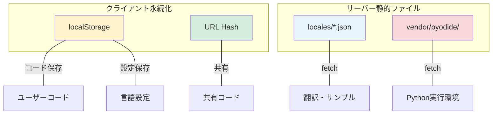

**バックアップ**: ユーザーデータはlocalStorageのみに保存されるため、サーバーサイドのバックアップは不要。コード共有URL経由でユーザー自身がバックアップ可能。

## 国際化 (i18n) アーキテクチャ

### 言語展開フェーズ

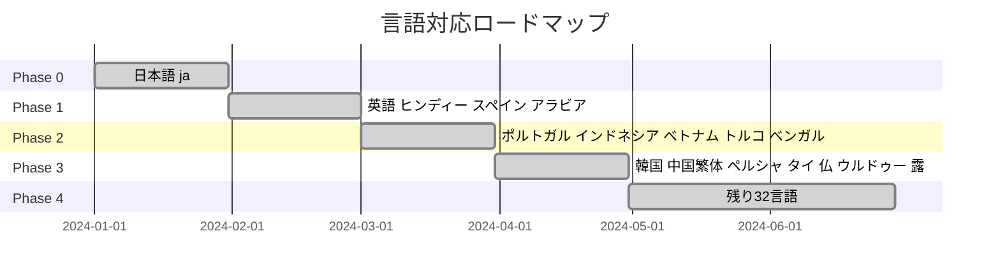

### i18n データフロー

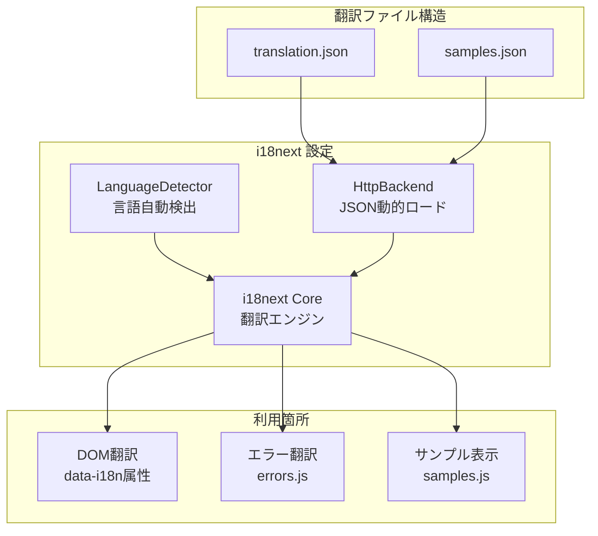

## エラー翻訳システム

```mermaid
flowchart TD
    PyErr["Python Error<br/>SyntaxError: invalid syntax"]
    Parse["エラーパーサー<br/>正規表現20+パターン"]
    Extract["情報抽出<br/>行番号 + エラー種別 + 変数名"]
    Translate["i18n翻訳<br/>t&#40;'error.syntaxInvalid'&#41;"]
    Display["ユーザー表示"]

    PyErr --> Parse
    Parse --> Extract
    Extract --> Translate
    Translate --> Display

    Display --> Friendly["子ども向けメッセージ<br/>「この書き方には間違いがあるよ」"]
    Display --> Detail["折りたたみ詳細<br/>元のエラーメッセージ"]
    Display --> Highlight["エディタ行ハイライト<br/>エラー行を赤表示"]
```

### 対応エラー種別

| カテゴリ | エラー種別 | 翻訳キー例 |
|---------|-----------|-----------|
| 構文 | SyntaxError (括弧未閉じ、不正文字等) | `error.parenOpen`, `error.syntaxInvalid` |
| 名前 | NameError (未定義変数) | `error.nameNotDefined` |
| 型 | TypeError (型不一致、引数不一致) | `error.typeConcat`, `error.argCount` |
| インデント | IndentationError | `error.indentUnexpected` |
| 範囲 | IndexError, KeyError | `error.indexRange`, `error.keyNotFound` |
| 数値 | ZeroDivisionError, ValueError | `error.zeroDivision`, `error.valueInvalid` |
| 属性 | AttributeError | `error.attributeNone` |

## セキュリティアーキテクチャ

### サンドボックスモデル

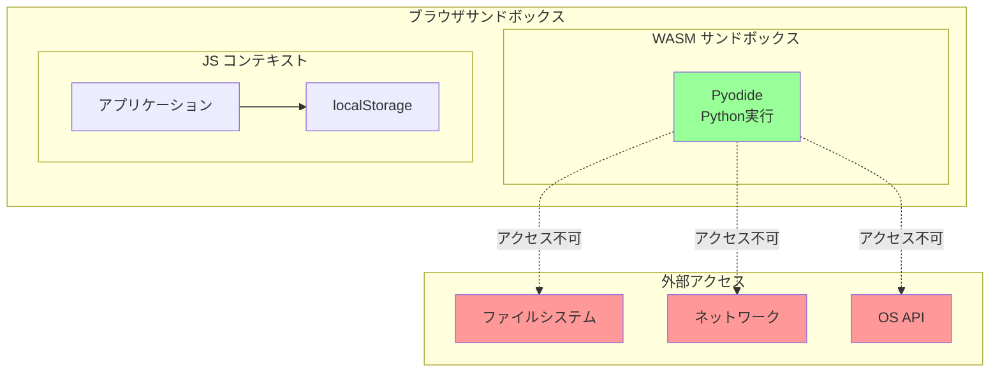

### データ保護

| 対象 | 保護方式 | 備考 |
|------|---------|------|
| ユーザーコード | localStorageにのみ保存 | サーバーに送信しない |
| 共有URL | Base64エンコード（暗号化ではない） | ユーザー操作必須 |
| Python実行 | WASM サンドボックス | ブラウザ外へのアクセス不可 |
| プライバシー | データ収集なし | プライバシーポリシーに明記 |

### 入力検証

- **Pythonコード**: Pyodideサンドボックス内で実行、ブラウザ外へのアクセスは不可
- **URL共有パラメータ**: Base64デコード失敗時はサイレントに無視
- **言語選択**: i18nextがサポート言語リストで検証

## パフォーマンス要件

### 初回ロード

| リソース | サイズ(概算) | キャッシュ戦略 |
|---------|-------------|-------------|
| Pyodide WASM + stdlib | ~50MB | ブラウザキャッシュ（変更頻度: 低） |
| bundle.js | ~150KB | ブラウザキャッシュ（ビルド毎に更新） |
| 翻訳JSON | ~5KB/言語 | ブラウザキャッシュ |
| style.css | ~5KB | ブラウザキャッシュ |

### Pyodide ロードシーケンス

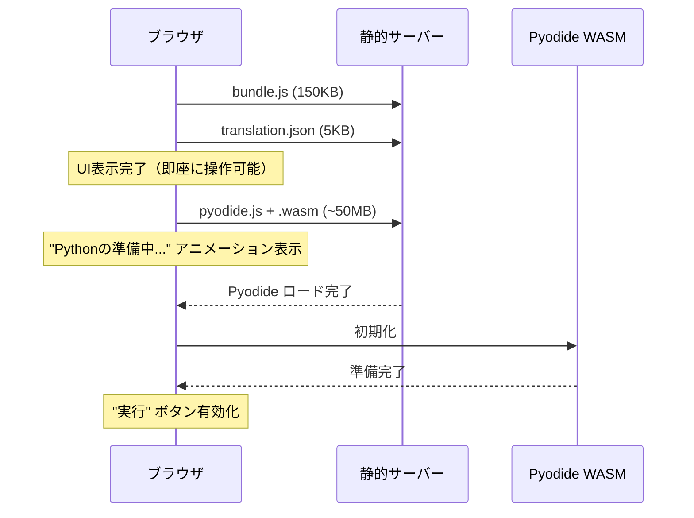

## スケーラビリティ設計

### 現在の設計が有効な範囲

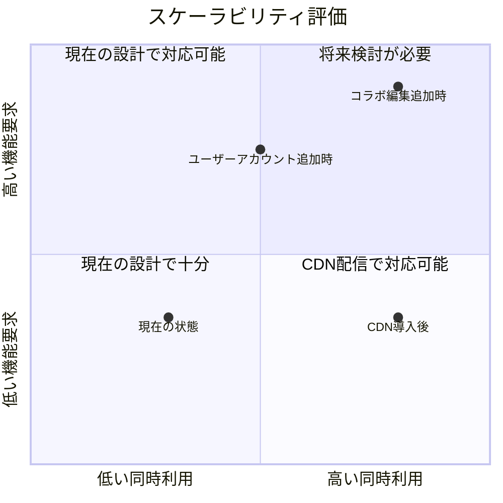

- **水平スケーリング**: 静的ファイル配信のためCDNで対応可能
- **計算負荷**: クライアントサイド実行のためサーバー負荷なし
- **データ増加**: localStorageの5MB制限内で運用（コード保存のみ）
- **言語追加**: `locales/` にディレクトリ追加するだけで拡張可能

## デプロイメント

### 現在の構成

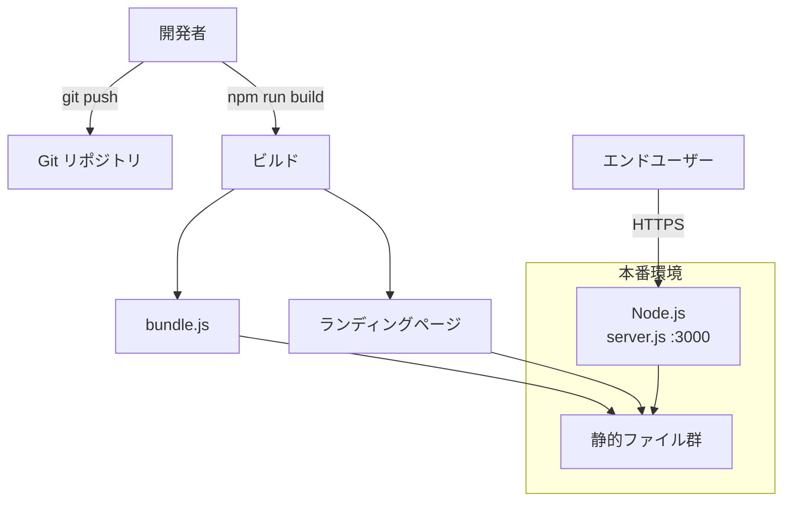

### ビルドコマンド

```bash
npm install              # 依存パッケージインストール
npm run build            # src/ → app/dist/bundle.js
npm run build:lp         # テンプレート → 49言語のLP/プライバシーページ
npm run validate:i18n    # 翻訳ファイルの構造検証
npm run screenshots      # LP用スクリーンショット生成 (Playwright)
```

## SEO 構成

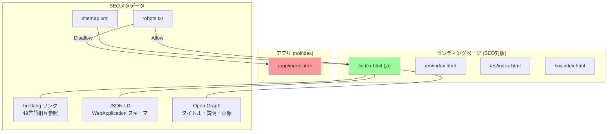

## テスト戦略

### 現在のテスト体制

| テスト種別 | ツール | 対象 | 状態 |
|-----------|-------|------|------|
| i18n検証 | validate-i18n.js | 翻訳JSONの構造・キー一貫性 | 実装済み |
| スクリーンショット | Playwright | LP表示確認 | 実装済み |
| ユニットテスト | 未定 | ビジネスロジック | 未実装 |
| E2Eテスト | Playwright (候補) | コード実行フロー | 未実装 |

### 推奨テストピラミッド

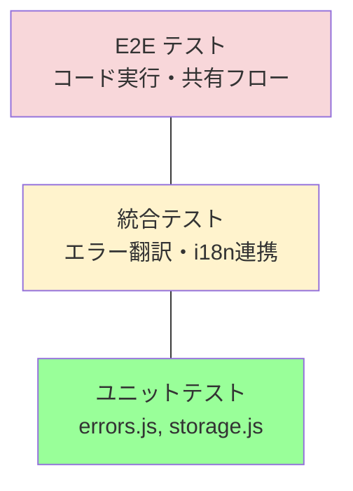

## 技術的制約

### 環境要件

| 要件 | 値 | 備考 |
|------|---|------|
| ブラウザ | WebAssembly + ES2020対応 | Chrome 80+, Firefox 79+, Safari 14.1+, Edge 80+ |
| ネットワーク | 初回ロード時に必要 | Pyodide ~50MBのダウンロード |
| ストレージ | localStorage 5MB以内 | コード保存のみ、十分な容量 |
| サーバー | 静的ファイル配信可能な任意のHTTPサーバー | Node.js, Nginx, CDN等 |

### パフォーマンス制約

- Pyodide初回ロード: ネットワーク速度に依存（50MB）
- Python実行速度: ネイティブ比で約10-100倍遅い（WASMオーバーヘッド）
- メモリ: Pyodideが数百MBのメモリを使用（モバイルでは制約あり）

## 依存関係管理

| ライブラリ | 用途 | バージョン管理方針 | 更新頻度 |
|-----------|------|-------------------|---------|
| codemirror | エディタ | `^6.0.2` (マイナー自動) | 中 |
| @codemirror/lang-python | Python構文 | `^6.2.1` (マイナー自動) | 低 |
| @codemirror/view | エディタ描画 | `^6.40.0` (マイナー自動) | 中 |
| @codemirror/state | エディタ状態 | `^6.6.0` (マイナー自動) | 低 |
| i18next | 国際化 | `^26.0.1` (マイナー自動) | 中 |
| i18next-browser-languagedetector | 言語検出 | `^8.2.1` (マイナー自動) | 低 |
| i18next-http-backend | 翻訳ロード | `^3.0.2` (マイナー自動) | 低 |
| esbuild | バンドラー | `^0.27.4` (マイナー自動) | 高 |
| playwright | テスト | `^1.58.2` (devDependency) | 高 |
| Pyodide | Python WASM | vendorディレクトリに固定 | 低（年次） |

## 設計判断の根拠

| 判断 | 選択 | 根拠 |
|------|------|------|
| Python実行方式 | クライアントサイド (Pyodide) | サーバースケーリング不要、プライバシー保護、オフライン動作可能 |
| フレームワーク | なし (Vanilla JS) | アプリ規模が小さく、フレームワークのオーバーヘッドが不要 |
| 状態管理 | localStorage直接 | 単一値の保存のみ、状態管理ライブラリ不要 |
| バンドラー | esbuild | 高速、設定最小限、ESM出力対応 |
| 型システム | なし (JavaScript) | モジュール数が少なく、TypeScriptの導入コストが見合わない |
| CSS | Vanilla CSS | コンポーネント数が少なく、CSSフレームワーク不要 |
| テンプレート | 独自 (`{{var}}`) | LP生成のみ、テンプレートエンジン導入不要 |
| ユーザー認証 | なし | 教育用途、プライバシー重視、複雑さ回避 |
| データベース | なし | サーバーサイドのデータ保存が不要 |
