# Customer Problems — Bob Moesta式 Jobs-to-Be-Done 分析

## 1. ターゲットユーザー

6〜12歳の子どもたち、およびそのプログラミング学習を支援する**保護者・教師**。非英語圏を中心に、母語で使えるプログラミング環境が存在しない国・地域が主要ターゲットとなる。

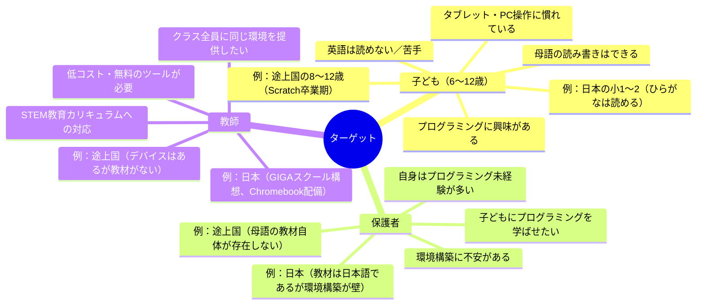

### なぜ6〜12歳か

| 地域 | 中心年齢 | 理由 |
|---|---|---|
| 日本 | 6〜8歳 | ひらがなUIにより低学年から利用可能。2020年プログラミング教育必修化 |
| 英語圏以外の先進国 | 8〜10歳 | Scratchからテキストコーディングへの移行期 |
| 途上国 | 8〜12歳 | デバイス普及が進む中、母語で使える入門ツールが皆無 |

---

## 2. 中心となるJob（JTBD）

> **子どもが「自分でプログラムを書いて動かせた！」という成功体験を得られるようにしたい — 言語やデバイスに関係なく**

これは子ども自身のJobであると同時に、保護者・教師が「雇いたい」Jobでもある。

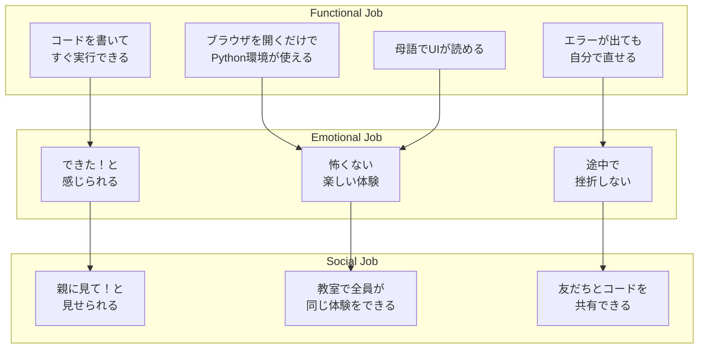

---

## 3. Struggling Moment（もがきの瞬間）

Bob Moestaのフレームワークでは、ユーザーが「今のやり方では限界だ」と感じる具体的な瞬間を特定する。

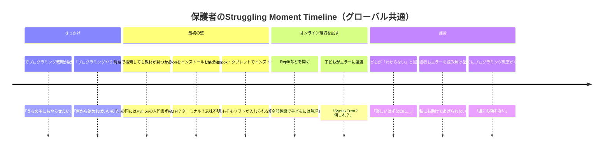

### もがきの瞬間 詳細

| # | Struggling Moment | 誰が | 感情 | スコープ |
|---|---|---|---|---|
| SM1 | Pythonインストールで`PATH`設定が必要と知った瞬間 | 保護者 | 「専門的すぎて手に負えない」 | 普遍 |
| SM2 | Chromebook・タブレットにソフトがインストールできないと気づいた瞬間 | 教師 | 「クラス全員に環境を揃えられない」 | 普遍 |
| SM3 | 英語UIのオンライン環境を子どもに見せた瞬間 | 保護者 | 「これは子どもには無理だ」 | 非英語圏 |
| SM4 | `SyntaxError: unexpected EOF` が表示された瞬間 | 子ども | 「こわい、壊れた？」 | 普遍 |
| SM5 | エラー行番号を見てもコードのどこか分からない瞬間 | 子ども | 「どこを直せばいいの？」 | 普遍 |
| SM6 | `input()`で突然ダイアログが出た瞬間 | 子ども | 「急に出てきた！何これ？」 | 普遍 |
| SM7 | ブラウザを閉じてコードが消えた瞬間 | 子ども | 「全部消えた！パニック！」 | 普遍 |
| SM8 | **母語でプログラミングの本・教材を探しても存在しない**と気づいた瞬間 | 保護者 | 「この言語では学ぶ方法がない」 | 非英語圏・途上国 |
| SM9 | **近くにプログラミング教室が一つもない**と気づいた瞬間 | 保護者 | 「誰にも教えてもらえない」 | 途上国・地方 |
| SM10 | 保護者自身がPCの基本操作に不慣れで**子どもを助けられない**瞬間 | 保護者 | 「私が教えるなんて無理」 | 途上国 |
| SM11 | 学校にデバイスが配備されたが**プログラミング教材が一つもない**瞬間 | 教師 | 「端末はあるのに使い道がない」 | 途上国・新興国 |

### SM8の深刻さ — 「教材がない」問題

日本の場合、プログラミング書籍は日本語で多数存在し、課題は「環境構築の難しさ」や「英語UIの壁」に集中する。しかし多くの非英語圏の国では状況が根本的に異なる：

- **書籍自体が母語で存在しない** — Python入門書がある言語は世界でもごく一部
- **オンライン教材も英語のみ** — YouTube、ドキュメント、チュートリアルのほぼすべてが英語
- **学校カリキュラムにプログラミングがあっても、使えるツールがない**

この状況では、「英語UIが読めない」（SM3）は入口の問題に過ぎず、**そもそも母語で学ぶ手段自体が存在しない**（SM8）ことが本質的な壁となる。

---

## 4. Four Forces（4つの力）

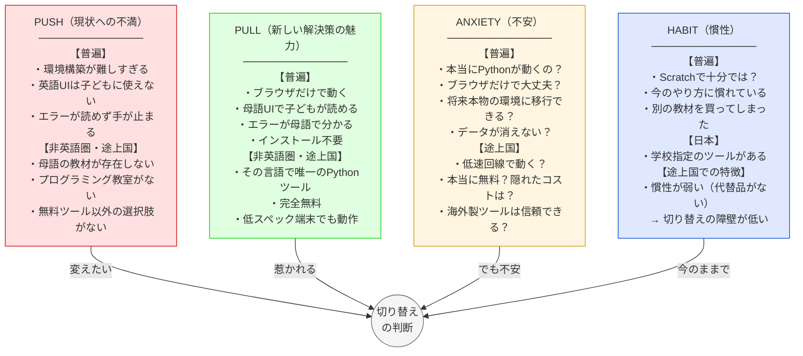

### 戦略的洞察：途上国ではHabitが弱い

先進国（日本含む）では、Scratchや既存教材への慣性が切り替えの障壁となる。しかし途上国では**代替品自体が存在しない**ため、Habitの力が極めて弱い。これは：

- **PUSHとPULLだけで切り替えが起こりうる**（Habitの抵抗がほぼゼロ）
- **ANXIETYの解消が唯一の課題**（「本当に無料？」「低速回線で動く？」）
- つまり、**途上国は先進国よりも切り替えが起こりやすい市場**である

---

## 5. 既存の代替品（Competing Solutions）

子ども・保護者・教師が現在「雇っている」代替品を分析する。

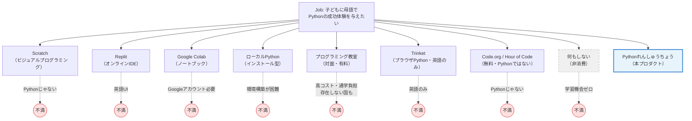

### 「何もしない（非消費）」— 最大の競合

Bob Moestaは「非消費（Non-consumption）」を最も見落とされがちな競合として重視する。多くの途上国・地方では：

- プログラミング教室が存在しない
- 母語のプログラミング教材が存在しない
- 英語のツールは子どもには使えない
- **結果として、子どもはプログラミングを「学ばない」**

「何もしない」が現在のデフォルト行動である市場では、本プロダクトは既存ツールからのスイッチではなく、**まったく新しい行動を生み出す**ことになる。これは競合との差別化ではなく、**市場の創造**である。

### 代替品の詳細比較

| 代替品 | Jobの達成度 | 子ども向けか | 導入の手軽さ | コスト | 母語対応 | 致命的な不満 |
|---|---|---|---|---|---|---|
| **Scratch** | 中（Pythonではない） | ◎ | ◎ | 無料 | 多言語 | テキストコーディングを学べない |
| **Replit** | 高 | ✕ | ○ | 無料〜有料 | 英語のみ | 英語UI、業務用の見た目 |
| **Google Colab** | 高 | ✕ | △ | 無料 | 一部多言語 | Googleアカウント必要、子どもに不向き |
| **ローカルPython** | 最高 | ✕ | ✕ | 無料 | — | 環境構築が子ども・保護者に不可能 |
| **プログラミング教室** | 高 | ◎ | ◎ | 月1〜2万円 | 母語 | 高コスト、存在しない地域も多い |
| **Trinket** | 高 | △ | ◎ | 無料〜有料 | 英語のみ | 非英語圏の子どもに使えない |
| **Code.org** | 中（Pythonではない） | ◎ | ◎ | 無料 | 多言語 | テキストコーディングを学べない |
| **何もしない** | ゼロ | — | — | 無料 | — | 学習機会が完全に失われる |
| **Pythonれんしゅうちょう** | 高 | ◎ | ◎ | 無料 | 多言語対応中 | — |

---

## 6. Effort-Impact Matrix（既存代替品）

代替品を「導入の手間（Effort）」と「Jobの達成度（Impact）」で評価する。

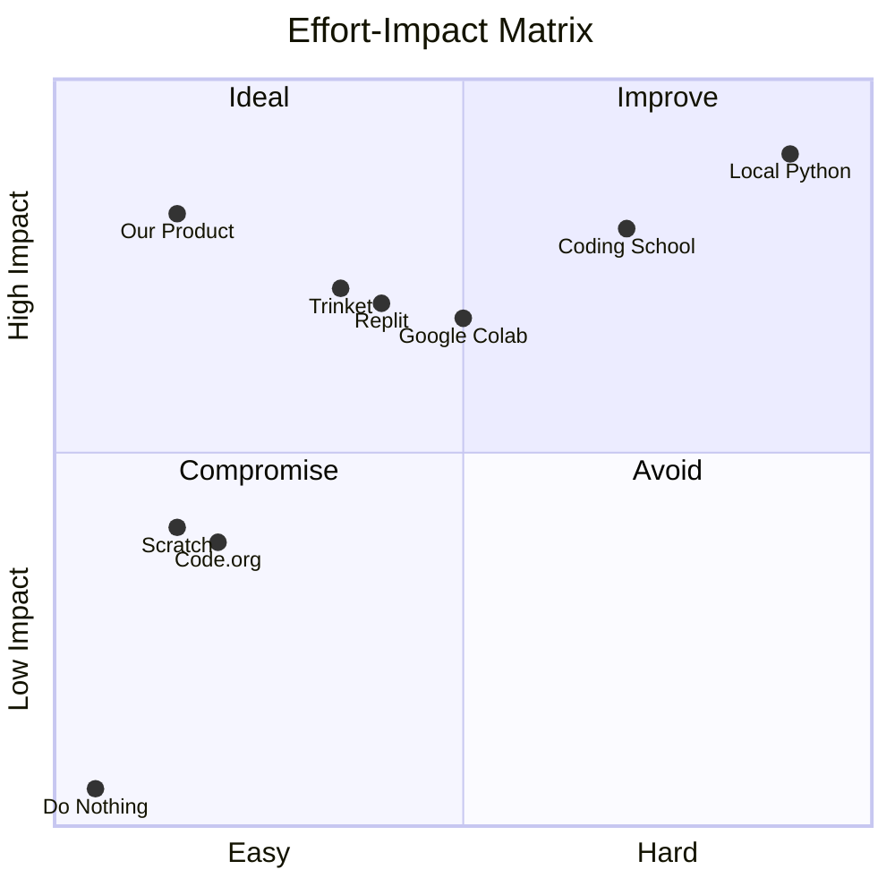

> **凡例**: Our Product = Pythonれんしゅうちょう / Coding School = プログラミング教室 / Local Python = ローカルPython / Do Nothing = 何もしない（非消費）

### 途上国での読み方：右半分が「アクセス不能」

先進国ではマトリクス全体が選択肢となるが、途上国では右側（高Effort）の選択肢の多くが**物理的にアクセスできない**：

- **プログラミング教室** → 存在しない
- **ローカルPython** → 低スペック端末では環境構築が現実的でない
- **Google Colab** → Googleアカウント取得のハードルが高い国もある

結果として、左上の「理想ゾーン」に本プロダクトが**ほぼ唯一の選択肢**として位置する。

### 代替品ごとのEffort-Impact詳細スコア

| 代替品 | 環境構築 | アカウント | 言語の壁 | 金銭コスト | 母語教材の有無 | Effort合計 | 本物Python | テキスト | エラー解決 | 楽しさ | 継続性 | Impact合計 |
|---|---|---|---|---|---|---|---|---|---|---|---|---|
| **Pythonれんしゅうちょう** | 0 | 0 | 0 | 0 | ◎ | **0** | ◎ | ◎ | ◎ | ◎ | ○ | **高** |
| **Scratch** | 0 | 0 | 1 | 0 | ◎ | **1** | ✕ | ✕ | ◎ | ◎ | ◎ | **低** |
| **Code.org** | 0 | 1 | 1 | 0 | ◎ | **2** | ✕ | ✕ | ◎ | ◎ | ○ | **低** |
| **Trinket** | 0 | 0 | 3 | 0 | ✕ | **3** | ◎ | ◎ | △ | ○ | △ | **中** |
| **Replit** | 0 | 2 | 3 | 0 | ✕ | **5** | ◎ | ◎ | ✕ | ✕ | △ | **中** |
| **Google Colab** | 0 | 3 | 2 | 0 | ✕ | **5** | ◎ | ◎ | ✕ | ✕ | △ | **中** |
| **プログラミング教室** | 0 | 1 | 0 | 5 | ◎ | **6** | ◎ | ◎ | ◎ | ◎ | ◎ | **高** |
| **ローカルPython** | 5 | 0 | 2 | 0 | ✕ | **7** | ◎ | ◎ | ✕ | ✕ | △ | **中** |

---

## 7. Switch Timeline（切り替えのタイムライン）

Bob Moesta式の「切り替え」は一瞬の判断ではなく、段階的に進む。ここでは日本と非英語圏の2つのジャーニーを示す。

### ジャーニーA：日本の保護者

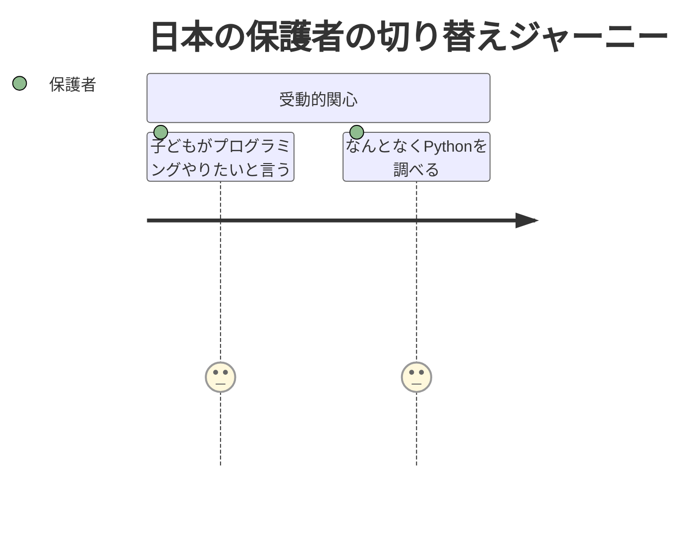
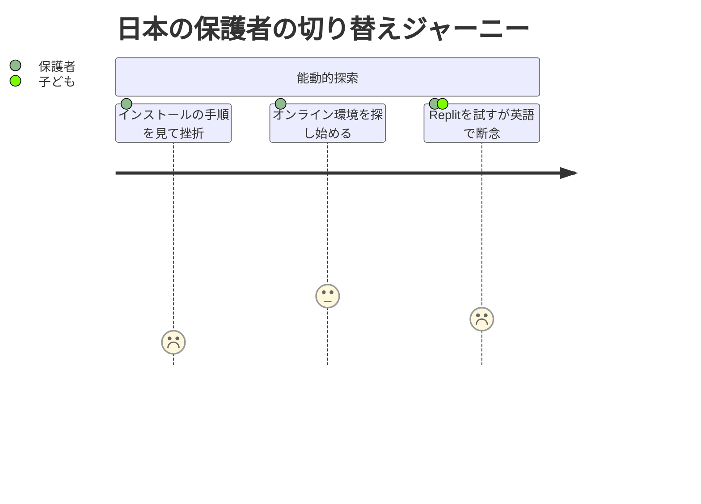
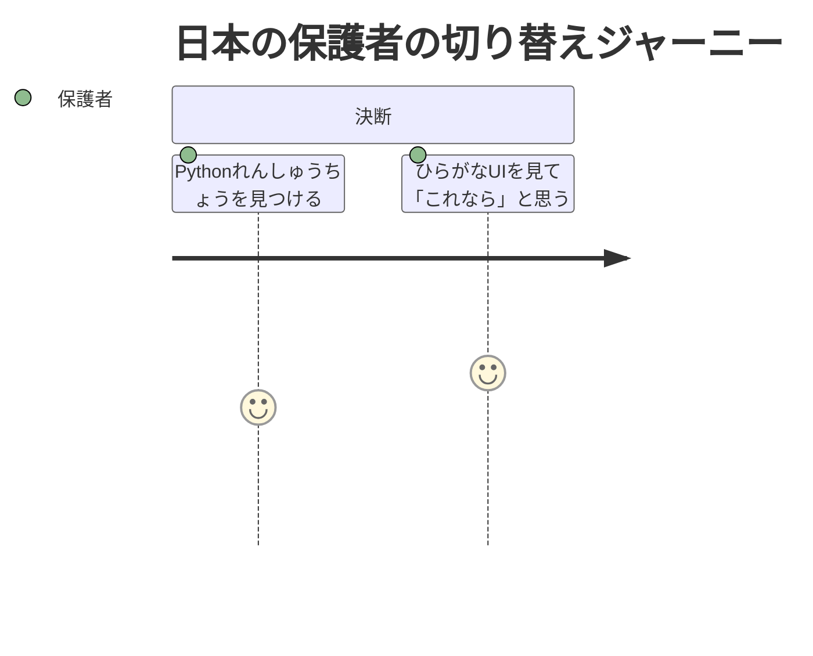

### ジャーニーB：非英語圏（途上国）の保護者

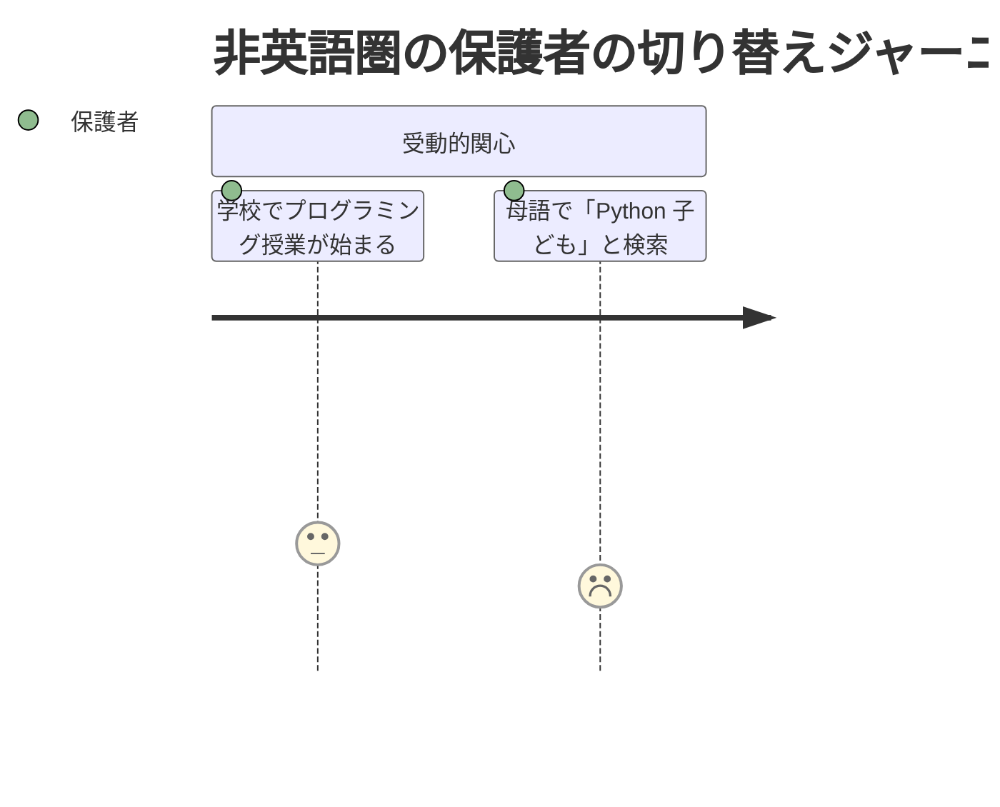
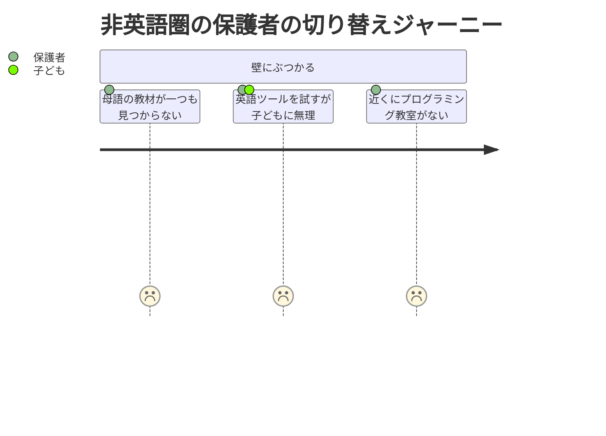
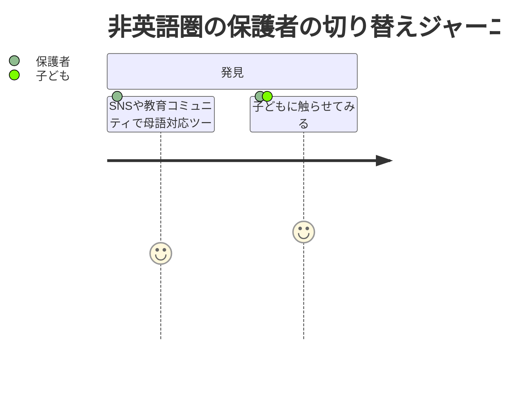

### 共通：初回体験（First Use）

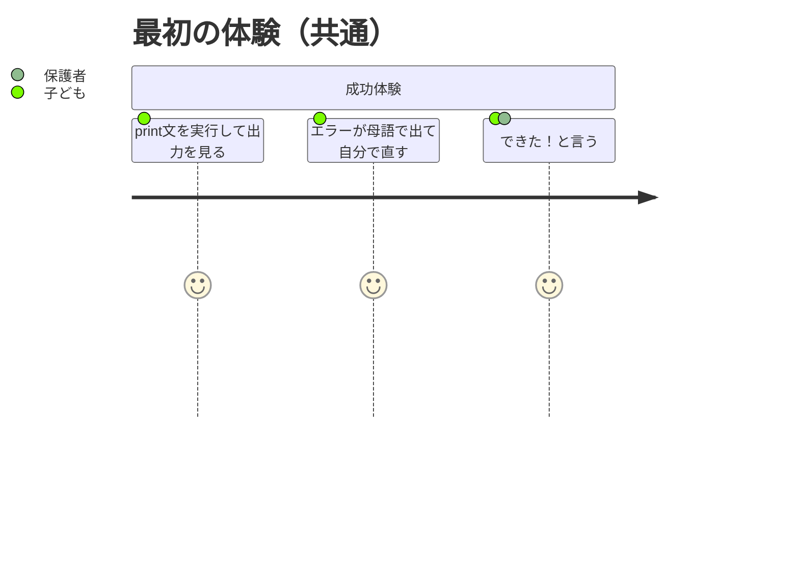

### 2つのジャーニーの違い

| フェーズ | 日本 | 非英語圏（途上国） |
|---|---|---|
| 最初の壁 | 環境構築の難しさ、英語UI | **教材自体が存在しない** |
| 代替手段 | Scratch、プログラミング教室がある | **代替手段がほぼない** |
| 発見経路 | Web検索、口コミ | 教育コミュニティ、SNS、NGO |
| 切り替えの障壁 | Habitが強い（既存ツールへの慣れ） | Habitが弱い（比較対象がない） |
| 初回体験 | 共通：母語で「できた！」を感じる | 共通 |

---

## 8. Progress Making Forces（進歩を生む力）

各Struggling Momentに対して、本プロダクトがどのように「進歩」を実現するか。

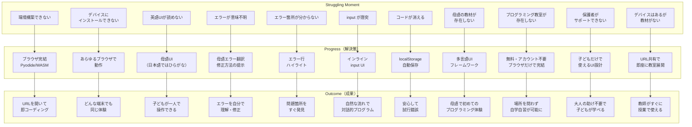

---

## 9. Demand-Side Insight（需要サイドの洞察）

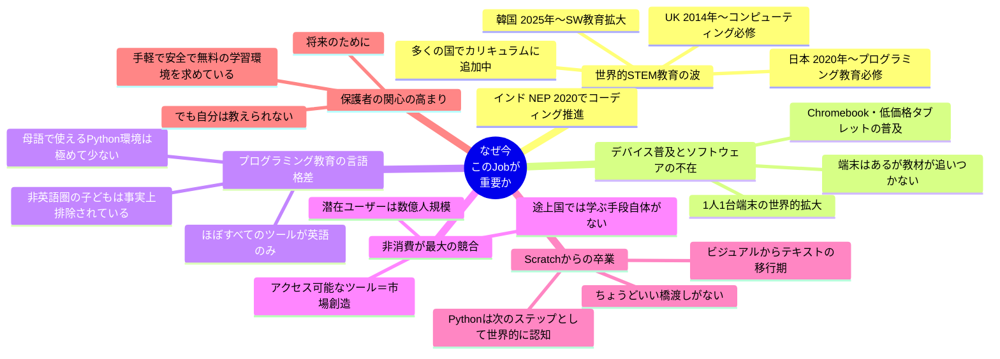

### 切り替えを後押しする3つの問い（Moesta式）

1. **What's pushing you away?**（何が今のやり方から離れさせる？）
   - 普遍：環境構築の難しさ、英語の壁、エラーで止まる体験
   - 非英語圏：母語で学ぶ手段が存在しないという根本的な問題
   - 途上国：プログラミング教室もなく、無料ツールしか選択肢がない

2. **What's pulling you toward?**（何が新しい解決策に引き寄せる？）
   - 普遍：ゼロセットアップ、母語UI、母語エラー翻訳、可愛いデザイン
   - 非英語圏：**その言語で唯一のPythonツール**という圧倒的な引力
   - 途上国：完全無料、低スペック端末対応、アカウント不要

3. **What's holding you back?**（何が切り替えを躊躇させる？）
   - 普遍：「本物のPython？」「データ消えない？」「将来移行できる？」
     → Pyodide、localStorage、標準Python構文で解消
   - 途上国：「低速回線で動く？」「本当に無料？」「海外製ツールは信頼できる？」
     → クライアントサイド完結（初回ロード後はオフライン可）、完全無料、オープンな技術で解消

---

## 10. 対象言語・展開戦略

### 目標：Scratch並みの70言語対応

Scratchは70言語以上、Hedyは約50言語に対応している。しかし**母語UIで実際のPythonを学べる子供向けツール**は、ほぼすべての言語で空白市場である。この空白を埋めることが本プロダクトのグローバル戦略の核となる。

### 展開の2レイヤー

| レイヤー | 内容 | 対象範囲 | 方式 |
|---|---|---|---|
| **UI翻訳** | ボタン・ラベル・メニュー等の翻訳 | 70言語 | コミュニティ翻訳（Crowdin等）で段階的に拡大 |
| **エラーメッセージ翻訳** | 子供向けの表現でのエラー説明 | 主要言語から段階的に | 各言語ネイティブによる監修が必要 |

UIテキストは機械翻訳+コミュニティレビューで迅速にスケールできるが、エラーメッセージは「子供にわかる表現」が必要なため、言語ごとの品質管理が重要となる。

### 優先言語とフェーズ

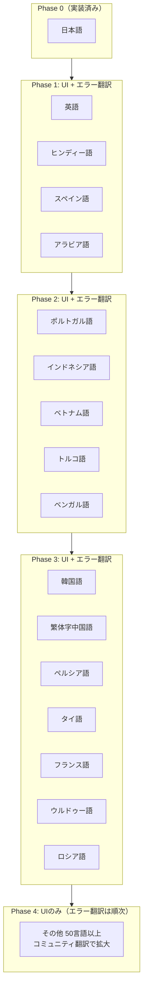

### Phase 1 詳細（UI + エラーメッセージ完全対応）

| 言語 | 6-12歳推定話者数 | 主要国 | 選定理由 |
|---|---|---|---|
| 英語 | ~5,000万人 | 米国、英国、豪州等 | 基盤言語。国際的な認知獲得に必須 |
| ヒンディー語 | ~1.2億人 | インド | 最大の児童人口。コーディング必修化。Python子供向けツール皆無 |
| スペイン語 | ~5,500万人 | メキシコ、コロンビア等 | 20カ国以上で使用。EdTech急成長。言語の壁が明確 |
| アラビア語 | ~6,000万人 | エジプト、サウジ、UAE等 | 政府投資活発。RTL対応で1.2億人以上の児童をカバーする足がかり |

### Phase 2 詳細（UI + エラーメッセージ完全対応）

| 言語 | 6-12歳推定話者数 | 主要国 | 選定理由 |
|---|---|---|---|
| ポルトガル語 | ~2,800万人 | ブラジル | ブラジルEdTech市場の爆発的成長 |
| インドネシア語 | ~4,200万人 | インドネシア | 2.85億人の人口。デジタル変革推進中 |
| ベトナム語 | ~1,400万人 | ベトナム | 2年生からプログラミング教育。政府施策が強力 |
| トルコ語 | ~1,100万人 | トルコ | テック人材需要。Python子供向けツール空白 |
| ベンガル語 | ~3,500万人 | バングラデシュ、インド | 巨大な児童人口。完全な空白市場 |

### Phase 3 詳細（UI + エラーメッセージ完全対応）

| 言語 | 6-12歳推定話者数 | 主要国 | 選定理由 |
|---|---|---|---|
| 韓国語 | ~300万人 | 韓国 | 高購買力。2025年からコーディング教育倍増 |
| 繁体字中国語 | ~200万人 | 台湾、香港 | 日本との文化的親和性。中国本土の競合と差別化可能 |
| ペルシア語 | ~1,200万人 | イラン | Code.org in Farsiの成功が市場を証明 |
| タイ語 | ~600万人 | タイ | 政府のデジタル推進。1,000万人コーディング教育目標 |
| フランス語 | ~5,000万人 | アフリカ仏語圏、フランス | アフリカの人口爆発。長期的に巨大市場 |
| ウルドゥー語 | ~5,500万人 | パキスタン | 巨大人口。RTL対応をアラビア語と共有 |
| ロシア語 | ~1,500万人 | ロシア、旧ソ連諸国 | 理数教育の伝統。子供向けPythonツール空白 |

### Phase 4: コミュニティ翻訳による拡大（70言語へ）

Phase 1-3で17言語のUI+エラー翻訳を完了した後、コミュニティ翻訳プラットフォーム（Crowdin等）を活用して残り50言語以上に拡大する。

**Phase 4の対象候補（抜粋）：**

| カテゴリ | 言語 |
|---|---|
| 南アジア | タミル語、テルグ語、マラーティー語、グジャラート語、パンジャーブ語、シンハラ語、ネパール語 |
| 東南アジア | マレー語、クメール語、ミャンマー語、ラオ語、フィリピノ語 |
| 東アジア | 簡体字中国語、モンゴル語 |
| 中東・中央アジア | クルド語、ウズベク語、カザフ語、アゼルバイジャン語 |
| アフリカ | スワヒリ語、アムハラ語、ハウサ語、ヨルバ語、ズールー語、ソマリ語、オロモ語 |
| ヨーロッパ | ドイツ語、イタリア語、オランダ語、ポーランド語、ウクライナ語、チェコ語、ルーマニア語、ハンガリー語、ギリシャ語、セルビア語、クロアチア語、ブルガリア語、スロバキア語、リトアニア語、ラトビア語、エストニア語、フィンランド語、ノルウェー語、スウェーデン語、デンマーク語、カタルーニャ語、バスク語 |
| その他 | ヘブライ語、グルジア語 |

**Phase 4ではUIのみの翻訳を先行し、エラーメッセージ翻訳は利用者数に応じて順次対応する。**

### 技術的考慮事項

| 課題 | 影響言語 | 対応方針 |
|---|---|---|
| **RTL（右から左）レイアウト** | アラビア語、ペルシア語、ウルドゥー語、ヘブライ語 | Phase 1でアラビア語対応時にRTL基盤を構築。3言語で1.2億人以上をカバー |
| **複雑な文字体系** | ヒンディー語(デーヴァナーガリー)、ベンガル語、タイ語、クメール語等 | Webフォント+Unicode対応。CodeMirrorは多言語対応済み |
| **CJK文字処理** | 日本語（実装済み）、韓国語、中国語 | 日本語実装の基盤を活用。展開コスト低 |
| **文字の長さの差異** | 全言語 | UIをフレキシブルレイアウトで設計。ドイツ語等の長い単語にも対応 |

### カバレッジ推計

Phase 1-3の17言語（日本語含む）で**世界の6-12歳児童の約60%以上**をカバーできる。Phase 4で70言語に拡大すれば、**90%以上**のカバレッジとなる。

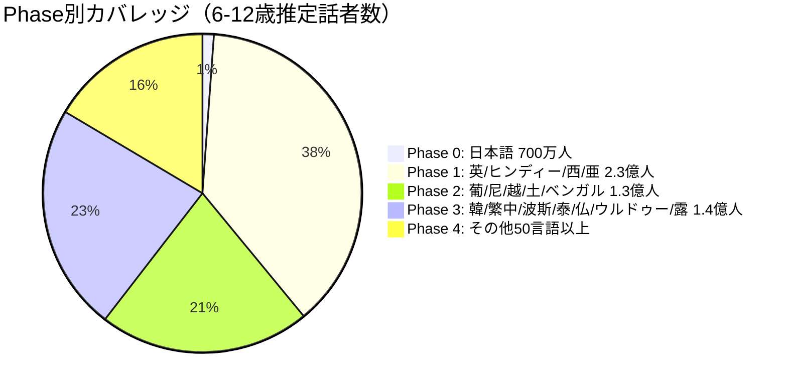
