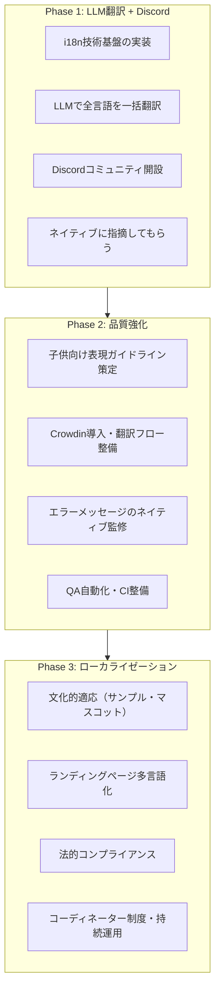
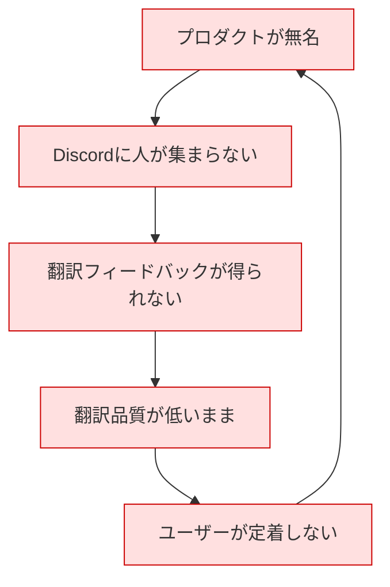
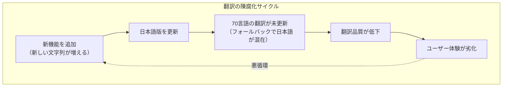

# 多言語化（i18n） — Problems

更新日: 2026-03-30

## 現状の課題

「Pythonれんしゅうちょう」を70言語に展開するには、コードを書き換えるだけでは実現しない。**170+のハードコード文字列**を翻訳可能にする技術的課題に加え、**翻訳の品質管理**、**コミュニティの構築**、**文化的適応**、**持続可能な運用体制**が同時に求められる。

本ドキュメントでは課題を3つのフェーズに分け、Phase 1で**LLM翻訳+Discordコミュニティ**による最速展開を行い、Phase 2-3で品質・運用を段階的に強化する。

---

## フェーズ概要



| フェーズ | 目的 | 翻訳手段 | コミュニティ |
|---|---|---|---|
| **Phase 1** | 全言語で「使える状態」を最速で作る | **LLM（Claude/GPT）** | **Discord** |
| **Phase 2** | 翻訳品質を引き上げる | Crowdin + ネイティブ監修 | Discord + Crowdin |
| **Phase 3** | 文化的適応・持続運用 | コミュニティ主導 | Discord + Crowdin + NGOパートナー |

---

## Phase 1 の課題

### P1. 翻訳対象は4カテゴリに分かれ、LLMの適用可能性が異なる

| 翻訳カテゴリ | 文字列数 | 所在ファイル | LLM翻訳の品質 | Phase 1での扱い |
|---|---|---|---|---|
| **UIラベル** | ~12 | app/index.html, main.js | ◎ 高品質 | LLMで一括翻訳。そのまま使える |
| **システムメッセージ** | ~10 | main.js, runner.js, storage.js | ○ 概ね良好 | LLMで翻訳。Discordでレビュー依頼 |
| **エラーメッセージ** | 25 | errors.js | △ 技術的には正確だが子供向け表現が不自然になりうる | LLMで翻訳。**Discordで重点レビュー** |
| **サンプルコード** | 11セット | samples.js | △ コードは正確だが文化的配慮が不足 | LLMで翻訳。文化依存の高いもの（おみくじ等）はDiscordで相談 |

**Phase 1の方針**: LLMで全カテゴリを一括翻訳し、「完璧ではないが使える状態」を70言語で作る。致命的な問題はDiscordで指摘してもらい、順次修正する。

### P2. LLM翻訳の品質リスク

LLMは高品質な翻訳を生成できるが、以下のリスクがある：

| リスク | 具体例 | 影響度 | 検出方法 |
|---|---|---|---|
| **補間パラメータの破損** | `{{name}}` が消える、名前が変わる | **致命的** | CIで自動チェック（Phase 1で実装） |
| **子供向け表現が硬い** | 技術的に正確だが大人向けの文体 | 中 | Discordでネイティブが指摘 |
| **方言の選択ミス** | アラビア語でエジプト方言 vs 標準語 | 中 | Discordでネイティブが指摘 |
| **文化的に不適切な表現** | ヘビに対するネガティブな感情がある文化圏 | 低〜中 | Discordでネイティブが指摘 |
| **サンプルコードの変数名が不自然** | 母語で自然な変数名ではない | 低 | Discordでネイティブが指摘 |

**共通パターン**: 「致命的」な問題はCIで自動検出し、「中〜低」の問題はDiscordコミュニティに委ねる。

### P3. LLM翻訳のプロンプト設計

LLMに翻訳を依頼する際、以下の指示が必要：

- **対象年齢を明示**: 「6-12歳の子供が読む文章です」
- **口調の指定**: 「やさしく、はげますような口調で」
- **技術用語の扱い**: 「Python, print, input 等のキーワードは翻訳しない」
- **補間パラメータの保持**: 「`{{name}}` 等のプレースホルダーはそのまま残す」
- **JSONフォーマットの維持**: 翻訳後もJSONとして有効であること

→ 言語ごとの翻訳プロンプトテンプレートを作成し、一括生成スクリプトを用意する。

### P4. エラーメッセージの補間パラメータが壊れやすい

エラーメッセージには `{{name}}`, `{{fn}}`, `{{expected}}` 等の補間パラメータが含まれる。LLMでもこれを誤って変更するリスクがある。

```
// 正しい翻訳
"`{{name}}` ってなに？ まだつくってないか、なまえをまちがえているよ"

// LLMが犯しうるミス
"`{{nombre}}` ってなに？..."    ← パラメータ名がスペイン語化
"`name` ってなに？..."          ← {{}} が消えた
```

→ **CIでの自動チェックをPhase 1で実装する**。全言語のJSONに対して、ソース言語（日本語）と同じプレースホルダーが存在するかを検証するスクリプト。

### P5. 170+のハードコード文字列の抽出と置換

現在の文字列は6つのJSファイルと2つのHTMLファイルに散在している：

| ファイル | 文字列数 | 文字列の性質 |
|---|---|---|
| `src/errors.js` | 25 | エラーパターンマッチ + 日本語メッセージ。`$1`/`$2` 置換あり |
| `src/samples.js` | 11セット | タイトル + 完全なPythonコード |
| `src/main.js` | ~8 | ボタン状態、ダイアログ、出力メッセージ |
| `src/runner.js` | 1 | ローディングメッセージ |
| `src/storage.js` | 2 | デフォルトコード、共有テキスト |
| `app/index.html` | ~12 | ボタンラベル、フッター、バナー |
| `index.html` | ~80 | ランディングページ全体（Phase 3で対応） |

→ ランディングページを除く~60文字列+11サンプルセットをPhase 1で抽出・翻訳。

### P6. サンプルコードは「翻訳」ではなく「書き直し」が必要

現在のサンプルコードには日本語の変数名（`なまえ`、`てんき`）、`input()` プロンプト、`print()` 文字列が含まれる。

```python
# 日本語版
なまえ = input("なまえをおしえて: ")
print(なまえ + "さん、こんにちは！")

# 英語版（変数名も変わる）
name = input("What is your name? ")
print("Hello, " + name + "!")
```

→ サンプルコードは言語ごとに完全なコードブロックを持つ。LLMに「このPythonサンプルを○○語の子供向けに書き直して」と指示する。

### P7. RTL（右から左）言語のUI対応

アラビア語、ペルシア語、ウルドゥー語、ヘブライ語はRTL。Phase 1で対応が必要：

- CSSを論理プロパティ（`margin-inline-start` 等）に変換
- エディタ/出力エリアは `dir="ltr"` で固定（Pythonコードは常にLTR）
- `<html dir="rtl">` の動的設定

→ Phase 1で技術基盤を実装しないと、RTL言語が4つ使えない状態になる。

### P8. 翻訳ロード時のちらつき（FOUC）

翻訳JSONを非同期で読み込む場合、HTMLに埋め込まれた日本語が一瞬表示される。特に途上国の低速回線では数秒続く可能性がある。

→ Phase 1の実装で、言語検出結果に基づくローディング戦略を組み込む。

### P9. Discordコミュニティの設計

Phase 1のコミュニティ基盤としてDiscordを使う。

**チャンネル構成案**:

| チャンネル | 目的 |
|---|---|
| `#announcements` | リリース・翻訳更新の通知 |
| `#translation-general` | 翻訳に関する全般的な議論 |
| `#report-issues` | 翻訳の誤り・不自然な表現の報告 |
| 言語別チャンネル（`#lang-hindi`, `#lang-arabic`, ...） | 各言語の翻訳議論。Phase 1では主要言語のみ |
| `#dev` | 開発者向け（技術的なi18n議論） |

**Discordでの翻訳フィードバックフロー**:

```
LLMで翻訳を生成
  ↓
GitHubにPR（全言語分）
  ↓
Discordの各言語チャンネルで「翻訳レビューお願いします」と告知
  ↓
ネイティブスピーカーがおかしい箇所を報告
  （#report-issues または言語別チャンネル）
  ↓
報告をもとに修正（開発者 or LLMで再翻訳）
  ↓
修正をマージ
```

### P10. Discordコミュニティの初期メンバー獲得

コミュニティもコールドスタート問題がある。Discordに人が集まらなければフィードバックが得られない。



**Phase 1での突破策**:

1. **英語版を自力で完成させる** — 英語版リリースが国際的な認知の起点
2. **Product Hunt / Hacker News / Reddit で紹介** — 「Kids' Python IDE in 70 languages — help us improve translations!」
3. **Hacktoberfest（10月）** — 翻訳フィードバックをGitHub Issuesで受け付け、`hacktoberfest` ラベルを付ける
4. **アプリ内にDiscordリンクを配置** — 「翻訳がおかしい？教えてね →」でDiscordに誘導
5. **各言語のプログラミング教育コミュニティにDM** — Facebook、Telegram、Reddit等で直接呼びかけ

---

## Phase 2 の課題

Phase 1で「LLM翻訳+Discordフィードバック」の体制が動き始めた後、品質を本格的に引き上げる。

### P11. 言語ごとに「子供向け」の基準が異なる

| 言語 | 「子供向け」の基準 | 課題 |
|---|---|---|
| 日本語 | ひらがなのみ（漢字を使わない） | 明確。自動チェック可能 |
| 英語 | 短い単語、簡単な文法 | 基準が曖昧。何歳向けの語彙か？ |
| ヒンディー語 | デーヴァナーガリー文字。口語 vs 文語の差が大きい | 地域差による表現の違い |
| アラビア語 | 方言差が極めて大きい（エジプト vs 湾岸 vs 北アフリカ） | どの方言で書くか？標準アラビア語は子供には硬い |
| 中国語繁体字 | 注音 vs ピンイン、台湾口語 vs 書き言葉 | 台湾と香港で表現が異なる |

→ Phase 2で各言語の「子供向け表現ガイドライン」を策定。Phase 1のDiscordで得た知見をもとにする。

### P12. エラーメッセージは「技術的に正確」かつ「子供が理解できる」必要がある

LLM翻訳は技術的には正確だが、「子供が読んで分かるか」はネイティブの教育者にしか判断できない。

→ Phase 2でCrowdinを導入し、エラーメッセージの**ネイティブ監修フロー**を構築。

### P13. Crowdinへの移行

Phase 1はDiscord+GitHub Issuesでフィードバックを集めるが、言語数が増えると管理が追いつかない。

| 課題 | Phase 1（Discord） | Phase 2（Crowdin） |
|---|---|---|
| 翻訳の管理 | JSONファイルを手動編集 | Crowdin UIで一元管理 |
| レビューフロー | Discord報告 → 開発者が修正 | Crowdin内で提案 → レビュー → 承認 |
| 進捗管理 | 不可視 | 言語ごとの翻訳率が自動表示 |
| 新規文字列の追加 | 手動で各JSONに追加 | GitHub同期で自動検出 |
| 品質チェック | CIのみ | Crowdin QAチェック + CI |

→ Phase 2でCrowdinのOSS無料枠を申請し、GitHub連携を設定。Phase 1のDiscordコミュニティの活発なメンバーをCrowdinのレビュアーに招待。

### P14. QA自動化・CI整備

言語数が増えると手動テストは不可能。

| テスト対象 | 方法 | Phase |
|---|---|---|
| **プレースホルダー整合性** | CIで `{{param}}` の存在チェック | **Phase 1** |
| **JSONの構文チェック** | CIでJSON parse | **Phase 1** |
| **翻訳の抜け検出** | ソース言語と各言語のキー比較 | Phase 2 |
| **文字列の長さ超過** | 最長文字列の自動検出 | Phase 2 |
| **RTLレイアウト** | Playwrightスクリーンショット比較 | Phase 2 |
| **サンプルコードの動作** | 各言語のサンプルをPyodideで実行 | Phase 2 |

### P15. 貢献者のモチベーション維持

Phase 1でDiscordに集まった初期メンバーの熱量が冷めた後、どう維持するか。

| モチベーション要因 | 施策 | Phase |
|---|---|---|
| **認知** | 各言語版にcontributorsページ。翻訳者名を表示 | Phase 2 |
| **達成感** | 言語ごとの翻訳進捗バーを公開 | Phase 2（Crowdin導入後） |
| **影響力の可視化** | 「あなたの翻訳で○○人の子供がPythonを学んでいます」 | Phase 2 |
| **コミュニティ帰属** | Discord内でロール付与（Translator, Reviewer等） | **Phase 1** |
| **教育的使命感** | 「自分の母語で、子供がプログラミングを学べる世界を作っている」 | **Phase 1**（Discord開設時からミッションを共有） |

---

## Phase 3 の課題

### P16. 翻訳では足りない — ローカライゼーションが必要

| 要素 | 日本版 | ローカライゼーションの必要性 |
|---|---|---|
| **マスコット** | ヘビ | 文化によってネガティブな象徴の可能性 |
| **カラーパレット** | パステルみずいろ + ピンク | 「子供向け」の色感覚が国によって異なる |
| **UIの口調** | 「〜だよ」「〜してね」 | 各言語での子供向け口調が異なる |
| **サンプルコードの題材** | おみくじ | 日本固有。各文化の同等概念に置換が必要 |
| **OGP画像** | 日本語テキスト入り | 言語ごとに画像の再生成が必要 |
| **プライバシーポリシー** | 日本法準拠 | GDPR、COPPA等への対応 |

### P17. サンプルコードの文化的適応

文化依存度の高いサンプル：

| サンプル | 文化依存度 | Phase 3での対応 |
|---|---|---|
| 「なんばんめ？」（果物リスト） | **中** | 現地の果物に変更 |
| **「おみくじ」** | **高** | 文化ごとの同等概念に置換（Fortune Cookie, ラッキーナンバー等） |

→ Phase 1ではLLMが文化的に最も近い置換を選択。Phase 3でDiscordコミュニティと相談して洗練。

### P18. 法的コンプライアンス

| 法規制 | 対象地域 | 本プロダクトへの影響 |
|---|---|---|
| **COPPA** | 米国 | localStorageのみ使用、個人情報収集なし → 影響小 |
| **GDPR** | EU | 完全クライアントサイド → 影響小 |
| **AADC** | 英国 | 現設計は適合的 |
| **各国法** | インド、ブラジル等 | プライバシーポリシーの多言語化が必要 |

**本プロダクトの優位性**: サーバーにデータを送信しない完全クライアントサイド設計により、ほとんどの法規制の影響を回避できる。

### P19. ランディングページの多言語化

アプリ本体とは異なるアプローチが必要：

- **アプリ**: JSベースの動的翻訳で十分
- **ランディングページ**: SEO対策のため言語別の静的HTML生成が必要（`hreflang`, meta description等）

→ Phase 3でビルド時HTML生成を実装。

### P20. 翻訳の陳腐化

プロダクトが進化すると翻訳が追いつかなくなる。



→ Phase 3でString Freeze運用、翻訳カバレッジ閾値（80%未満は非公開）、CIでの差分監視を導入。

### P21. 言語コーディネーター制度

各言語に品質の最終責任者が必要。

- 70言語分のコーディネーター確保は非常に困難
- 特にマイナー言語ではなり手が極めて少ない
- コーディネーターが離脱すると言語全体が停滞する

→ Phase 3で正式なコーディネーター制度を設計。Phase 1-2で活躍したDiscordメンバーから選出。

---

## 課題の優先度マトリクス

```mermaid
quadrantChart
    title i18n課題の優先度
    x-axis Easy --> Hard
    y-axis Low Impact --> High Impact
    quadrant-1 Plan (Ph2)
    quadrant-2 Do First (Ph1)
    quadrant-3 Defer (Ph3)
    quadrant-4 Investigate
    P5 String extraction: [0.35, 0.85]
    P1 LLM translation: [0.25, 0.85]
    P4 Placeholder safety: [0.20, 0.80]
    P9 Discord setup: [0.30, 0.75]
    P10 Cold start: [0.75, 0.85]
    P7 RTL support: [0.50, 0.70]
    P13 Crowdin migration: [0.40, 0.70]
    P11 Child-friendly std: [0.65, 0.75]
    P14 QA automation: [0.45, 0.65]
    P15 Motivation: [0.55, 0.55]
    P16 Localization: [0.70, 0.45]
    P20 Staleness: [0.55, 0.50]
    P18 Legal: [0.60, 0.30]
    P19 LP i18n: [0.50, 0.40]
```

## まとめ：フェーズ別の課題マッピング

### Phase 1（最速展開）

| # | 課題 | 対応方針 |
|---|---|---|
| P1 | 翻訳カテゴリの難易度差 | LLMで全カテゴリ一括翻訳。品質差はDiscordで吸収 |
| P2 | LLM翻訳の品質リスク | 致命的問題はCIで自動検出、他はDiscordで報告 |
| P3 | LLM翻訳のプロンプト設計 | 言語ごとの翻訳プロンプトテンプレートを作成 |
| P4 | 補間パラメータの破損 | CIでプレースホルダー整合性チェックを実装 |
| P5 | 文字列の抽出・置換 | i18next導入、JSON抽出、コードリファクタ |
| P6 | サンプルコードの書き直し | LLMに「子供向けに書き直して」と指示 |
| P7 | RTL対応 | CSS論理プロパティ化、エディタ/出力のLTR固定 |
| P8 | FOUC | ローディング戦略を実装に組み込む |
| P9 | Discordコミュニティ設計 | チャンネル構成、フィードバックフローの構築 |
| P10 | コールドスタート | 英語版自力完成 → Product Hunt/HN/Reddit → Discord誘導 |

### Phase 2（品質強化）

| # | 課題 | 対応方針 |
|---|---|---|
| P11 | 子供向け表現の基準 | Phase 1の知見をもとに各言語ガイドライン策定 |
| P12 | エラーメッセージの二重制約 | Crowdinでネイティブ監修フローを構築 |
| P13 | Crowdinへの移行 | OSS無料枠申請、GitHub連携、Discord活発メンバーを招待 |
| P14 | QA自動化 | 翻訳抜け検出、長さ超過、RTLスクリーンショット、サンプル実行 |
| P15 | モチベーション維持 | contributorsページ、進捗バー、影響力の可視化 |

### Phase 3（ローカライゼーション・持続運用）

| # | 課題 | 対応方針 |
|---|---|---|
| P16 | 文化的適応 | マスコット、色、口調をDiscordコミュニティと相談 |
| P17 | サンプルの文化適応 | おみくじ等を各文化の同等概念に置換 |
| P18 | 法的コンプライアンス | プライバシーポリシー多言語化。現設計で大部分は回避済み |
| P19 | ランディングページ多言語化 | ビルド時HTML生成、hreflang、多言語SEO |
| P20 | 翻訳の陳腐化 | String Freeze運用、カバレッジ閾値、CI差分監視 |
| P21 | コーディネーター制度 | Phase 1-2の活躍メンバーから選出。各言語最低2名 |
