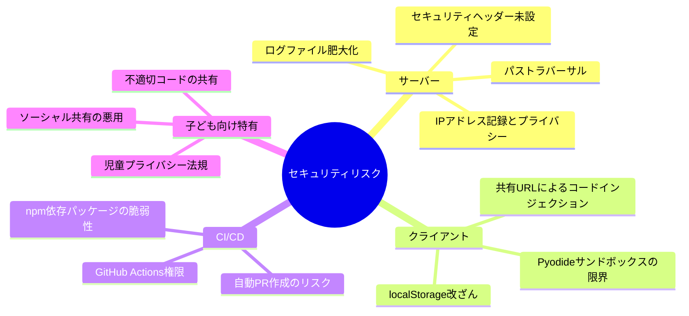
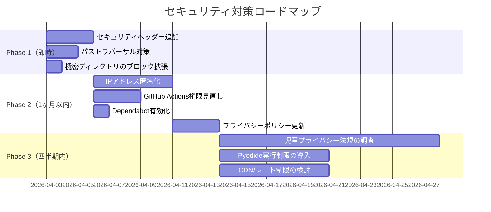
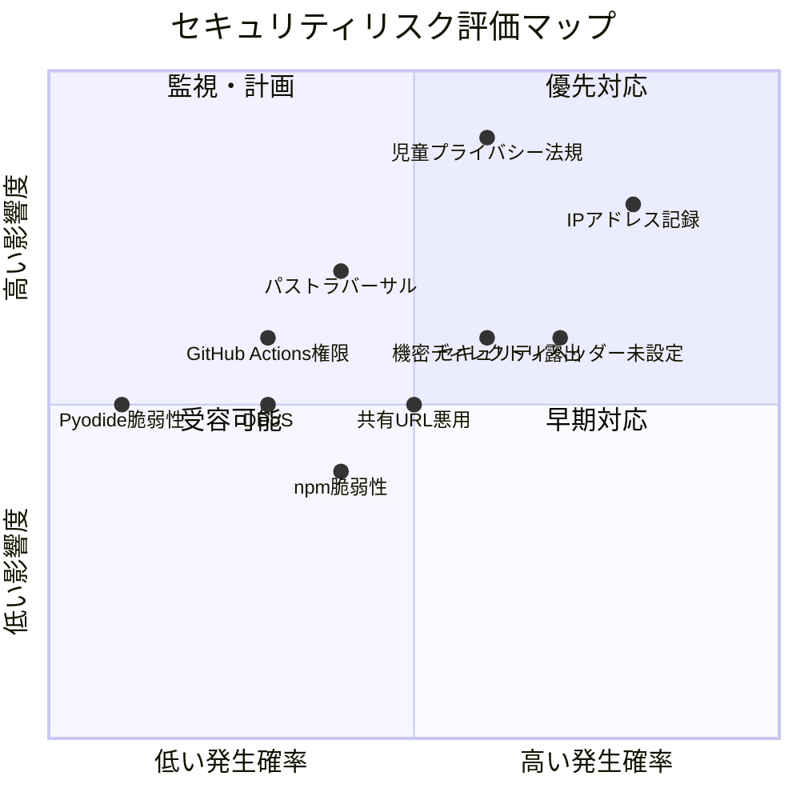

# セキュリティリスク — Problems & 対策

更新日: 2026-04-02

---

## 概要

「Pythonれんしゅうちょう」は子ども向けサービスであり、一般的なWebセキュリティに加え**児童保護**の観点が必要となる。本ドキュメントではリスクを洗い出し、対策の優先度を定め、施策を段階的に実施するための基準とする。

### リスク評価基準

| 影響度 | 定義 |
|---|---|
| **Critical** | 児童の安全・プライバシーに直接影響、または法的リスク |
| **High** | サービス停止・データ漏洩・信頼失墜 |
| **Medium** | セキュリティ姿勢の弱点、攻撃面の拡大 |
| **Low** | ベストプラクティスからの逸脱、将来のリスク要因 |

---

## リスク一覧



---

## Phase 1: 即座に対応すべきリスク

### P1-1. セキュリティヘッダー未設定

| 項目 | 内容 |
|---|---|
| 影響度 | **High** |
| 現状 | `server.js` でレスポンスヘッダーに `Content-Type` のみ設定。セキュリティヘッダーが一切ない |
| リスク | クリックジャッキング、MIMEスニッフィング、XSSの攻撃面が広い |

**必要なヘッダー**:

| ヘッダー | 推奨値 | 目的 |
|---|---|---|
| `X-Content-Type-Options` | `nosniff` | MIMEスニッフィング防止 |
| `X-Frame-Options` | `DENY` | クリックジャッキング防止 |
| `Content-Security-Policy` | 後述 | XSS・インジェクション防止 |
| `Referrer-Policy` | `strict-origin-when-cross-origin` | リファラー情報の漏洩抑制 |
| `Permissions-Policy` | `camera=(), microphone=(), geolocation=()` | 不要なブラウザAPIの無効化 |

**CSPの推奨ポリシー**:
```
default-src 'self';
script-src 'self' 'wasm-unsafe-eval';
style-src 'self' 'unsafe-inline';
img-src 'self' data:;
connect-src 'self';
frame-ancestors 'none';
```

> `wasm-unsafe-eval` はPyodide（WASM）の実行に必要。

---

### P1-2. パストラバーサルの可能性

| 項目 | 内容 |
|---|---|
| 影響度 | **High** |
| 現状 | `server.js:69` で `path.join(ROOT, url)` によりファイルパスを構築。`/logs/` のブロックはあるが、`..` を含むパスの正規化に依存している |
| リスク | `path.join` はNode.jsで `..` を解決するため直接のトラバーサルは難しいが、エンコードされたパス（`%2e%2e`）やシンボリックリンクによる迂回の可能性 |

**対策**:
- `realpath` で解決後のパスが `ROOT` 配下であることを検証する
- `/logs/` 以外にも `.git/`、`.env`、`node_modules/`、`.claude/` へのアクセスを拒否する

---

### P1-3. 共有URLによるコードインジェクション

| 項目 | 内容 |
|---|---|
| 影響度 | **Medium** |
| 現状 | `storage.js` で `#code=<base64>` をデコードしてエディタにセット。デコード失敗時は `null` を返す |
| リスク | Pyodideサンドボックス内で実行されるため直接的な攻撃は限定的だが、**子どもに不適切なコード**（暴力的・性的な出力を生成するコード）を共有URLで送りつけることが可能 |

**対策**:
- 共有コードの最大長制限（URL長の実用的制限: 約2,000文字）
- 将来的に: 共有コードの実行前プレビュー（「このコードを読み込みますか？」確認UI）

---

## Phase 2: 中期的に対応すべきリスク

### P2-1. IPアドレス記録とプライバシー

| 項目 | 内容 |
|---|---|
| 影響度 | **Critical**（児童対象のため） |
| 現状 | `logs/access.jsonl` に生IPアドレスを記録。GeoIPで国コードも取得 |
| リスク | 児童のIPアドレスは個人情報に該当する可能性がある（GDPR、日本の個人情報保護法）。ログファイルが漏洩した場合、児童の利用パターンが特定されうる |

**対策**:
- IPアドレスの匿名化（末尾オクテットのマスク: `106.72.191.xxx`）
- ログの自動ローテーション・削除（30日保持など）
- プライバシーポリシーにログ記録の事実と保持期間を明記

---

### P2-2. GitHub Actions の権限範囲

| 項目 | 内容 |
|---|---|
| 影響度 | **Medium** |
| 現状 | `claude.yml` に `contents: write`, `pull-requests: write`, `issues: write` 権限。Issue作成をトリガーにClaude Codeが自動で実装・PR作成を実行 |
| リスク | 悪意あるIssue内容によるプロンプトインジェクション→意図しないコード変更のPR作成 |

**対策**:
- Issue作成者をコラボレーター・オーナーに制限する（現状は制限なし）
- 自動PRはDraft PRとして作成し、人間のレビューを必須にする
- `CLAUDE_CODE_OAUTH_TOKEN` のスコープを最小限にする

---

### P2-3. npm依存パッケージの脆弱性

| 項目 | 内容 |
|---|---|
| 影響度 | **Medium** |
| 現状 | `geoip-lite` 等のサーバー依存パッケージ、`codemirror`・`i18next` 等のクライアント依存パッケージ。定期的な脆弱性チェックの仕組みがない |
| リスク | 既知の脆弱性を持つパッケージの放置 |

**対策**:
- GitHub Dependabot の有効化
- `npm audit` をCIに追加
- Pyodideはvendorディレクトリに固定 → 更新時に手動チェック

---

### P2-4. 機密ファイルへのアクセス制御

| 項目 | 内容 |
|---|---|
| 影響度 | **Medium** |
| 現状 | `/logs/` のみブロック。他のディレクトリは制限なし |
| リスク | `/.git/config`、`/package.json`、`/.claude/settings.local.json`、`/node_modules/` 等にHTTP経由でアクセス可能 |

**対策**:
ブロック対象ディレクトリの拡張:
```
/logs/
/.git/
/.github/
/.claude/
/node_modules/
/scripts/
/src/
/docs/
```

---

## Phase 3: 長期的に対応すべきリスク

### P3-1. 児童プライバシー法規への準拠

| 項目 | 内容 |
|---|---|
| 影響度 | **Critical**（法的リスク） |
| 現状 | プライバシーポリシーで「アナリティクス不使用」「データ収集なし」と明記。しかしアクセスログにIPを記録している |
| リスク | プライバシーポリシーと実態の乖離。将来的にアナリティクスやアカウント機能を追加した場合、COPPA（米国）/ GDPR-K（EU）/ 個人情報保護法（日本）への対応が必要 |

**対応方針**:

| 法規 | 対象地域 | 年齢閾値 | 主な要件 |
|---|---|---|---|
| COPPA | 米国 | 13歳未満 | 保護者の同意なくデータ収集禁止 |
| GDPR (子ども) | EU | 16歳未満（国により13-16歳） | 保護者の同意、データ最小化 |
| 個人情報保護法 | 日本 | 年齢による区別なし | 利用目的の明示、第三者提供制限 |

**対策**:
- 現時点: プライバシーポリシーにアクセスログの記載を追加
- 機能追加時: 法規に基づくデータ収集・保持ポリシーを事前設計

---

### P3-2. Pyodideサンドボックスの限界

| 項目 | 内容 |
|---|---|
| 影響度 | **Low**（現時点ではブラウザが保護） |
| 現状 | PyodideはWASMサンドボックス内で動作し、ファイルシステム・ネットワーク・OSへのアクセスは不可 |
| リスク | Pyodideの脆弱性が発見された場合のサンドボックスエスケープ。無限ループによるブラウザタブのハング |

**対策**:
- Pyodideのセキュリティアドバイザリを監視
- 実行時間制限（タイムアウト）の導入を検討
- Web Worker内での実行による隔離強化を検討

---

### P3-3. DDoS / リソース枯渇

| 項目 | 内容 |
|---|---|
| 影響度 | **Medium** |
| 現状 | レート制限なし。`server.js` はリクエストごとに `fs.readFile` + `fs.appendFile` を実行 |
| リスク | 大量リクエストによるファイルI/O飽和、ログファイル肥大化、サービス停止 |

**対策**:
- リバースプロキシ（Nginx/Cloudflare）でのレート制限
- ログの非同期バッファリング
- CDN配信への移行（静的ファイルのためCDNと相性が良い）

---

## 対策ロードマップ



---

## 現在のセキュリティ姿勢サマリー



### 強み（維持すべき設計）

| 設計判断 | セキュリティ効果 |
|---|---|
| クライアントサイド完結（Pyodide） | サーバーにユーザーコードが送信されない |
| ユーザー認証なし | 認証情報の漏洩リスクがゼロ |
| Cookie不使用 | セッションハイジャックのリスクがゼロ |
| データベースなし | SQLインジェクションのリスクがゼロ |
| 静的ファイル配信のみ | サーバー攻撃面が極めて小さい |

### 弱み（対策が必要）

| 弱点 | 対応Phase |
|---|---|
| セキュリティヘッダーが皆無 | Phase 1 |
| 機密ファイルへのHTTPアクセスが可能 | Phase 1 |
| IPアドレスの生記録 | Phase 2 |
| プライバシーポリシーとログ実態の乖離 | Phase 2 |
| 児童向けサービスとしての法規準拠が未検討 | Phase 3 |
