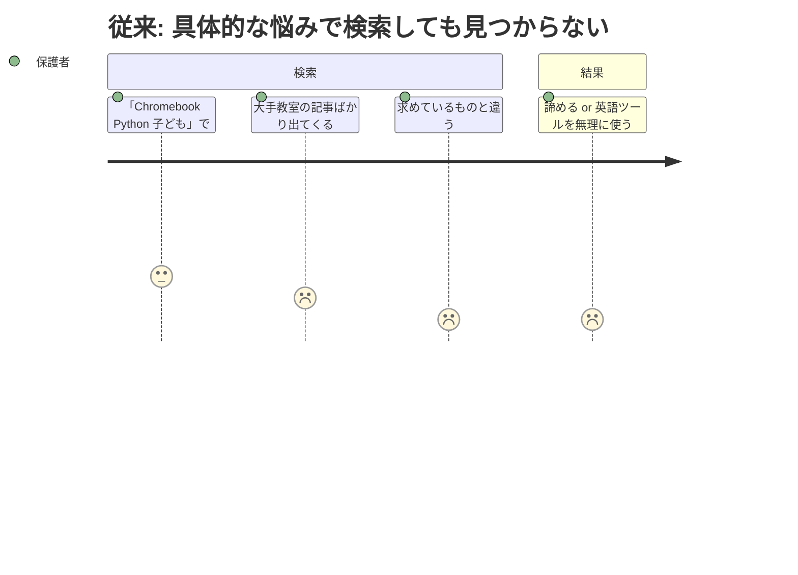
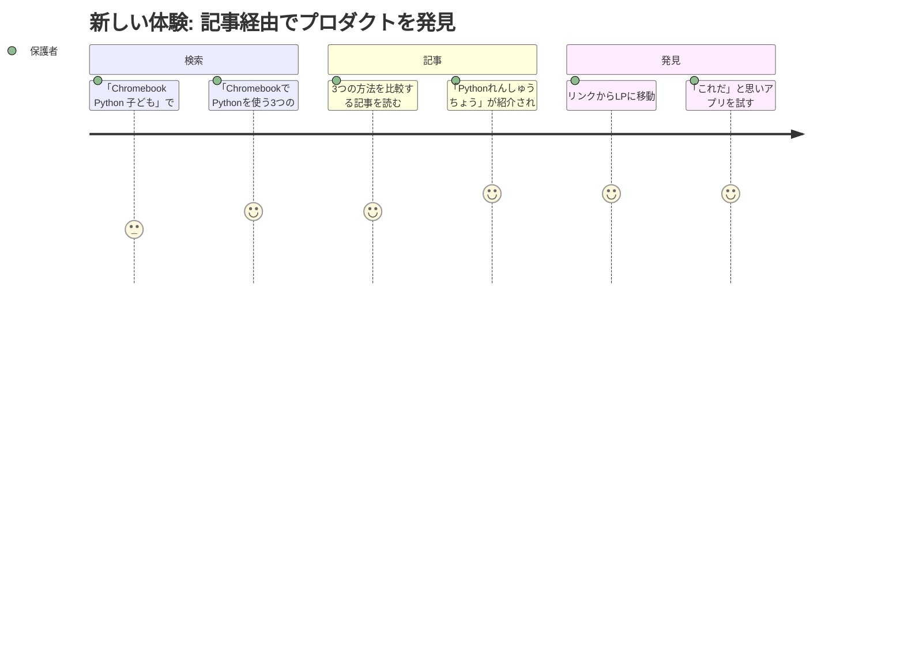

# コンテンツマーケティング・被リンク獲得 — Requirements

## 概要

ブログ記事・SNS発信を通じてLPへの被リンクと検索流入を獲得し、ターゲットキーワードでの検索順位を高める。

## 背景

LP単体ではドメインオーソリティが低く、ターゲットキーワードで上位表示するのが困難。また、LP以外のコンテンツがないため、ロングテールキーワード（「Chromebook Python 子ども」等）で保護者・教師がたどり着く経路が存在しない。外部プラットフォームで記事を公開し、そこからLPへリンクを張ることで、検索エンジンの評価を高めつつ、新たな流入経路を作る。

## ユーザーストーリー

### ストーリー1: 保護者がロングテールキーワードでプロダクトを発見する

| ユーザー | 保護者（意思決定者） |
|---|---|
| ジョブ | 子どものプログラミング学習環境を見つける |
| 課題 | 「Chromebook Python 子ども」等の具体的な悩みで検索しても、PythonれんしゅうちょうのLPが出てこない |
| 従来のタスク | 検索上位の大手プログラミング教室の記事を読むが、求めているものと違う |
| 従来のコスト | 30分以上検索しても見つからず諦める |
| 新しいタスク | 記事「ChromebookでPythonを使う3つの方法」を読み、記事内のリンクからLPに辿り着く |
| 新しいコスト | 検索→記事→LP→アプリ試用まで5分 |





### ストーリー2: 教育系ブロガーがプロダクトを紹介する

| ユーザー | 教育系ブロガー |
|---|---|
| ジョブ | 子ども向けプログラミングツールのまとめ記事を書く |
| 課題 | 良質な無料ツールを探しているが、Pythonれんしゅうちょうの存在を知らない |
| 従来のタスク | 既知のツール（Scratch、Code.org等）だけで記事を書く |
| 従来のコスト | 記事に新しさがなく、読者の反応が薄い |
| 新しいタスク | 掲載依頼を受けてプロダクトを試し、まとめ記事に追加する |
| 新しいコスト | ツールを10分試すだけ（無料・登録不要のため） |

### ストーリー3: 途上国の教師が母語のPython教材として発見する（多言語対応後）

| ユーザー | 途上国の公立校教師（例: インドのヒンディー語教師） |
|---|---|
| ジョブ | 母語でPythonを教えるための教材を見つける |
| 課題 | ヒンディー語でPythonを教える教材がほぼ存在しない |
| 従来のタスク | 英語の教材を自力で翻訳して使う |
| 従来のコスト | 毎回の授業準備に1時間以上 |
| 新しいタスク | Product Huntの紹介記事やRedditのスレッドからプロダクトを発見し、ヒンディー語UIで授業に使う |
| 新しいコスト | 発見後すぐに利用開始（無料・登録不要） |

## 受け入れ条件（Gherkin形式）

### ロングテールキーワードから記事経由でLPに到達できる

```gherkin
Given 「ChromebookでPythonを使う3つの方法」という記事がZennに公開されている
When  保護者が「Chromebook Python 子ども」で検索する
Then  検索結果に記事が表示される
  And 記事内にLPへのリンクが含まれている
  And リンクをクリックするとLPに遷移する
```

### 記事がLPへの被リンクとして機能する

```gherkin
Given 外部プラットフォーム（note/Zenn）に記事が3本以上公開されている
  And 各記事からLPへのリンクが張られている
When  Googleが記事をクロール・インデックスする
Then  GSCの「リンク」レポートでnote/ZennからのリンクがLP向けに確認できる
```

### 教育系まとめ記事にプロダクトが掲載される

```gherkin
Given 運営者が教育系まとめ記事の運営者に掲載を依頼した
When  掲載が承認され、記事にPythonれんしゅうちょうが追加される
Then  GSCの「リンク」レポートでそのサイトからの被リンクが確認できる
  And 検索順位の改善に寄与する
```

### SNS発信からLPへの流入が発生する

```gherkin
Given X(Twitter)でプロダクトに関する投稿を週2回以上行っている
When  投稿にLPへのリンクが含まれている
Then  投稿経由でのLP訪問が発生する（GSCのリファラーで確認）
```

## 前提・制約

- 予算: ゼロ（有料広告・PR記事は使わない）
- 人的リソース: 1人（個人開発者。プロダクト開発が最優先）
- コンテンツ作成にかけられる時間: 週2-3時間程度
- ブログ基盤: 外部サービス（note, Zenn）を使用。自前構築はしない
- 多言語対応: 進行中 → 英語版リリース後に国際プラットフォーム（Product Hunt, Reddit等）展開が可能になる

## 成功指標

- 最初のブログ記事が公開され、LPへのリンクが設置されていること
- 3ヶ月以内に記事3本以上を公開すること
- 外部サイトからの被リンクを1本以上獲得すること（GSCの「リンク」レポートで確認）
- ロングテールキーワードからの検索流入が発生すること（seo-tracking.mdで確認）

## スコープ外

以下はこのフェーズでは実施しません:

- 有料広告（Google Ads, SNS広告）
- PR記事・タイアップ
- 動画コンテンツ（YouTube）
- メールマガジン・LINE公式アカウント
- 自前ブログ基盤（/blog/）の構築
- 国際プラットフォーム展開（英語版リリース後に別ステアリングで対応）

## 参照ドキュメント

- `docs/marketing-problems.md` — P1: 発見経路の不在（残課題: 被リンク獲得）、P3: Passive Lookingへのリーチ
- `docs/steering/20260329-rank-tracking/` — 検索順位の計測（効果測定に使用）
- `docs/multilingual-market-analysis.md` — 多言語展開時の国際リーチ戦略
