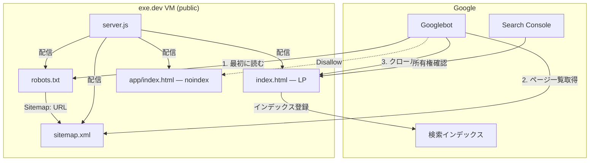
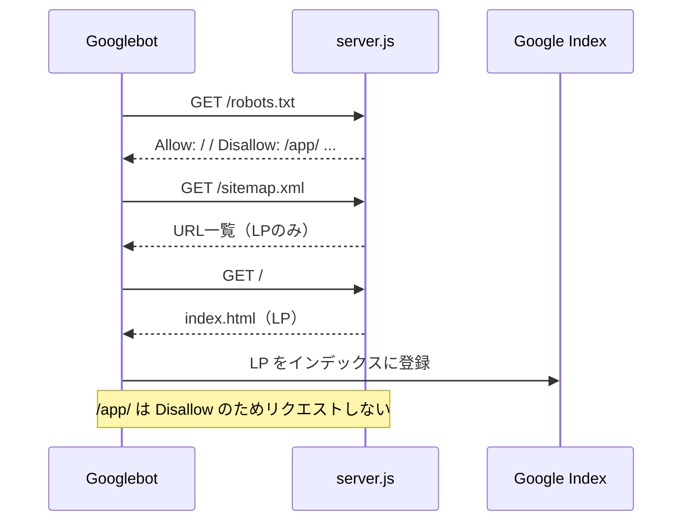
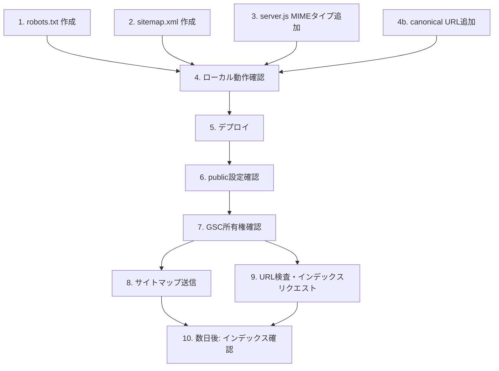

# Google Search Console 登録・インデックス確認 — Design

## アーキテクチャ概要

Googleのクローラーがサイトを効率的に巡回・インデックスできる状態を作る。具体的には (1) クローラー向けファイル（robots.txt, sitemap.xml）の追加、(2) server.jsの対応、(3) GSC登録の3つ。



## コンポーネント設計

### 1. robots.txt

**責務**:
- クローラーにクロール対象/対象外を指示する
- サイトマップの所在を伝える

**設計判断: Disallowの範囲**

| パス | Disallowする？ | 理由 |
|---|---|---|
| `/app/` | Yes | noindex設定済みだが、クロール自体を止めてサーバー負荷を防ぐ |
| `/vendor/` | Yes | Pyodide（100MB超）。クロールされると無駄な帯域消費 |
| `/dist/` | Yes | JSバンドル。インデックス不要 |
| `/assets/` | **No** | OGP画像（ogp.png）をGoogleに認識させたい |
| `/scripts/` | Yes | 開発用スクリプト。公開不要 |
| `/node_modules/` | Yes | 依存パッケージ |
| `/docs/` | Yes | 内部ドキュメント |

**実装の要点**:
- 静的ファイルとしてルートに配置。server.jsの既存ファイル配信ロジックでそのまま配信される
- ただし `.txt` のMIMEタイプが未登録 → server.jsに追加が必要

### 2. sitemap.xml

**責務**:
- クローラーにインデックス対象ページの一覧と最終更新日を伝える

**設計判断: 静的 vs 動的生成**

| 方式 | メリット | デメリット |
|---|---|---|
| **静的ファイル（採用）** | シンプル、依存なし | LP更新時に手動で lastmod を更新する必要あり |
| 動的生成（server.jsで） | lastmod自動化 | サーバーロジックが複雑化。ページ1つに対してオーバーエンジニアリング |

→ 現時点でインデックス対象ページはLPの1ページのみ。静的ファイルで十分。

**実装の要点**:
- `.xml` のMIMEタイプが未登録 → server.jsに追加が必要
- `[DOMAIN]` はデプロイ先の実ドメインで埋める（exe.dev環境では `online-python.exe.xyz`）

### 3. server.js — MIMEタイプ追加

**責務**:
- `.xml` と `.txt` を正しいContent-Typeで配信する

**実装の要点**:
- 追加するMIMEタイプは2つだけ: `.xml` → `application/xml`, `.txt` → `text/plain`
- 既存のルーティングロジック（ルート直下の静的ファイルをそのまま返す）は変更不要

### 4. LPへのcanonical URL追加

**責務**:
- 検索エンジンにURLの正規形を伝え、重複コンテンツ問題を防ぐ

**設計判断: 必要か？**

ページは1つだが、以下のケースで重複が発生し得る:
- `https://online-python.exe.xyz/` と `https://online-python.exe.xyz/index.html`
- クエリパラメータ付き（`?utm_source=...`等）

→ 低コストなので追加しておく。

### 5. GSC所有権確認

**責務**:
- Googleに「このサイトの管理者である」ことを証明する

**設計判断: 確認方式の選択**

| 方式 | メリット | デメリット | exe.dev環境で使えるか |
|---|---|---|---|
| DNS TXTレコード | 最も確実 | DNSレコード編集が必要 | **不可**（exe.dev管理） |
| **HTMLファイル（第1候補）** | シンプル、ファイル1つ追加するだけ | ファイルを維持する必要あり | **可** |
| **HTMLメタタグ（第2候補）** | ファイル追加不要 | LPの `<head>` を変更する必要あり | **可** |
| Google Analytics連携 | GA導入済みなら楽 | GA未導入 | 対象外 |
| Google Tag Manager | GTM導入済みなら楽 | GTM未導入 | 対象外 |

→ **HTMLファイル方式を第1候補**とする。失敗した場合はメタタグ方式にフォールバック。

## データフロー

### クローラーがサイトを巡回する

```
1. Googlebot が robots.txt にアクセス
2. Allow/Disallow を確認し、クロール対象を決定
3. Sitemap: ディレクティブから sitemap.xml の URL を取得
4. sitemap.xml にアクセスし、ページ一覧を取得
5. LP（/）をクロールし、コンテンツを取得
6. /app/ は Disallow + noindex のためスキップ
7. インデックスに LP を登録
```



### 運営者がGSCでインデックス状況を確認する

```
1. GSC にログイン
2. URL検査で / を入力
3. 「URLはGoogleに登録されています」を確認
4. カバレッジレポートでエラーがないか確認
5. 検索パフォーマンスで表示回数・クリック数を確認
```

## テスト戦略

### 手動確認（デプロイ後）

| 確認項目 | 方法 | 期待値 |
|---|---|---|
| robots.txt配信 | `curl https://DOMAIN/robots.txt` | 200 + 正しい内容 |
| sitemap.xml配信 | `curl https://DOMAIN/sitemap.xml` | 200 + 正しいXML |
| robots.txtのContent-Type | レスポンスヘッダ確認 | `text/plain` |
| sitemap.xmlのContent-Type | レスポンスヘッダ確認 | `application/xml` |
| GSC所有権確認 | GSCダッシュボード | 「確認済み」 |
| Googleインデックス | `site:DOMAIN` で検索 | LPが表示される（数日後） |
| /app/ 除外 | `site:DOMAIN/app/` で検索 | 結果なし |

### ローカル確認（デプロイ前）

```bash
# server.js起動後
curl -I http://localhost:3000/robots.txt   # Content-Type: text/plain
curl -I http://localhost:3000/sitemap.xml  # Content-Type: application/xml
curl -s http://localhost:3000/robots.txt   # 内容確認
curl -s http://localhost:3000/sitemap.xml  # 内容確認
```

## ディレクトリ構造

```
/ （追加・変更のみ）
├── robots.txt              ← 新規
├── sitemap.xml             ← 新規
├── google[確認ID].html     ← 新規（GSCから取得）
├── index.html              ← 変更（canonical URL追加）
└── server.js               ← 変更（MIMEタイプ追加）
```

## 実装の順序



1-4b は並行作業可能。5以降は順序依存。

## セキュリティ考慮事項

- robots.txt の Disallow はクローラーへの「お願い」であり、アクセス制御ではない。/app/ 自体に機密情報がないことは確認済み（クライアント完結型アプリ）
- GSC確認用HTMLファイルにはGoogleが生成した一意のトークンが含まれる。これ自体は秘密情報ではない（公開ファイルとして配置する前提）
- sitemap.xml に内部パスを過剰に含めない（公開ページのみ）

## パフォーマンス考慮事項

- robots.txt と sitemap.xml は軽量（数百バイト）。パフォーマンスへの影響はゼロ
- /vendor/（Pyodide、100MB超）を Disallow にすることで、クローラーによる無駄な帯域消費を防止

## 前提条件: exe.dev public設定

**重要**: exe.dev VMはデフォルトでprivate（VM権限者のみアクセス可能）。Googleクローラーがアクセスするには **publicに設定する必要がある**。

```bash
ssh exe.dev share set-public online-python
```

これが未実施だとクローラーがアクセスできず、全ての施策が無効になる。実装の最初に確認すべき項目。
