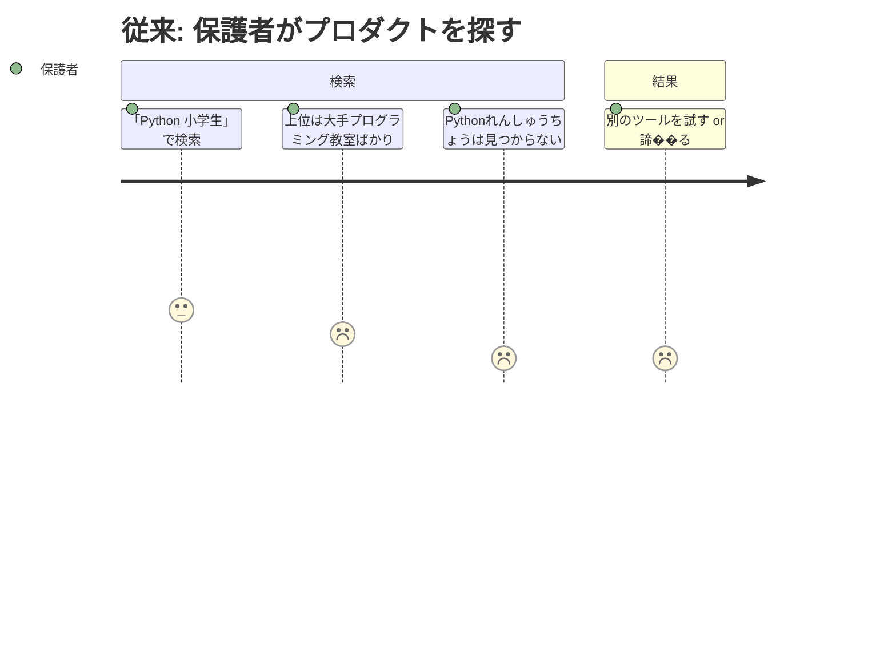
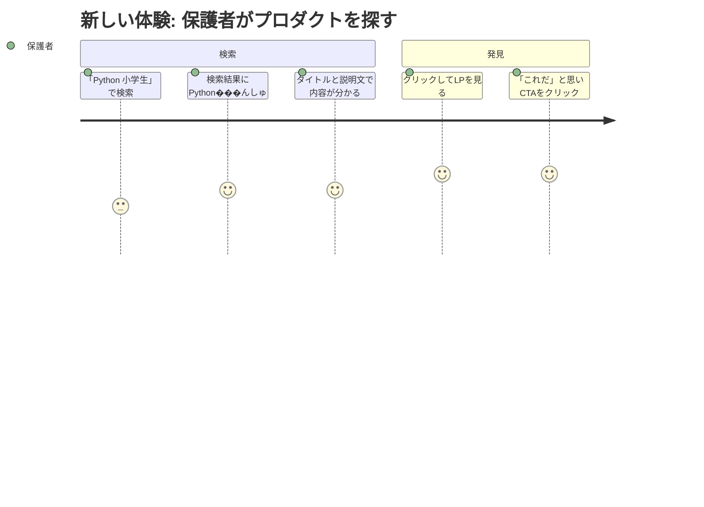

# Google Search Console 登録・インデックス確認 — Requirements

## 概要

LPを Google 検索結果に表示させるために、Google Search Console（GSC）への登録とインデックス確認を行う。

## 背景

LP は公開済みだが、Google がこのサイトの存在を認識しているか分からない状態にある。保護者が「Python 小学生」等で検索しても、LPが検索結果に出てこない可能性が高い。GSC に登録してインデックスを促進し、検索経由でユーザーがプロダクトを発見できる状態を作る必要がある。

## ユーザーストーリ���

| ユーザー | 保護者（意思決定者） |
|---|---|
| ジョブ | 子どものプログラミング学習環境を見つける |
| 課題 | 「Python 小学生」で検索しても Pythonれんしゅうちょう が出てこない |
| 従来���タスク | 直接URLを知っている人からの口コミでしか辿り着けない |
| 従来のコスト | ほぼ発見不可能（知人経由のみ） |
| 新しい��スク | Google検索で関連キーワードを入れると検索結果に表示される |
| 新しいコスト | 検索1回（数秒） |





## 受け入れ条件（Gherkin形式）

### サイトがGoogleに認識される

```gherkin
Given LPが公開されている
When  Googleのクローラーがサイトを訪問する
Then  LPページ（/）がインデックスに登録される
  And アプリページ（/app/）はイン���ックスから除外される
```

### 検索結果に表示される

```gherkin
Given LPがGoogleにインデックスされている
When  保護者が「Python 小学生」等のターゲットキーワードで検索する
Then  検索結果にPythonれんしゅうちょうのLPが表示される
  And タイトルとmeta descriptionが正しく表示される
```

### クロール状況を把握できる

```gherkin
Given GSCにサイトが登録されている
When  運営者がGSCのダッシュボードを確認する
Then  インデックス状況（登録済み/除外/エラー）が確認できる
  And 検索クエリごとの表示回数・クリック数が確認できる
```

### クローラーが効率的に巡回できる

```gherkin
Given クローラーがサイトを訪問する
When  /robots.txt を読み取る
Then  クロール対象（LP）と対象外（/app/, /vendor/）が明示されている
  And sitemap.xml の場所が分かる
```

```gherkin
Given クローラーが /sitemap.xml にアクセスする
When  サイトマップを読み取る
Then  LPのURL・最終更新日が記載されている
  And noindexページ（/app/）は含まれていない
```

## 前提・制約

- ホスティング: exe.dev VM（HTTPSプロキシ経由で公開）
- ドメイン: exe.dev のサブ��メイン（独自ドメインではない）
- DNSレコード編集: 不可（exe.dev管理） → GSC所有権確認はHTMLファイル方式を使用
- 既存SEO対策: meta description, OGP, JSON-LD構造化データは設定済み

## 成功指標

- GSCでサイトの所有権が確認されること
- LP（/）がGoogleにインデックスされること（`site:` 検索で確認）
- /app/ がインデックスから除外されていること
- GSCの検索パフォーマンスレポートでデータが取得できること
- クロールエラーがゼロであること

## スコープ外

以下はこのフェーズでは実施しません:

- 検索順位の計測・改善サイクル（別ステアリング: 20260329-rank-tracking）
- コンテンツマーケティング（別ステアリング: 20260329-content-marketing）
- Google Analytics等のアクセス解析導入
- 独自ドメイ���の取得

## 参照ドキュメント

- `docs/marketing-problems.md` — P1: 発見経路の不在
- `docs/steering/20260329-growth-p1/requirements.md` — LP作成時のSEO要件（R2）
