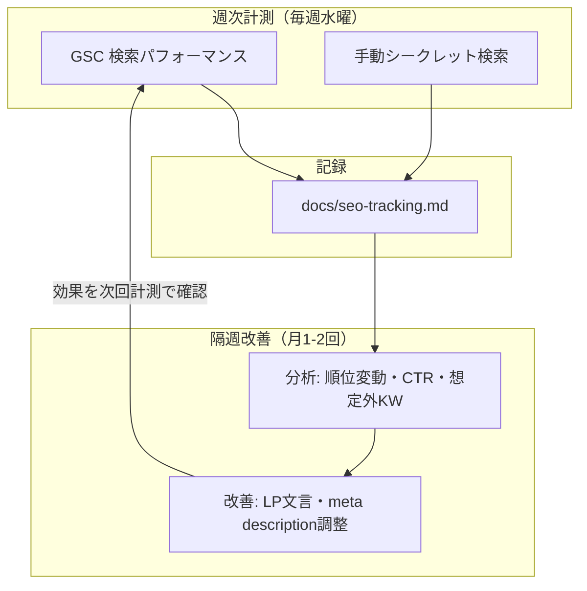
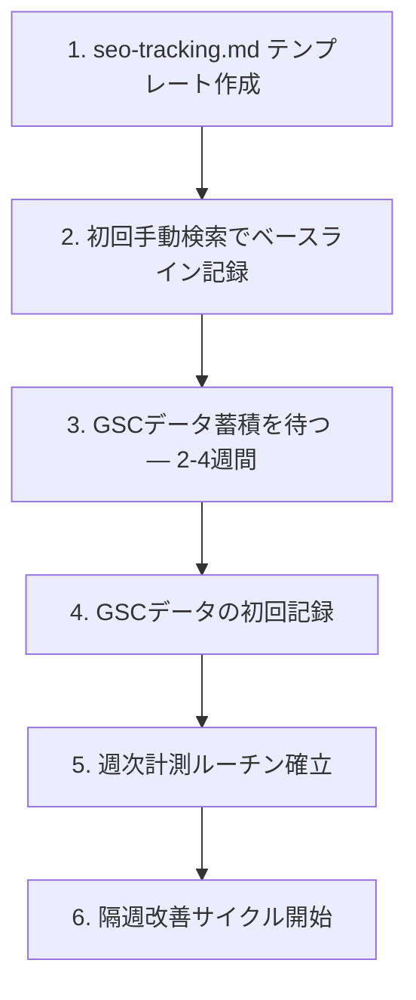

# 検索順位の計測 — Design

## アーキテクチャ概要

GSC（主要）と手動検索（補助）を組み合わせて、ターゲットキーワードの検索順位を週次で計測・記録する。記録は `docs/seo-tracking.md` に蓄積し、データに基づいたSEO改善サイクルを回す。



## コンポーネント設計

### 1. docs/seo-tracking.md（計測記録ファイル）

**責務**:
- ターゲットキーワードの定義（マスターリスト）
- 週次計測結果の蓄積
- 改善アクションの記録

**設計判断: ファイル構成 — 単一ファイル vs 月別分割**

| 方式 | メリット | デメリット |
|---|---|---|
| **単一ファイル（採用）** | 全履歴を1箇所で見られる。grep しやすい | 半年後に長くなる（推定: 週50行 × 26週 = 1,300行） |
| 月別分割（seo-tracking-2026-04.md等） | ファイルが短い | 横断的な比較が面倒。ファイルが増える |

→ 1,300行は許容範囲。四半期ごとに古い週次データを折りたたみ（`<details>`）にする運用で対処。

**設計判断: 最新の記録の配置 — 上 vs 下**

| 方式 | メリット | デメリット |
|---|---|---|
| **最新が上（逆時系列・採用）** | 開いてすぐ最新が見える | git diff が読みにくい（ファイル先頭に追記するため） |
| 最新が下（時系列） | git diff が自然 | 最新を見るのにスクロールが必要 |

→ 人間が見る頻度の方が高いので、最新が上。

**記録フォーマット**:

```markdown
## [日付] 週次レポート

### インデックス状況
- LP (/): [インデックス済み / 未インデックス]
- サイトマップ: [認識済み / 未送信]

### 検索順位（手動確認）

| KW | PC | モバイル | 前回比 |
|---|---|---|---|
| KW1 | - | - | — |

### GSCデータ（7日間）

| クエリ | 表示 | クリック | CTR | 順位 |
|---|---|---|---|---|
| python 小学生 | 120 | 3 | 2.5% | 28 |

### 想定外クエリ（GSC）

| クエリ | 表示 | クリック | 対応候補 |
|---|---|---|---|
| （該当なし or 具体的なクエリ） | | | |

### 気づき・次のアクション
- [分析結果] → [具体的なアクション]
- 例: 「KW2の表示回数は多いがCTRが1%未満」→「meta descriptionにKW2を含む文言を追加」
```

**記録ルール**:
- 手動検索の順位: 上位50位以内のみ記録。圏外は `-`
- GSCデータ: 7日間の集計値を使用
- 「気づき・次のアクション」は必ず「事実 → アクション」の形式で記述する（曖昧な感想は書かない）

### 2. 計測ルーチン

**責務**:
- 週次で計測データを収集し、seo-tracking.md に記録する

**設計判断: 計測タイミング — 何曜日か**

| 曜日 | メリット | デメリット |
|---|---|---|
| 月曜 | 週の始まりで習慣化しやすい | GSCデータが2-3日遅れるため、金土日のデータが欠ける |
| **水曜（採用）** | GSCの遅延を考慮しても月曜までのデータが含まれる。週の中日で忘れにくい | 特になし |
| 金曜 | 1週間分のデータが揃いやすい | 週末に先送りしがち |

→ **毎週水曜日に計測**。GSCの「過去7日間」フィルタで前週の水曜〜火曜のデータを取得する。

**設計判断: 改善サイクルの頻度**

| 頻度 | メリット | デメリット |
|---|---|---|
| 毎週 | 素早い反応 | 個人プロジェクトでは頻繁すぎる。SEO変動は1-2週間単位 |
| **隔週（採用）** | SEOの変動サイクルに合う。負荷が適切 | やや遅い |
| 月次 | 負荷最小 | 反応が遅すぎる |

→ **計測は毎週水曜、改善アクションは隔週**（第1・第3水曜に分析+改善）。データが2週分溜まった方が傾向が見えやすい。

### 3. GSC活用

**責務**:
- 検索パフォーマンスデータの取得
- インデックス状況の監視

**確認する画面**:

| 画面 | 確認内容 | 頻度 |
|---|---|---|
| 検索パフォーマンス → クエリ | キーワード別の表示・クリック・順位 | 毎週 |
| 検索パフォーマンス → ページ | ページ別のパフォーマンス | 毎週 |
| カバレッジ | インデックス状況・エラー | 毎週 |
| URL検査 | 個別ページのインデックス状態 | 問題発生時のみ |

**フィルタ設定**:
- **期間**: 過去7日間（週次比較用）
- **検索タイプ**: ウェブ
- **国**: 日本（当面）

**設計判断: GSCフィルタの国設定**

| 設定 | メリット | デメリット |
|---|---|---|
| **日本のみ（当面採用）** | ノイズが少ない。日本語KWの計測に集中できる | 多言語対応後の国際アクセスが見えない |
| 全世界 | 国際アクセスも把握できる | 日本語KWの計測に無関係なデータが混ざる |

→ 日本語LP向けSEOのステアリングなので、当面は「日本」。多言語LP公開後に全世界に切り替えるか、別のGSCプロパティを作るかは別ステアリングで判断。

### 4. 手動検索確認

**責務**:
- GSCデータ蓄積前のベースライン取得
- GSC順位との突合（GSCは平均値のため、実際の検索結果と異なることがある）

**設計判断: GSC順位 vs 手動検索順位が異なる場合**

GSCの「平均順位」はインプレッション加重平均であり、手動検索で見える順位とは一致しないことがある。

| 状況 | 対処 |
|---|---|
| GSC順位=15位、手動=圏外 | GSCはインプレッションが少ない特定クエリでたまたま上位表示された可能性。**手動を信頼** |
| GSC順位=30位、手動=20位 | パーソナライズの影響。**GSCを信頼**（母集団が大きい） |
| 両方圏外 | そのKWでは上位表示できていない。LP改善かコンテンツ追加が必要 |

→ **GSCのデータが蓄積されたら、GSCを主、手動を補助とする**。手動検索はGSCデータ蓄積前（最初の2-4週間）とスポット確認用。

## データフロー

### 週次計測（毎週水曜）

```
1. GSC → 検索パフォーマンス → 過去7日間 → クエリタブを開く
2. ターゲットKWの表示回数・クリック数・CTR・順位を読み取る
3. 想定外クエリ（ターゲットKW以外で表示・クリックがあるもの）を確認
4. カバレッジレポートでエラーがないか確認
5. seo-tracking.md に新しい週次レポートセクションを追記
6.（GSC蓄積前のみ）シークレットモードで手動検索し、結果を記録
```

### 隔週改善（第1・第3水曜）

```
1. 直近2週分のデータを比較
2. 以下の判断基準で改善アクションを決定:

   [判断基準]
   - 表示回数 > 100 かつ CTR < 2% → title/meta description を改善
   - 順位 30位以下 → LP本文で該当KW周辺のテキストを強化
   - 想定外KWで表示回数 > 50 → コンテンツ追加を検討（content-marketingステアリングへ）
   - 前週比で順位が5以上下落 → 競合分析（上位サイトの内容確認）

3. 改善アクションを実施
4. seo-tracking.md の「気づき・次のアクション」に記録
```

## テスト戦略

このステアリングはコード変更を伴わないため、従来のユニットテスト/統合テストは不要。代わりに以下を確認する。

### 計測記録の品質チェック

| チェック項目 | 方法 | 頻度 |
|---|---|---|
| seo-tracking.md が更新されているか | git log で最終更新日を確認 | 毎週水曜（計測ルーチンの一部） |
| 全ターゲットKWが記録されているか | KW1-KW8の全行が埋まっているか目視確認 | 毎週 |
| 「気づき・次のアクション」が空でないか | 「事実 → アクション」形式で1つ以上記載されているか | 毎週 |
| GSCデータとseo-tracking.mdの整合性 | GSCの数値と記録が一致しているか | 月次（抜き打ち） |

## ディレクトリ構造

```
docs/
├── seo-tracking.md          ← 新規作成（計測記録）
└── steering/
    └── 20260329-rank-tracking/
        ├── requirements.md  ← 既存
        ├── design.md        ← 本ファイル
        └── tasklist.md      ← 既存（要更新）
```

## 実装の順序



- 1-2 は即時実行可能
- 3 は待ち時間（GSC登録後2-4週間）
- 4-6 はGSCデータが揃い次第

## 将来の拡張性

### 多言語対応後

- 英語版LP公開後、英語キーワード（"python for kids", "browser python" 等）を計測対象に追加
- GSCフィルタを「全世界」に変更するか、言語別のGSCプロパティを作成するか検討
- seo-tracking.md に「国際版」セクションを追加、または別ファイル（seo-tracking-intl.md）に分離

### コンテンツマーケティング連携

- content-marketing ステアリングで記事を公開した後、seo-tracking.md に「コンテンツマーケティング」セクションを追加
- 記事ごとのPV・スキ・LP流入・被リンクを記録
