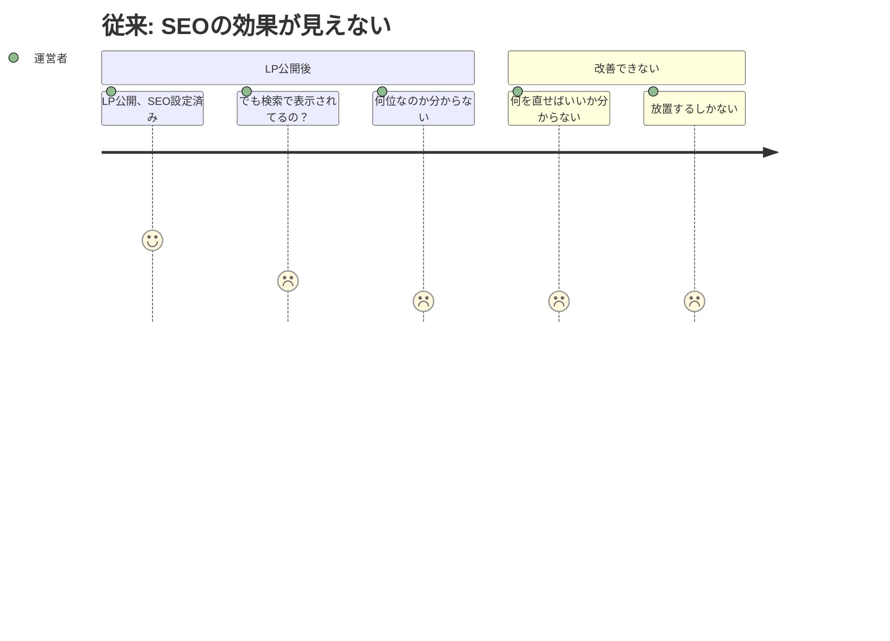
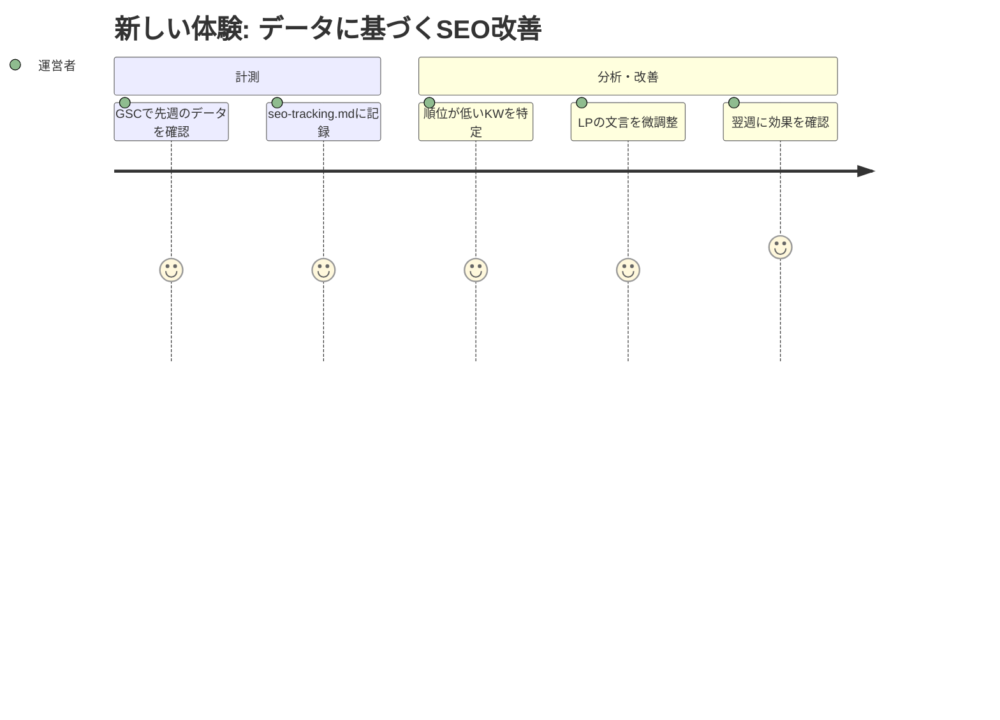

# 検索順位の計測 — Requirements

## 概要

ターゲットキーワードでの検索順位を定期的に計測・記録し、SEO施策の効果を把握できる状態を作る。

## 背景

LP公開・GSC登録まで完了したが、「実際に検索結果に表示されているのか？何位なのか？」が分からない。効果が見えなければ改善もできない。計測の仕組みを作り、データに基づいたSEO改善サイクルを回せるようにする。

## ユーザーストーリー

### ストーリー1: 運営者が現状を把握する

| ユーザー | 運営者（個人開発者） |
|---|---|
| ジョブ | SEO施策の効果を確認する |
| 課題 | LPが検索何位に出ているか分からない。施策が効いているかも不明 |
| 従来のタスク | なし（計測手段が存在しない） |
| 従来のコスト | 完全にブラインド |
| 新しいタスク | 週1回、GSCとseo-tracking.mdを見て順位の推移を確認する |
| 新しいコスト | 15分/週 |





### ストーリー2: 運営者が想定外の流入に気づく

| ユーザー | 運営者（個人開発者） |
|---|---|
| ジョブ | ユーザーが実際にどんな検索で来ているか知る |
| 課題 | 想定キーワード以外の流入があるか分からない |
| 従来のタスク | なし |
| 従来のコスト | 機会損失に気づけない |
| 新しいタスク | GSCのクエリレポートで想定外のキーワードを発見し、コンテンツに活かす |
| 新しいコスト | 計測の一環（追加コストなし） |

## 受け入れ条件（Gherkin形式）

### 週次の検索順位が記録できる

```gherkin
Given GSCにサイトが登録されている
When  運営者が週次の計測を実施する
Then  ターゲットキーワードごとの順位・表示回数・クリック数が seo-tracking.md に記録される
  And 前回との比較（上昇/下降/変化なし）が分かる
```

### 手動検索で初回のベースラインが取れる

```gherkin
Given GSCのデータがまだ蓄積されていない（登録直後）
When  運営者がシークレットモードで各ターゲットキーワードを検索する
Then  上位50位以内にLPが含まれるかどうかが記録される
  And 上位に表示されている競合サイトがメモされる
```

### 想定外のクエリを発見できる

```gherkin
Given GSCに2週間以上のデータが蓄積されている
When  運営者がクエリレポートを確認する
Then  想定キーワード以外で表示・クリックがあったクエリが特定できる
  And そのクエリをコンテンツ改善の候補として記録できる
```

### 計測データから改善アクションが導ける

```gherkin
Given 2週間分以上の計測データが seo-tracking.md に記録されている
When  運営者が順位変動を分析する
Then  「表示されているがクリックされないKW」→ title/description改善
  And 「順位が低いKW」→ LP本文のテキスト強化
  And 「想定外の流入KW」→ 新コンテンツの検討
  のような改善アクションが導ける
```

## 前提・制約

- 予算: ゼロ（有料SEOツールは使わない。GSCの無料機能のみ）
- GSC: 登録完了済み（20260329-gsc ステアリングで対処）
- 計測頻度: 週1回で十分（個人プロジェクトの規模）
- 対象キーワード: growth-p1のR2.2で定義済み（8キーワード）

## 成功指標

- seo-tracking.md が作成され、初回のベースラインが記録されていること
- GSCデータが取得可能になった時点で、週次レポートが1回以上記録されていること
- 計測データから1つ以上の改善アクションが導かれていること

## スコープ外

以下はこのフェーズでは実施しません:

- 有料SEOツール（Ahrefs, SEMrush等）の導入
- Google Analytics等のアクセス解析導入
- コンテンツマーケティング（別ステアリング: 20260329-content-marketing）
- 自動化スクリプトによる順位取得（検索エンジンの規約違反リスク）

## 参照ドキュメント

- `docs/marketing-problems.md` — P1: 発見経路の不在（残課題: 検索順位の計測）
- `docs/steering/20260329-growth-p1/requirements.md` — R2.2 ターゲットキーワード
- `docs/steering/20260329-gsc/` — GSC登録（本ステアリングの前提）
