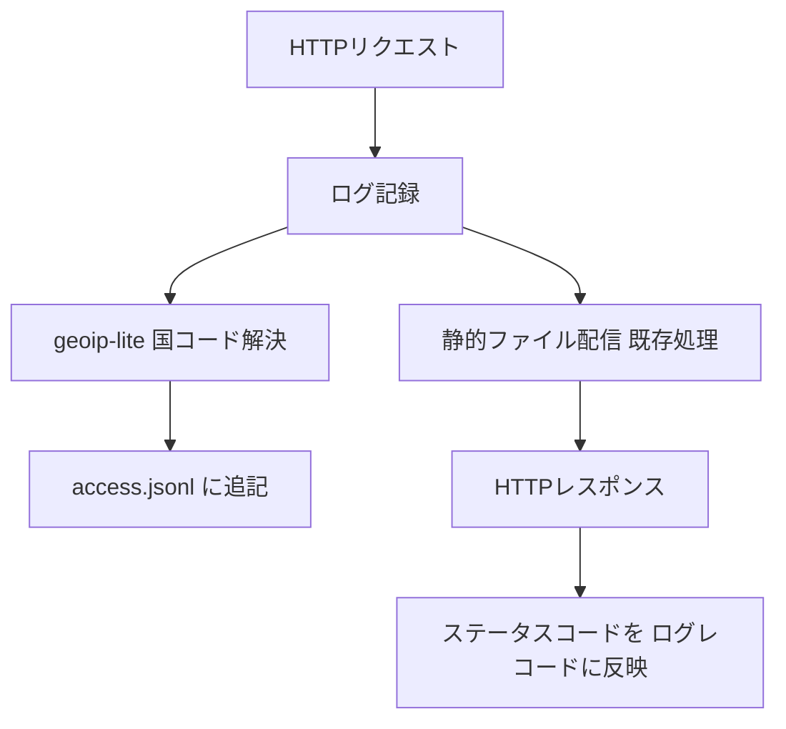
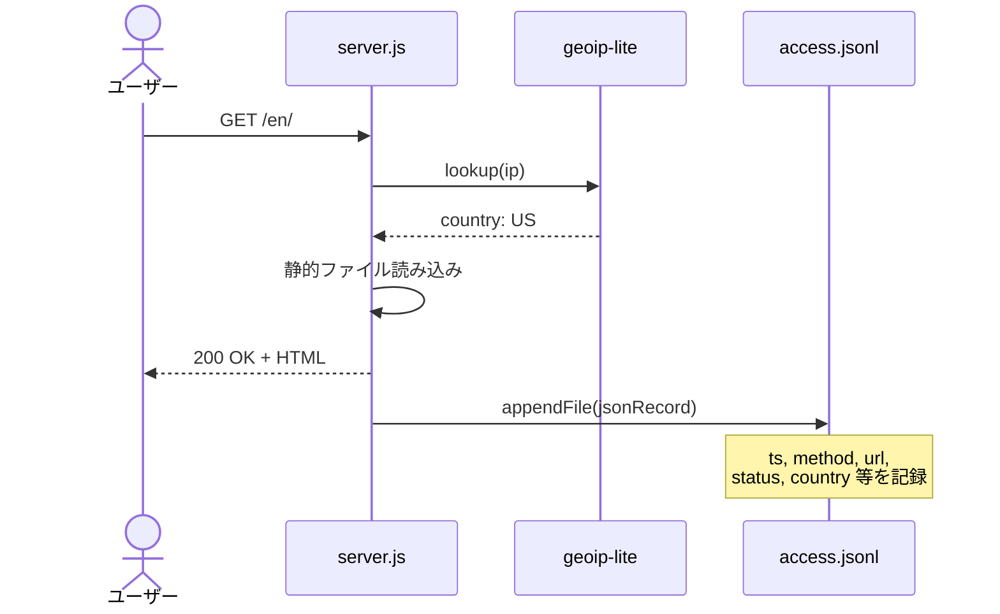
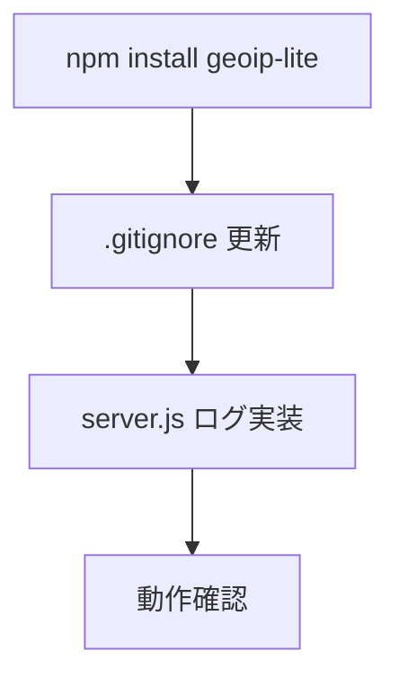

# 設計書

## アーキテクチャ概要

server.jsの既存のHTTPリクエスト処理にログ記録ミドルウェアを追加する。外部ライブラリ依存は `geoip-lite` のみ。



## コンポーネント設計

### 1. ログ記録処理（server.js内に追加）

**責務:**
- リクエスト情報を収集しJSONオブジェクトを構築
- GeoIPで国コードを解決
- レスポンス完了後にステータスコードを確定してファイルに追記

**実装の要点:**
- `fs.appendFile` で非同期追記（パフォーマンス影響を最小化）
- レスポンスのステータスコードはファイル配信の成否が確定した後に取得
- ログ記録の失敗がリクエスト処理をブロックしないこと（fire-and-forget）

### 2. GeoIP解決

**責務:**
- IPアドレスから国コード（ISO 3166-1 alpha-2）を返す

**実装の要点:**
- `geoip-lite` はメモリ内にDBを持つため、外部APIコールなし
- `req.headers['x-forwarded-for']` またはリバースプロキシ経由のIPに対応
- 解決できない場合は `null`

## データフロー

### リクエスト → ログ記録

```
1. HTTPリクエスト受信
2. リクエスト情報を取得（method, url, ua, referer, ip）
3. geoip-lite でIPから国コード取得
4. 静的ファイル配信（既存処理）
5. レスポンス送信完了
6. ステータスコード確定
7. JSONレコード構築 → access.jsonl に追記
```



## ログレコード仕様

### フィールド定義

| フィールド | 型 | 例 | 説明 |
|-----------|-----|-----|------|
| ts | string (ISO 8601) | `"2026-03-30T12:00:00.000Z"` | リクエスト受信時刻 |
| method | string | `"GET"` | HTTPメソッド |
| url | string | `"/en/"` | リクエストURL（クエリ文字列含む） |
| status | number | `200` | HTTPステータスコード |
| ua | string | `"Mozilla/5.0..."` | User-Agent |
| ref | string or null | `"https://google.com"` | Refererヘッダー |
| ip | string | `"203.0.113.1"` | クライアントIP |
| country | string or null | `"JP"` | GeoIP国コード（ISO 3166-1） |

### 出力例

```jsonl
{"ts":"2026-03-30T12:00:00.000Z","method":"GET","url":"/en/","status":200,"ua":"Mozilla/5.0","ref":"https://google.com","ip":"203.0.113.1","country":"US"}
{"ts":"2026-03-30T12:00:01.000Z","method":"GET","url":"/app/","status":200,"ua":"Mozilla/5.0","ref":"/en/","ip":"198.51.100.5","country":"JP"}
{"ts":"2026-03-30T12:00:02.000Z","method":"GET","url":"/nonexistent","status":404,"ua":"Googlebot/2.1","ref":null,"ip":"66.249.64.1","country":"US"}
```

## エラーハンドリング戦略

### ログ書き込みエラー

- `fs.appendFile` のエラーは `console.error` に出力するが、リクエスト処理は続行
- logsディレクトリが存在しない場合、サーバー起動時に `fs.mkdirSync` で作成

### GeoIP解決エラー

- `geoip-lite` がnullを返す場合（プライベートIPなど）、countryフィールドはnull

## テスト戦略

### ユニットテスト
- ログレコード構築関数のテスト（各フィールドが正しく設定されること）
- GeoIP解決がnullの場合のフォールバック

### 統合テスト
- サーバー起動 → リクエスト → access.jsonlにレコードが追記されること
- 404レスポンス時にstatus=404が記録されること

## 依存ライブラリ

```json
{
  "dependencies": {
    "geoip-lite": "^1.4.10"
  }
}
```

## ディレクトリ構造

```
online-python/
  logs/              ← 新規（gitignore対象）
    access.jsonl     ← アクセスログ出力先
  server.js          ← ログ記録処理を追加
  .gitignore         ← logs/ を追加
```

## 実装の順序

1. `geoip-lite` をインストール
2. `.gitignore` に `logs/` を追加
3. server.js にログ記録処理を追加
4. サーバー起動時にlogsディレクトリ自動作成
5. 動作確認（アクセスしてaccess.jsonlを確認）



## セキュリティ考慮事項

### データアクセス認可チェック（必須）
- access.jsonlにはIPアドレスが含まれる → 個人情報に該当する可能性
- `logs/` ディレクトリをgitignoreし、リポジトリにコミットしない
- 静的ファイル配信でlogsディレクトリが公開されないことを確認

### パストラバーサル対策
- 現在のserver.jsは `path.join(ROOT, url)` で単純に結合しているため、`logs/access.jsonl` が直接アクセス可能
- ログファイルのパスへのアクセスを拒否するか、logsディレクトリをROOT外に配置する

## パフォーマンス考慮事項

- `fs.appendFile` は非同期であり、リクエスト処理をブロックしない
- `geoip-lite` はメモリ内DB（初回ロード時にメモリに展開、約50MB）
- 高トラフィック時はバッファリングを検討するが、現段階では不要

## 将来の拡張性

- ログローテーション（日次ファイル分割）の追加が容易な構造にする
- ダッシュボードスクリプト（jq集計コマンド集）の追加
- リアルタイムモニタリング（tail -f + jq）
