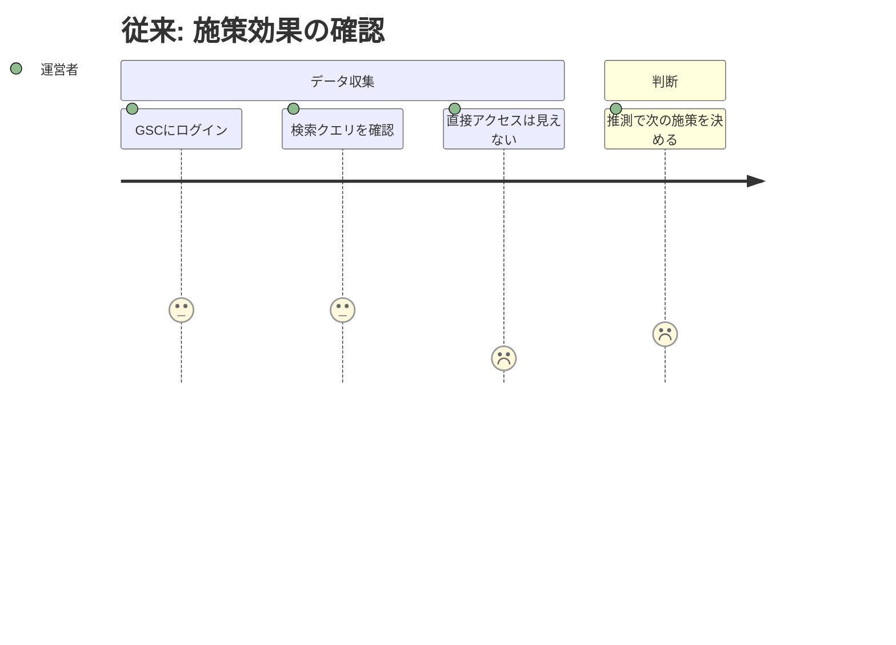
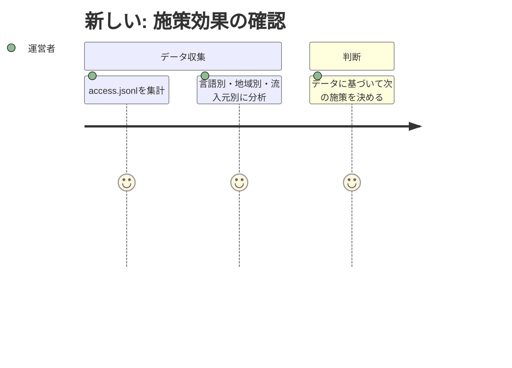

# 要求内容

## 概要

server.jsにアクセスログ記録機能を追加し、全HTTPリクエストをJSONL形式でファイルに出力する。GeoIPによるリアルタイム地域解決も行う。

## 背景

49言語LP + アプリを運用しているが、サーバーサイドのアクセスログが一切存在しない。ユーザー行動・流入元・地域・エラーの全てが不可視な状態を解消する。

## ユーザーストーリー

| 項目 | 内容 |
|------|------|
| ユーザー | プロダクト運営者（自分） |
| ジョブ | 多言語展開の効果を数値で把握し、次の施策を決める |
| 課題 | アクセスデータがゼロで、施策の効果が測定できない |
| 従来のタスク | GSCの検索データだけを見て推測する |
| 従来のコスト | 判断の精度が低く、時間をかけても確証が持てない |
| 新しいタスク | access.jsonlを集計して流入元・言語・地域を確認 |
| 新しいコスト | コマンド1つで即座にデータ確認 |





## 受け入れ条件（Gherkin形式）

### アクセスログ記録

```gherkin
Given server.jsが起動している
When  ユーザーが任意のURLにHTTPリクエストを送信する
Then  access.jsonlに1行のJSONレコードが追記される
And   レコードにはts, method, url, status, ua, referer, ip, countryが含まれる
```

### GeoIP地域解決

```gherkin
Given geoip-liteがインストールされている
When  リクエストのIPアドレスからGeoIP検索を行う
Then  国コード（例: "JP", "US"）がログレコードのcountryフィールドに記録される
And   解決できない場合はnullが記録される
```

### 404エラーの記録

```gherkin
Given 存在しないURLへのリクエストが発生する
When  server.jsが404レスポンスを返す
Then  ログレコードのstatusが404として記録される
```

### ログ出力先

```gherkin
Given server.jsが起動している
When  ログの出力先ファイルを確認する
Then  プロジェクトルートのlogs/access.jsonlに出力されている
And   logsディレクトリはgitignoreされている
```

## 成功指標

- server.js起動後、全リクエストが漏れなくログに記録される
- `cat logs/access.jsonl | wc -l` でリクエスト数が即座に確認できる
- `grep` や `jq` で言語別・地域別・ステータス別に集計できる

## スコープ外

以下はこのフェーズでは実装しません:

- ダッシュボードUI（ログはCLIで分析）
- ログのリモート転送・外部サービス連携
- ログローテーション（単一ファイルで運用開始）
- アクセス解析の自動レポート生成

## 参照ドキュメント

- docs/architecture.md — 現在のサーバー構成
- docs/seo-tracking.md — 現在のSEO計測方法
