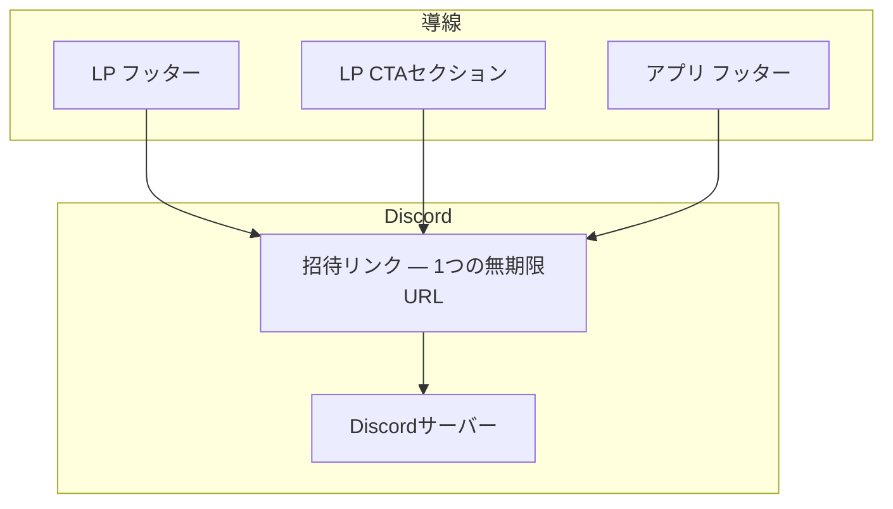
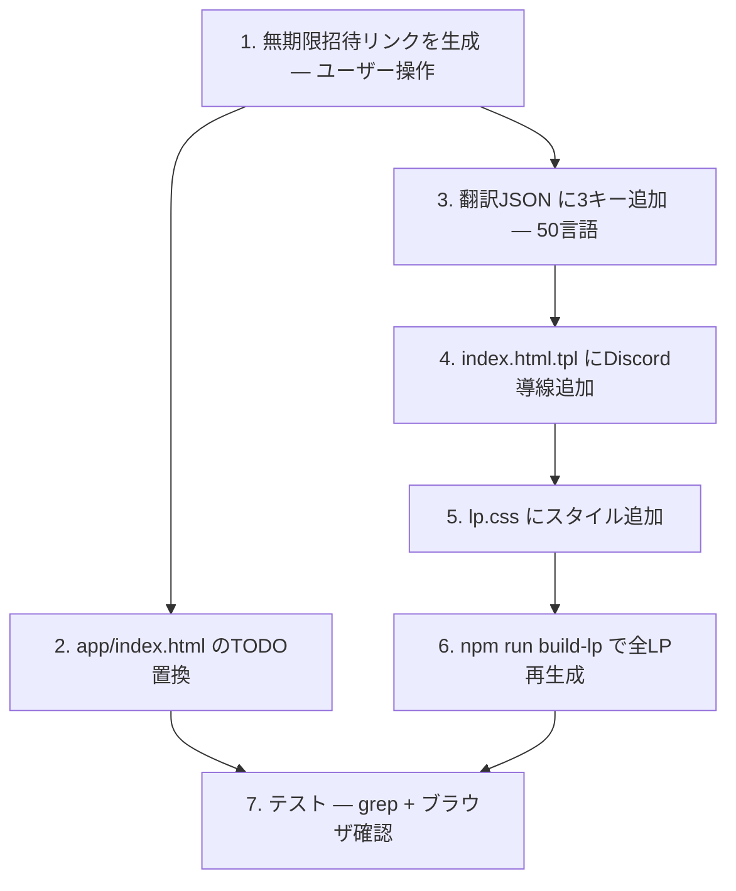

# Discord導線の整備 — Design

## アーキテクチャ概要

LP（テンプレート）とアプリの複数箇所にDiscord招待リンクを設置する。リンクテキストは多言語対応（翻訳JSON）。招待URLは1つの無期限リンクを全箇所で共有。



## コンポーネント設計

### 1. Discord招待リンク

**責務:**
- 全導線から共通でアクセスできる入口

**設計判断: 招待リンクの管理方法**

| 方式 | メリット | デメリット |
|---|---|---|
| **ハードコード（採用）** | シンプル。全箇所で同じURL | 変更時に複数ファイルを更新 |
| 環境変数/設定ファイル | 1箇所で変更可能 | ビルドプロセスが複雑化 |
| build-lp.js で変数化 | テンプレートに渡せる | LP側のみ。アプリ側は別管理 |

→ 招待リンクは頻繁に変わらない。ハードコードで十分。変更時は grep で全箇所を検索して置換。

**設計判断: 招待リンクの形式**

| 形式 | 例 | メリット | デメリット |
|---|---|---|---|
| **discord.gg/xxxxx（採用）** | `discord.gg/abc123` | 短い、覚えやすい | カスタムURLはサーバーブースト or パートナー必要 |
| discord.com/invite/xxxxx | 長い | 正規形式 | 長い |

→ `discord.gg/xxxxx` のバニティURL（カスタム短縮）が取れなければ、自動生成の招待コードを使用。

### 2. 導線の配置場所

**設計判断: LP内のどこに配置するか**

| 場所 | 視認性 | 自然さ | 採用 |
|---|---|---|---|
| Hero（最上部） | 最高 | 低（CTAと競合） | ❌ |
| Features セクション後 | 中 | 中 | ❌ |
| **CTAセクション（共有ボタンの隣）** | 高 | 高（共有 = コミュニティの文脈） | ✅ |
| **フッター** | 低 | 高（定番の位置） | ✅ |
| 専用セクション新設 | 高 | 低（セクション増えすぎ） | ❌ |

→ **2箇所に配置**: CTAセクション（共有ボタン付近）+ フッター

理由:
- CTAセクション: 「試す」CTAの直後に「コミュニティに参加」があると、次のアクションとして自然
- フッター: 定番の位置。情報を探しているユーザーが見る場所

**設計判断: アプリ内の配置**

| 場所 | 視認性 | 自然さ | 採用 |
|---|---|---|---|
| **フッター（既存のTODOを置換）** | 低〜中 | 高（既に場所がある） | ✅ |
| ツールバー内 | 高 | 低（操作UI内にコミュニティリンクは異質） | ❌ |
| エラー表示時に「翻訳がおかしい？」 | 中 | 高（文脈に合致） | 将来検討 |

→ まずフッターのTODOを置換。エラー表示時の導線は将来の改善として検討。

### 3. LPテンプレート（index.html.tpl）の変更

**変更箇所1: CTAセクション**

共有ボタンの下にDiscord導線を追加:

```html
<!-- 既存の share-section の後に追加 -->
<div class="community-section">
  <p class="community-label">{{lp.communityLabel}}</p>
  <a href="https://discord.gg/XXXXX" class="community-btn" target="_blank" rel="noopener">
    {{lp.communityButton}}
  </a>
</div>
```

**変更箇所2: フッター**

フッターにDiscordリンクを追加:

```html
<p>
  <a href="mailto:...">{{lp.footerContact}}</a> ｜
  <a href="{{privacyUrl}}">{{lp.footerPrivacy}}</a> ｜
  <a href="https://discord.gg/XXXXX" target="_blank" rel="noopener">{{lp.footerDiscord}}</a>
</p>
```

### 4. アプリ（app/index.html）の変更

**変更箇所: フッター**

```html
<!-- 変更前 -->
<a href="https://discord.gg/TODO" ...>翻訳を手伝う / Help translate</a>

<!-- 変更後 -->
<a href="https://discord.gg/XXXXX" ...>翻訳を手伝う / Help translate</a>
```

`XXXXX` は実際の招待コードに置換。

### 5. 翻訳JSONの追加キー

50言語の `translation.json` に以下のキーを追加:

| キー | 日本語 | 英語 |
|---|---|---|
| `lp.communityLabel` | コミュニティに参加しよう | Join the community |
| `lp.communityButton` | Discordに参加する | Join Discord |
| `lp.footerDiscord` | コミュニティ（Discord） | Community (Discord) |

**設計判断: 翻訳キーの追加方法**

| 方式 | メリット | デメリット |
|---|---|---|
| **LLMで全50言語を一括翻訳（採用）** | 高速。既存のi18nワークフローと同じ | 翻訳品質はLLMなり（Discordで改善可能） |
| 手動で主要5言語のみ | 高品質 | 45言語が欠落 |

→ 3キーだけなのでLLMで一括翻訳。文が短く定型的なのでLLM品質で十分。

### 6. lp.css の追加スタイル

CTAセクション内のDiscord導線スタイル:

```css
.community-section {
  margin-top: 20px;
}

.community-label {
  color: #888;
  font-size: 0.9rem;
  margin-bottom: 8px;
}

.community-btn {
  display: inline-block;
  background: #5865F2; /* Discord brand color */
  color: #fff;
  font-weight: bold;
  padding: 10px 24px;
  border-radius: 20px;
  text-decoration: none;
  font-size: 0.95rem;
}

.community-btn:hover {
  background: #4752C4;
}
```

**設計判断: ボタンの色**

| 色 | 理由 |
|---|---|
| **#5865F2 Discordブランドカラー（採用）** | 「Discord」と即座に認識される。CTAボタン（オレンジ）と差別化 |
| サイトのアクセント色（水色） | 統一感 | 「共有」と「Discord」の区別がつかない |

→ Discordブランドカラーを使用。Discordのブランドガイドラインでも推奨。

## データフロー

### ユーザーがDiscordに参加するフロー

```
1. ユーザーがLPまたはアプリを閲覧
2. 導線（CTAセクション or フッター）のDiscordリンクをクリック
3. discord.gg の招待ページが開く
4. 「参加する」をクリック
5. Discordアカウントでログイン（未ログインの場合）
6. サーバーに参加完了
```

## テスト戦略

### ビルド確認

| チェック | 方法 | 期待値 |
|---|---|---|
| LPに Discord リンクがある | `grep "discord.gg" index.html` | CTAセクション+フッターの2箇所 |
| 全言語LPにリンクがある | `grep -l "discord.gg" */index.html \| wc -l` | 49（ja以外） + 1（ja） = 50 |
| アプリのTODOが置換されている | `grep "TODO" app/index.html` | マッチなし |
| 翻訳キーが全言語にある | `npm run validate-i18n` | エラーなし |

### ブラウザ確認

- LP（日本語）: フッターとCTAセクションにDiscordリンクがある
- LP（英語）: 英語テキストでDiscordリンクが表示される
- LP（アラビア語）: RTLでも正しく表示される
- アプリ: フッターのリンクがDiscord招待ページに遷移する

## ディレクトリ構造

```
（変更のみ）
index.html.tpl       ← 変更（CTAセクション+フッターにDiscordリンク追加）
lp.css               ← 変更（community-section スタイル追加）
app/index.html       ← 変更（TODO → 実際の招待URL）
locales/*/translation.json ← 変更（3キー追加 × 50言語）
```

## 実装の順序



1 はユーザー操作（Discord画面で招待リンク生成）。2-6 は並行可能だが、3→4→6 は順序依存。

## セキュリティ考慮事項

- Discord招待リンクは公開情報（パブリックコミュニティ）
- スパム対策はDiscordサーバー側の設定（検証レベル: メール認証必須）で対処

## パフォーマンス考慮事項

- `<a>` タグとCSSの追加のみ。パフォーマンス影響ゼロ
- 外部リソース（Discord CDN等）は読み込まない

## 将来の拡張性

- エラー表示時に「翻訳がおかしい？Discordで教えてね →」のコンテキスト内導線
- Discord Widget（メンバー数表示）の埋め込み（サーバーが成長してから）
- LP にコミュニティ専用セクションを新設（メンバー数が100を超えてから）
