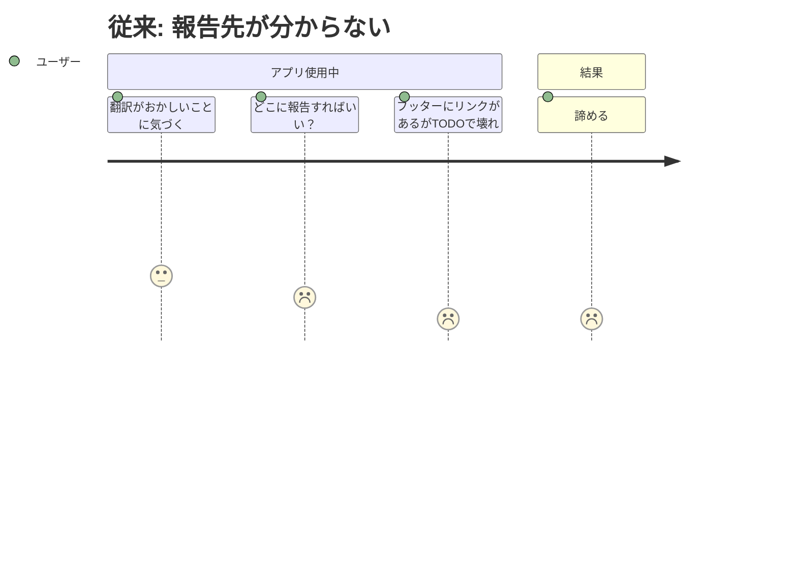
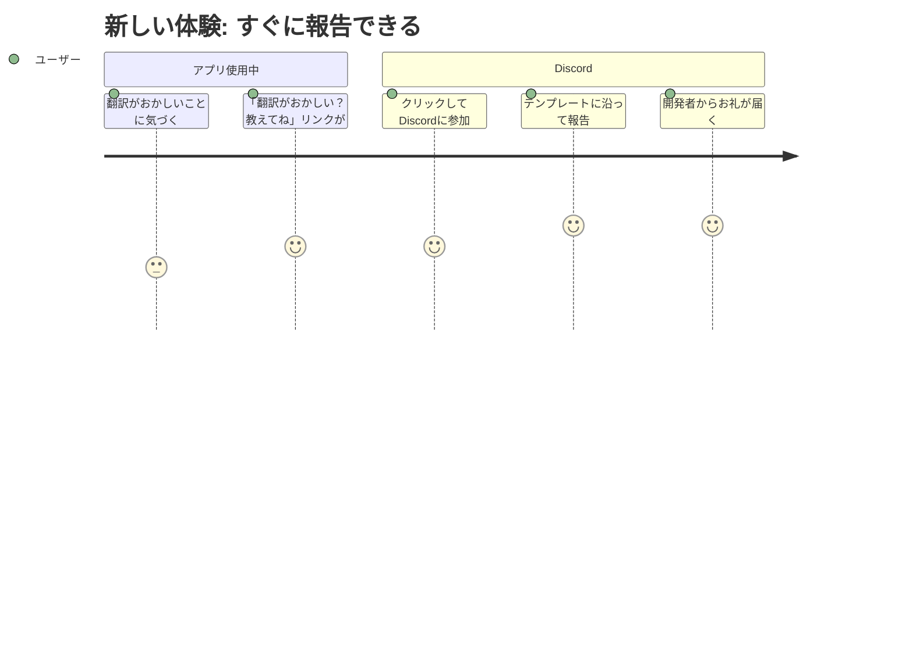

# Discord導線の整備 — Requirements

## 概要

LP・アプリの複数箇所からDiscordコミュニティへの導線を設置し、ユーザーがDiscordに参加しやすい状態を作る。

## 背景

Discordサーバーは開設済み（https://discord.com/channels/1487983651525361774/）だが、ユーザーがDiscordの存在を知り、参加する導線がほぼない。アプリのフッターに `discord.gg/TODO` というプレースホルダーが1箇所あるだけで、LPにはDiscordへの導線がゼロ。

多言語対応で50言語のLPと17言語のアプリUIが揃った今、翻訳フィードバックや国際コミュニティの成長にはDiscordへの流入が不可欠。「プロダクトを使う → 自然にDiscordに辿り着く → 参加する」という動線を複数用意する。

## ユーザーストーリー

### ストーリー1: 翻訳の問題に気づいたユーザーが報告したい

| ユーザー | バイリンガルの保護者・教師 |
|---|---|
| ジョブ | 母語の翻訳がおかしい箇所を報告したい |
| 課題 | どこに報告すればいいか分からない |
| 従来のタスク | 諦めてそのまま使う。不満が溜まって離脱 |
| 従来のコスト | 翻訳品質が改善されない。ユーザーの善意が無駄になる |
| 新しいタスク | アプリ内の「翻訳がおかしい？教えてね」リンクからDiscordに参加し、報告テンプレートに沿って投稿 |
| 新しいコスト | 5分 |





### ストーリー2: LPを見た教育者がコミュニティに興味を持つ

| ユーザー | 途上国の教師 |
|---|---|
| ジョブ | 同じツールを使っている他の教師と交流したい |
| 課題 | LPを見てプロダクトに興味を持ったが、コミュニティの存在を知らない |
| 従来のタスク | LPからアプリに遷移して終わり。孤立した利用 |
| 従来のコスト | コミュニティが成長しない。口コミが生まれない |
| 新しいタスク | LPのフッターまたはCTAセクションでDiscordコミュニティを発見し、参加する |
| 新しいコスト | 1クリック |

### ストーリー3: Product Hunt/Redditから来た開発者が貢献したい

| ユーザー | オープンソースに興味のある開発者 |
|---|---|
| ジョブ | プロジェクトに貢献したい（翻訳・コード） |
| 課題 | GitHubリポジトリは見つかるが、カジュアルに参加できるコミュニティがない |
| 従来のタスク | GitHubにIssueを立てるハードルが高い |
| 従来のコスト | 貢献者を逃す |
| 新しいタスク | LP・アプリ・GitHubのいずれからもDiscordに辿り着き、#dev チャンネルで会話開始 |
| 新しいコスト | 1クリック |

## 受け入れ条件（Gherkin形式）

### アプリのフッターからDiscordに参加できる

```gherkin
Given アプリを使っているユーザーが
When  フッターの「翻訳を手伝う / Help translate」リンクをクリックする
Then  有効なDiscord招待ページが開く（discord.gg/TODO ではない）
```

### LPからDiscordに参加できる

```gherkin
Given LPを閲覧しているユーザーが
When  フッターセクションを見る
Then  Discordコミュニティへのリンクが表示されている
  And クリックすると有効なDiscord招待ページが開く
```

### LPのCTAセクションにコミュニティ導線がある

```gherkin
Given LPの最終CTAセクション（共有ボタンの近く）を見ているユーザーが
When  「コミュニティに参加」的なリンクを見つける
Then  クリックするとDiscord招待ページが開く
```

### 50言語のLPで導線が機能する

```gherkin
Given 任意の言語版LP（例: /hi/, /ar/）を開く
When  Discord導線をクリックする
Then  有効なDiscord招待ページが開く
  And リンクテキストはその言語で表示されている
```

## 前提・制約

- Discordサーバー: 開設済み（https://discord.com/channels/1487983651525361774/）
- 招待リンク: 無期限の招待リンクを生成する必要がある
- アプリ: `app/index.html` にプレースホルダー（`discord.gg/TODO`）が既にある
- LP: `index.html.tpl` のテンプレート展開。Discord導線は現状ゼロ
- 多言語: 翻訳JSONにDiscord関連のテキストキーを追加する必要がある

## 成功指標

- アプリのフッターリンクが有効なDiscord招待URLになっていること
- 50言語の全LPにDiscord導線が表示されていること
- 各言語のリンクテキストがその言語で表示されていること

## スコープ外

以下はこのフェーズでは実施しません:

- Discord内のチャンネル構成・テンプレート設定（`20260330-discord` ステアリングで対応済み）
- Discordボット開発
- Product Hunt / Reddit への投稿（別施策）
- GitHubリポジトリへのDiscordリンク追加（手動で対応可能）

## 参照ドキュメント

- `docs/steering/20260330-discord/` — Discordサーバー構築ステアリング（前提）
- `docs/i18n-problems.md` — P9: Discordコミュニティの設計、P10: 初期メンバー獲得
- `docs/marketing-problems.md` — P9: コミュニティ構築
- `app/index.html:38` — 現在のTODOプレースホルダー
- `index.html.tpl` — LPテンプレート（Discord導線なし）
