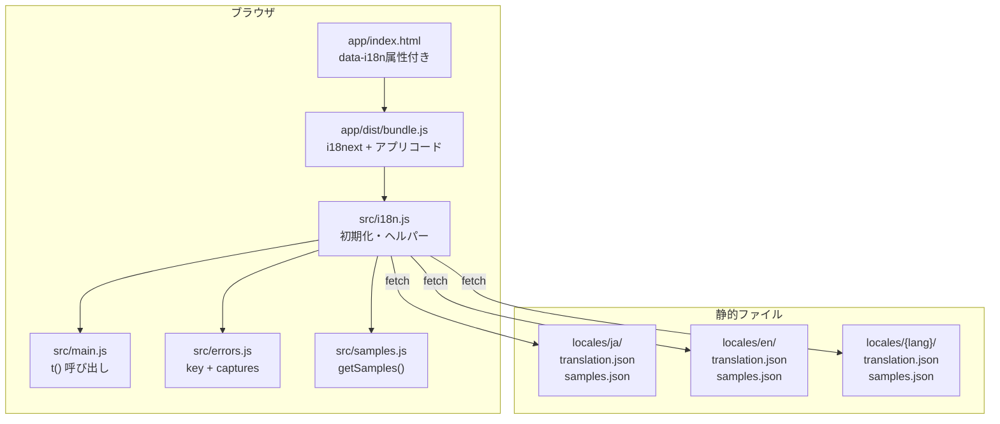
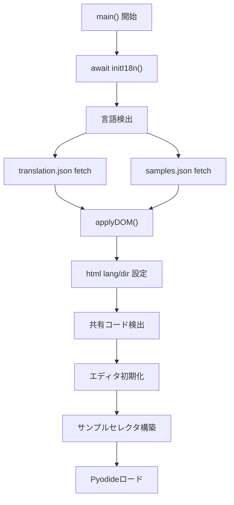
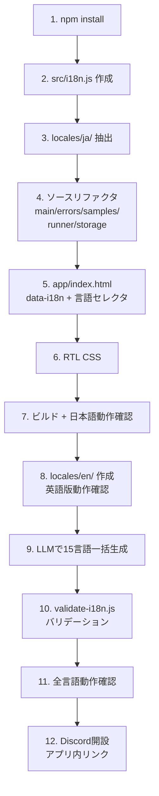

# 設計書

## アーキテクチャ概要

i18next + i18next-http-backend + i18next-browser-languagedetector を導入し、esbuildでバンドルする。翻訳データは `/locales/{lang}/` に言語別JSONとして配置し、実行時にfetchで非同期読み込みする。



---

## コンポーネント設計

### 1. src/i18n.js（新規）

**責務**:
- i18nextの初期化（プラグイン設定、言語検出、JSONロード）
- DOM翻訳の適用（`data-i18n` 属性の走査・置換）
- RTL/LTR方向の設定
- 言語切り替えAPI

**エクスポートするAPI**:

```javascript
export async function initI18n()      // 初期化。await必須
export const t = (...args) => i18next.t(...args)  // 翻訳ショートカット
export const getLocale = () => i18next.language
export async function setLocale(code) // 言語切り替え + DOM再翻訳
export const LANGUAGES = [...]        // 言語メタデータ定数
```

**実装の要点**:
- `fallbackLng: "ja"` — 翻訳がない言語は日本語にフォールバック
- `ns: ["translation", "samples"]` — 2つのネームスペース
- `backend.loadPath: "/locales/{{lng}}/{{ns}}.json"` — i18next-http-backendの規約
- `detection.order: ["querystring", "localStorage", "navigator"]` — ?lang= → localStorage → ブラウザ設定
- RTL言語リスト `["ar", "fa", "ur", "he"]` を定数で保持
- `applyDOM()` で `[data-i18n]`, `[data-i18n-alt]` を走査してtextContent/属性を置換

### 2. src/errors.js（変更）

**責務**:
- Pythonエラーメッセージの正規表現マッチング（変更なし）
- マッチしたキャプチャグループを名前付きパラメータに変換（新規）
- `t()` で翻訳キーを解決（変更）

**実装の要点**:
- `ERROR_MESSAGES` 配列の各エントリ: `message` → `key` + `captures` に変換
- `captures` はキャプチャグループ名の配列（例: `["name"]`, `["fn", "expected", "given"]`）
- `translateError()` 内で `t(entry.key, params)` を呼ぶ
- 正規表現パターンは変更しない（Pythonエラーは常に英語）

変換例:
```javascript
// 変更前
{ type: "NameError", pattern: /name '(.+)' is not defined/,
  message: "`$1` ってなに？ まだつくってないか、なまえをまちがえているよ" }

// 変更後
{ type: "NameError", pattern: /name '(.+)' is not defined/,
  key: "error.nameNotDefined", captures: ["name"] }
```

### 3. src/samples.js（変更）

**責務**:
- i18nextの `samples` ネームスペースからサンプルデータを取得

**実装の要点**:
- `export const samples = [...]` → `export function getSamples()` に変更
- `i18next.t("list", { ns: "samples", returnObjects: true })` でオブジェクト配列を取得
- i18nextのフォールバックにより、サンプルが翻訳されていない言語では日本語が返る

### 4. src/main.js（変更）

**責務**:
- アプリ初期化フローの先頭で `await initI18n()` を呼ぶ
- 全ハードコード文字列を `t()` に置換
- 言語セレクタUIのイベントハンドリング
- サンプルセレクタの動的構築（`getSamples()` から）

**実装の要点**:
- トップレベルを `async function main()` でラップし、末尾で `main()` 呼び出し
- 共有コード検出（`detectSharedCode()`）は `initI18n()` の後に移動（`confirm()` のメッセージに `t()` を使うため）
- ローディングアニメーションの文字列も `t()` に

### 5. src/runner.js（変更）

**責務**: ローディングメッセージを `t()` に置換

### 6. src/storage.js（変更）

**責務**: SNS共有テキスト `SHARE_TEXT` を `t()` に置換

---

## データフロー

### ページロード時の初期化

```
1. main() 開始
2. await initI18n()
   2a. i18next-browser-languagedetector が言語検出
       ?lang= → localStorage → navigator.language → "ja"
   2b. i18next-http-backend が /locales/{lang}/translation.json をfetch
   2c. i18next-http-backend が /locales/{lang}/samples.json をfetch
   2d. applyDOM() で data-i18n 要素を翻訳置換
   2e. <html lang> と <html dir> を設定
3. 共有コード検出（confirm() に t() を使用）
4. エディタ初期化（既存フローと同じ）
5. サンプルセレクタ構築（getSamples() から）
6. Pyodideロード開始（既存フローと同じ）
```



### 言語切り替え時

```
1. ユーザーが言語セレクタで言語を選択
2. setLocale(code) が呼ばれる
3. i18next.changeLanguage(code)
   3a. 未ロードなら /locales/{code}/translation.json をfetch
   3b. 未ロードなら /locales/{code}/samples.json をfetch
4. localStorage に preferred-lang を保存
5. <html lang> と <html dir> を更新
6. applyDOM() で全 data-i18n 要素を再翻訳
7. サンプルセレクタを再構築
```

### エラー発生時

```
1. Pyodideがエラーを投げる（英語メッセージ）
2. translateError(rawMessage) を呼ぶ
3. parseError() で型・詳細・行番号を抽出
4. ERROR_MESSAGES から pattern でマッチ
5. captures からパラメータを構築
6. t(entry.key, params) で翻訳メッセージを取得
7. 翻訳メッセージを出力 + エラー行ハイライト
```

---

## エラーハンドリング戦略

### 翻訳JSON読み込み失敗

- i18next-http-backendが fetch に失敗した場合、i18next の `fallbackLng: "ja"` が適用される
- 日本語JSONの読み込みも失敗した場合、キー文字列がそのまま表示される（`"app.run"` 等）
- → 致命的ではない。UIは使えないが、Pyodide自体は動作する

### 不正な言語コードの指定

- `?lang=xxx` のように存在しない言語を指定した場合、`supportedLngs` に含まれないためフォールバックが発動
- → 日本語で表示される

---

## テスト戦略

### バリデーションスクリプト（scripts/validate-i18n.js）

- **プレースホルダー整合性**: ja の各キーに含まれる `{{param}}` が全言語にも存在するか
- **キーの網羅性**: ja に存在するキーが全言語にも存在するか（警告レベル）
- **JSON構文**: 全JSONがパース可能か
- **サンプルコード構文**: 各言語の samples.json 内のコードが Python として構文的に有効か（オプション）

### 手動テスト

- `?lang=en` で全画面要素が英語に切り替わること
- `?lang=ar` でRTLレイアウトが適用されること
- エラーを発生させてメッセージが翻訳されること
- サンプルコードを実行してエラーなく動作すること
- 言語セレクタで切り替えがリロードなしで動くこと
- 共有URLが言語に依存しないこと

---

## 依存ライブラリ

```json
{
  "dependencies": {
    "i18next": "^24.0.0",
    "i18next-http-backend": "^3.0.0",
    "i18next-browser-languagedetector": "^8.0.0"
  }
}
```

esbuildでバンドルされるため、CDN読み込みは不要。バンドルサイズ増加: 約9KB (gzip)。

---

## ディレクトリ構造

```
locales/                          ← 新規ディレクトリ
  ja/
    translation.json              ← 既存文字列を抽出（47キー）
    samples.json                  ← 既存サンプル11セットを抽出
  en/
    translation.json              ← 英語翻訳（自力作成）
    samples.json                  ← 英語サンプル（自力作成）
  hi/, es/, ar/, pt/, id/, vi/,
  tr/, bn/, ko/, zh-TW/, fa/,
  th/, fr/, ur/, ru/
    translation.json              ← LLMで一括生成
    samples.json                  ← LLMで一括生成

scripts/
  validate-i18n.js                ← 新規: バリデーションスクリプト

src/
  i18n.js                         ← 新規
  main.js                         ← 変更: t() 呼び出し + async化
  errors.js                       ← 変更: key + captures
  samples.js                      ← 変更: getSamples()
  runner.js                       ← 変更: t() 呼び出し
  storage.js                      ← 変更: t() 呼び出し

app/
  index.html                      ← 変更: data-i18n属性 + 言語セレクタ
  style.css                       ← 変更: CSS論理プロパティ化
  dist/bundle.js                  ← 再ビルド
```

### 翻訳JSONの形式

**translation.json**: i18next標準のネストJSON

```json
{
  "app": {
    "title": "Pythonれんしゅうちょう",
    "run": "じっこう",
    "errorLine": "{{line}}ぎょうめをみてね: "
  },
  "error": {
    "nameNotDefined": "`{{name}}` ってなに？ まだつくってないか、なまえをまちがえているよ"
  }
}
```

**samples.json**: タイトル + 完全なPythonコードの配列

```json
{
  "list": [
    {
      "title": "はじめまして",
      "code": "# Scratch: 「こんにちは！という」ブロックとおなじだよ\nprint(\"こんにちは！\")\n"
    }
  ]
}
```

---

## 実装の順序



1. **npm install**: i18next関連3パッケージ
2. **src/i18n.js 作成**: 初期化・ヘルパー関数
3. **locales/ja/ 抽出**: 既存文字列をJSONに
4. **ソースリファクタ**: 5ファイルの `t()` 置換
5. **app/index.html**: data-i18n属性 + 言語セレクタUI
6. **RTL CSS**: 論理プロパティ化 + エディタ/出力のLTR固定
7. **ビルド + 日本語動作確認**: デグレがないこと
8. **英語版作成**: locales/en/ を自力作成、`?lang=en` で確認
9. **LLM一括翻訳**: 残り15言語のJSON生成
10. **バリデーション**: プレースホルダー・JSON構文チェック
11. **全言語動作確認**: 主要言語でUI・エラー・サンプルを確認
12. **Discord**: サーバー開設、チャンネル構成、アプリ内リンク追加

---

## セキュリティ考慮事項

### データアクセス

- 翻訳JSONは全て静的ファイル。認証・認可は不要
- ユーザーデータの扱いに変更なし（localStorageに `preferred-lang` が追加されるのみ）
- `preferred-lang` は個人情報ではない

### XSS

- `applyDOM()` は `textContent` で設定するため、HTMLインジェクションのリスクなし
- `data-i18n-alt` 等の属性も安全（`alt` 属性にスクリプトは注入できない）
- 翻訳JSONが改ざんされた場合でも、textContent経由のためXSSは発生しない

---

## パフォーマンス考慮事項

### バンドルサイズ

- i18next + plugins: 約9KB (gzip)。Pyodide ~10MBに対して0.09%の増加
- 翻訳JSON: 1言語あたり約4-8KB。1リクエストで読み込み

### 初回表示のちらつき（FOUC）

- HTMLに日本語テキストを残すため、日本語ユーザーにはちらつきなし
- 非日本語ユーザー向け: i18nextの初期化は高速（JSON fetch 1回）だが、低速回線では日本語が一瞬見える可能性あり
- Phase 1ではこれを許容する。Phase 2で改善を検討

### キャッシュ

- 翻訳JSONはブラウザキャッシュが効く（静的ファイル）
- 2回目以降のアクセスではfetchがキャッシュヒットし、ほぼ即座にロード

---

## 将来の拡張性

- **Phase 2（Crowdin移行）**: locales/ のJSONフォーマットはCrowdinのi18next連携とそのまま互換
- **Phase 3（LP多言語化）**: translation.jsonに `lp.*` キーを追加し、ビルド時HTML生成スクリプトから参照可能
- **Phase 4（70言語）**: `LANGUAGES` 配列と `supportedLngs` に言語を追加するだけで対応可能
- **オフライン対応**: Service Workerで翻訳JSONをキャッシュすれば、途上国の低速回線でも2回目以降は即座に利用可能
