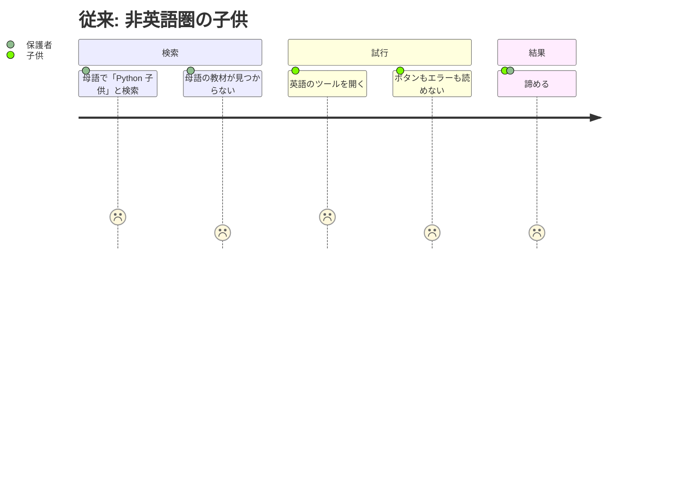
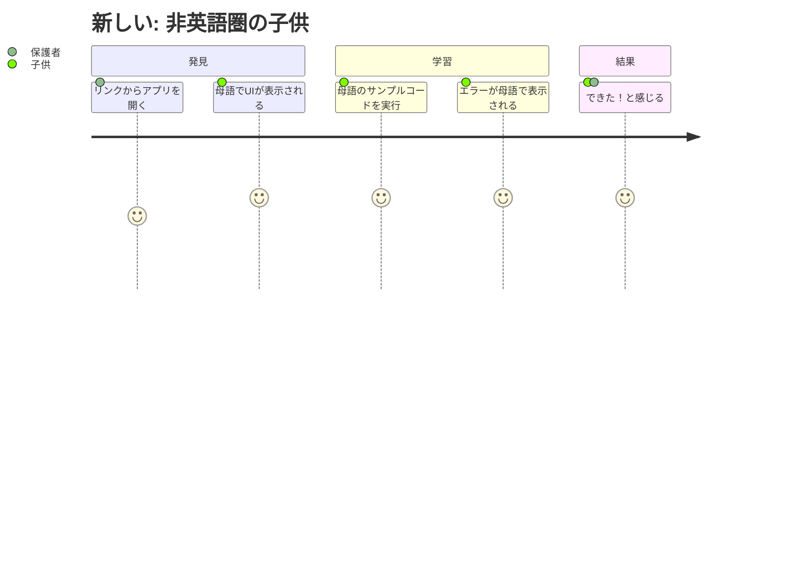

# 要求内容

## 概要

アプリ本体（`/app/`）を多言語対応し、ブラウザの言語設定や手動切り替えにより50言語でUI・エラーメッセージ・サンプルコードが表示されるようにする。初期翻訳はLLMで一括生成し、Discordコミュニティでネイティブフィードバックを得る体制を構築する。

## 背景

customer-problems.md の分析により、非英語圏の6-12歳の子供（推定6億人以上）にとって母語で使えるPython学習ツールは空白市場であることが判明した。現在のプロダクトは170+の日本語文字列がハードコードされており、日本語以外では使えない。

i18n-problems.md Phase 1 の方針に基づき、LLM翻訳 + Discord フィードバックで「完璧ではないが使える状態」を最速で全対象言語に展開する。

## ユーザーストーリー

### ストーリー1: 非英語圏の子供がPythonを学ぶ

| ユーザー | 非英語圏の子供（6-12歳）と保護者 |
|---|---|
| ジョブ | 母語でPythonプログラミングを学びたい |
| 課題 | 母語で使えるPython学習ツールが存在しない |
| 従来のタスク | 英語のツールを試す → 読めない → 諦める |
| 従来のコスト | 学習機会の完全な喪失 |
| 新しいタスク | ブラウザを開くと母語でUIが表示される。エラーも母語で読める |
| 新しいコスト | ゼロ（自動検出で即利用可能） |





### ストーリー2: 日本語ユーザーの体験を壊さない

| ユーザー | 既存の日本語ユーザー（小学生と保護者） |
|---|---|
| ジョブ | これまで通りひらがなUIでPythonを学びたい |
| 課題 | 多言語化によって日本語UIが壊れないか |
| 従来のタスク | ブラウザを開いてコードを書く |
| 従来のコスト | ゼロ |
| 新しいタスク | 何も変わらない（日本語がデフォルト、自動検出） |
| 新しいコスト | ゼロ |

### ストーリー3: ネイティブスピーカーが翻訳を改善する

| ユーザー | バイリンガルのプログラマー・教育者 |
|---|---|
| ジョブ | 母語の翻訳品質を改善したい |
| 課題 | LLM翻訳に不自然な表現がある |
| 従来のタスク | （手段がない） |
| 従来のコスト | — |
| 新しいタスク | Discordで不自然な箇所を報告する |
| 新しいコスト | 5分 |

## 受け入れ条件（Gherkin形式）

### 自動言語検出

```gherkin
Given ブラウザの言語設定がスペイン語のユーザーが
When  /app/ にアクセスする
Then  UIラベル・エラーメッセージ・サンプルコードがスペイン語で表示される
```

### 手動言語切り替え

```gherkin
Given 日本語でアプリを使っているユーザーが
When  言語セレクタから「English」を選択する
Then  ページリロードなしでUI全体が英語に切り替わる
  And 次回アクセス時も英語で表示される
```

### URLパラメータによる言語指定

```gherkin
Given 任意のユーザーが
When  /app/?lang=hi にアクセスする
Then  ヒンディー語でアプリが表示される
```

### 日本語フォールバック

```gherkin
Given 翻訳が存在しない言語（例: スワヒリ語）のブラウザで
When  /app/ にアクセスする
Then  日本語（デフォルト）でアプリが表示される
```

### RTLレイアウト

```gherkin
Given アラビア語でアプリを使っているユーザーが
When  画面を見る
Then  ボタン・ラベル等のUIレイアウトが右から左に表示される
  And コードエディタと出力エリアは左から右のまま
```

### エラーメッセージの翻訳

```gherkin
Given 英語でアプリを使っている子供が
When  print("hello" を実行してSyntaxErrorが発生する
Then  "The parenthesis ( was never closed. Add ) to close it" のような英語の子供向けメッセージが表示される
  And エラー行がハイライトされる（既存機能と同じ）
```

### サンプルコードの翻訳

```gherkin
Given ヒンディー語でアプリを使っている子供が
When  おてほんセレクタから「はじめまして」に相当するサンプルを選ぶ
Then  ヒンディー語のコメント・変数名・print文を含むPythonコードがエディタに表示される
  And そのコードを実行するとエラーなく動作する
```

### 共有URLの言語独立性

```gherkin
Given スペイン語ユーザーがコードを共有し
When  日本語ユーザーがその共有URLを開く
Then  コード自体はそのまま表示される
  And UIは日本語で表示される（受信者の言語設定に従う）
```

### 補間パラメータの整合性

```gherkin
Given 全50言語の翻訳JSONが存在する状態で
When  バリデーションスクリプトを実行する
Then  ソース言語（日本語）と同じプレースホルダーが全言語に存在する
  And 全JSONが有効な構文である
```

### Discordリンク

```gherkin
Given アプリを使っているユーザーが
When  フッターを見る
Then  Discordへの招待リンクが表示されている
```

## 成功指標

- 50言語すべてで `?lang=xx` によりUI・エラーメッセージ・サンプルコードが表示される
- RTL言語（ar, fa, ur）でUIが正しく反転し、エディタ/出力はLTRのまま
- 全言語のサンプルコードがPyodideで実行エラーなく動作する
- プレースホルダー整合性チェックが全言語でパスする
- 既存の日本語ユーザーの体験が一切変わらない（デグレなし）
- Discordサーバーが開設され、アプリ内からリンクされている

## スコープ外

以下はこのフェーズでは実装しません:

- ランディングページ（index.html）の多言語化（Phase 3）
- privacy.html の多言語化（Phase 3）
- Crowdinの導入（Phase 2）
- 子供向け表現ガイドラインの策定（Phase 2）
- 文化的適応の洗練（マスコット、カラー、おみくじ置換）（Phase 3）
- 翻訳カバレッジ閾値による非公開制御（Phase 3）
- 多言語SEO・hreflang対応（Phase 3）

## 参照ドキュメント

- [customer-problems.md](../../customer-problems.md) — セクション10: 対象言語・展開戦略
- [i18n-problems.md](../../i18n-problems.md) — Phase 1の課題分析（P1-P10）
- [multilingual-market-analysis.md](../../multilingual-market-analysis.md) — 25言語の市場分析
