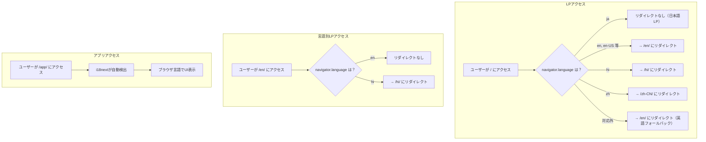
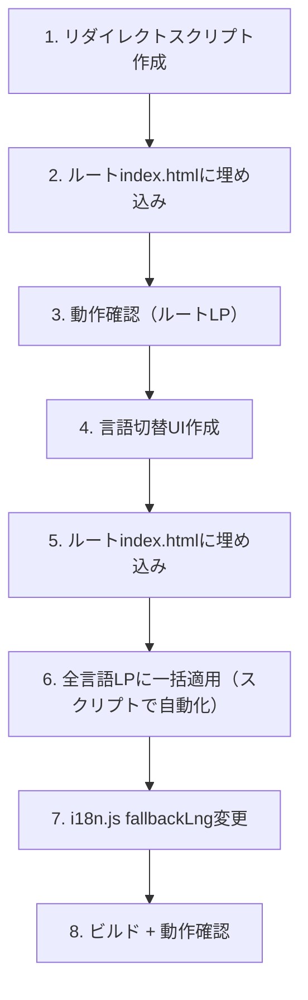

# LP言語自動リダイレクト — Design

## アーキテクチャ概要

ブラウザの言語設定に基づき、LP（ランディングページ）を自動的に適切な言語ページにリダイレクトする。加えて、LPに言語切り替えUIを追加し、アプリページのフォールバック言語を英語に変更する。

全てクライアントサイドJSで実装。サーバー変更なし。



## コンポーネント設計

### 1. リダイレクトスクリプト（LP用）

**責務**:
- `navigator.language` を読み取り、対応する言語LPにリダイレクトする
- 既に正しい言語ページにいる場合はリダイレクトしない

**設計判断: 対応言語の判定方法 — hreflangタグ vs ハードコード**

| 方式 | メリット | デメリット |
|---|---|---|
| **hreflangタグから読み取り（採用）** | 言語追加時にスクリプト修正不要。DRY | `<script>`より前にhreflangタグが必要（現状そうなっている） |
| ハードコードリスト | 高速 | 言語追加のたびにスクリプトも修正。二重管理 |

→ hreflangタグのhref属性からパスを抽出し、対応言語リストを動的に構築する。

**設計判断: 配置場所 — `<head>` 内 vs `<body>` 末尾**

| 方式 | メリット | デメリット |
|---|---|---|
| **`<head>` 内、hreflangタグの後（採用）** | DOM構築前にリダイレクト。日本語コンテンツのちらつき（FOUC）なし | headが長くなる |
| `<body>` 末尾 | head がシンプル | 日本語が一瞬表示されてからリダイレクト。体験が悪い |

**設計判断: リダイレクト方式 — `location.replace` vs `location.href`**

| 方式 | メリット | デメリット |
|---|---|---|
| **`location.replace`（採用）** | ブラウザの「戻る」で日本語LPに戻らない（リダイレクト前のURLが履歴に残らない） | なし |
| `location.href` | 「戻る」で日本語LPに戻れる | 戻る→再リダイレクトの無限ループリスク |

**設計判断: `zh` 単体の場合**

`navigator.language` が `zh`（リージョンなし）の場合 → **`zh-CN`** にマッチ。話者数で圧倒的多数のため。

**マッチングロジック**:

```
1. navigator.language を取得（例: "en-US", "zh-TW", "hi"）
2. 完全一致を試す: hreflangタグに "en-US" があるか → あればリダイレクト
3. なければ言語部分のみで試す: "en-US" → "en" で再検索
4. "zh" の場合は特例として "zh-CN" にマッチ
5. マッチしなければ英語（/en/）にフォールバック
6. 現在のURLが既にマッチ先なら何もしない（ループ防止）
7. 日本語LP（/）の場合、ブラウザ言語が "ja" なら何もしない
```

**配置対象**:

| ページ | スクリプトを入れるか | 理由 |
|---|---|---|
| `/index.html`（日本語LP） | **Yes** | トップページへの全アクセスが対象 |
| `/{lang}/index.html`（言語別LP） | **Yes** | 直リンク共有時に、ユーザーの母語に案内するため |

**ループ防止**:
- 現在のURLのパスから言語コードを抽出（例: `/hi/` → `hi`、`/` → `ja`）
- ブラウザ言語と一致していれば何もしない

### 2. 言語切り替えUI（LP用）

**責務**:
- ユーザーが手動で言語を切り替えられるセレクターをLPに追加

**設計判断: UI形式 — ドロップダウン vs ボタンリスト**

| 方式 | メリット | デメリット |
|---|---|---|
| **ドロップダウン（🌐ボタン + リスト）（採用）** | アプリと統一。50言語でもコンパクト | 実装がやや複雑 |
| ボタンリスト | シンプル | 50言語は並べきれない |

→ アプリの `#lang-selector` と同じ見た目・操作感にする。クリックで `/{lang}/` に遷移。

**設計判断: 配置場所**

| 場所 | メリット | デメリット |
|---|---|---|
| **ヘッダー右上（採用）** | 一般的な配置。ページ内容を見る前にアクセスできる | ヘッダーがないLPの場合、追加が必要 |
| フッター | 邪魔にならない | ユーザーが気づかない |

→ heroセクションの上部右端に固定配置。

**言語リストのソース**: hreflangタグから動的に生成。表示名はi18n.jsの`LANGUAGES`配列と同じにしたいが、LPはi18nextを読み込まないため、スクリプト内にハードコードする（50言語の `{code: name}` マッピング）。

**設計判断: 言語名のハードコード vs 外部JSON**

| 方式 | メリット | デメリット |
|---|---|---|
| **インラインハードコード（採用）** | 追加のHTTPリクエスト不要。速い | 言語追加時にスクリプト更新が必要 |
| 外部JSON読み込み | DRY | 非同期読み込みが必要。遅い |

→ LPは軽量を維持する方針。50言語の名前マッピングはコード量が小さい（1-2KB）のでインラインで十分。

### 3. アプリページのフォールバック言語変更

**責務**:
- i18nextのフォールバック言語を `ja` → `en` に変更

**変更箇所**: `src/i18n.js` の1行のみ

```js
// 変更前
fallbackLng: "ja",

// 変更後
fallbackLng: "en",
```

**影響**: 対応外の言語のブラウザでアプリにアクセスした場合、日本語ではなく英語が表示される。英語の方がグローバルユーザーにとって理解しやすい。

**設計判断: アプリページの自動リダイレクトは必要か？**

アプリページ（`/app/`）は既にi18next + `i18next-browser-languagedetector` で自動言語検出を行っている。ブラウザ言語に応じてUI・エラーメッセージ・サンプルコードが自動的にその言語で表示される。ページ遷移（リダイレクト）は不要。

→ アプリページは **変更不要**（フォールバック言語の変更のみ）。i18nextが既に自動検出を行っているため。

## データフロー

### ユーザーがトップページにアクセスする

```
1. ブラウザが / をリクエスト
2. server.js が index.html を返す
3. <head> 内のリダイレクトスクリプトが実行:
   a. navigator.language を取得（例: "hi"）
   b. hreflangタグを走査し、"hi" にマッチするhrefを検索
   c. マッチ → location.replace("/hi/") でリダイレクト
   d. マッチせず → location.replace("/en/") で英語にフォールバック
   e. "ja" の場合 → 何もしない
4. リダイレクト先の /{lang}/index.html が表示される
```

### ユーザーが言語別LPから言語を切り替える

```
1. ユーザーが /hi/ の🌐ボタンをクリック
2. 言語リストが表示される
3. "English" をクリック
4. location.href = "/en/" で遷移
```

## テスト戦略

### 手動テスト

| テストケース | 手順 | 期待結果 |
|---|---|---|
| 英語ブラウザ → / | Chromeの言語設定をen-USに変更して / にアクセス | /en/ にリダイレクト |
| 日本語ブラウザ → / | 言語設定をjaにして / にアクセス | リダイレクトなし |
| ヒンディー語ブラウザ → /en/ | 言語設定をhiにして /en/ にアクセス | /hi/ にリダイレクト |
| zh ブラウザ → / | 言語設定をzhにして / にアクセス | /zh-CN/ にリダイレクト |
| zh-TW ブラウザ → / | 言語設定をzh-TWにして / にアクセス | /zh-TW/ にリダイレクト |
| 対応外言語 → / | 言語設定をxyにして / にアクセス | /en/ にフォールバック |
| 🌐ボタンで切替 | /hi/ で🌐→English をクリック | /en/ に遷移 |
| 戻るボタン | リダイレクト後に「戻る」を押す | リダイレクト前のページに戻らない（replace使用） |

### ブラウザ言語の変更方法（テスト用）

Chrome: `chrome://settings/languages` → 言語を追加してトップに移動

## ディレクトリ構造

```
/（変更のみ）
├── index.html              ← 変更（リダイレクトスクリプト + 言語切替UI追加）
├── {lang}/index.html       ← 各50ファイル変更（リダイレクトスクリプト + 言語切替UI追加）
└── src/i18n.js             ← 変更（fallbackLng: "ja" → "en"）
```

## 実装の順序



1-5 はルートindex.htmlで開発・検証。6 でスクリプトにより全50言語LPに一括コピー。

## セキュリティ考慮事項

- `navigator.language` はユーザーのブラウザ設定から取得。偽装可能だが、リダイレクト先は全て自サイト内の既存ページなので、オープンリダイレクト脆弱性はない
- hreflangタグから読み取るURLはハードコードされた自サイトドメインのみ。外部URLへの遷移はない

## パフォーマンス考慮事項

- リダイレクトスクリプトは `<head>` 内でDOMパース前に同期実行。リダイレクト判定は数ミリ秒以内
- リダイレクト不要（日本語ユーザー or 既に正しいページ）の場合、オーバーヘッドはゼロに近い
- 言語切替UIの言語名マッピング（~1-2KB）はインライン。追加HTTPリクエストなし
