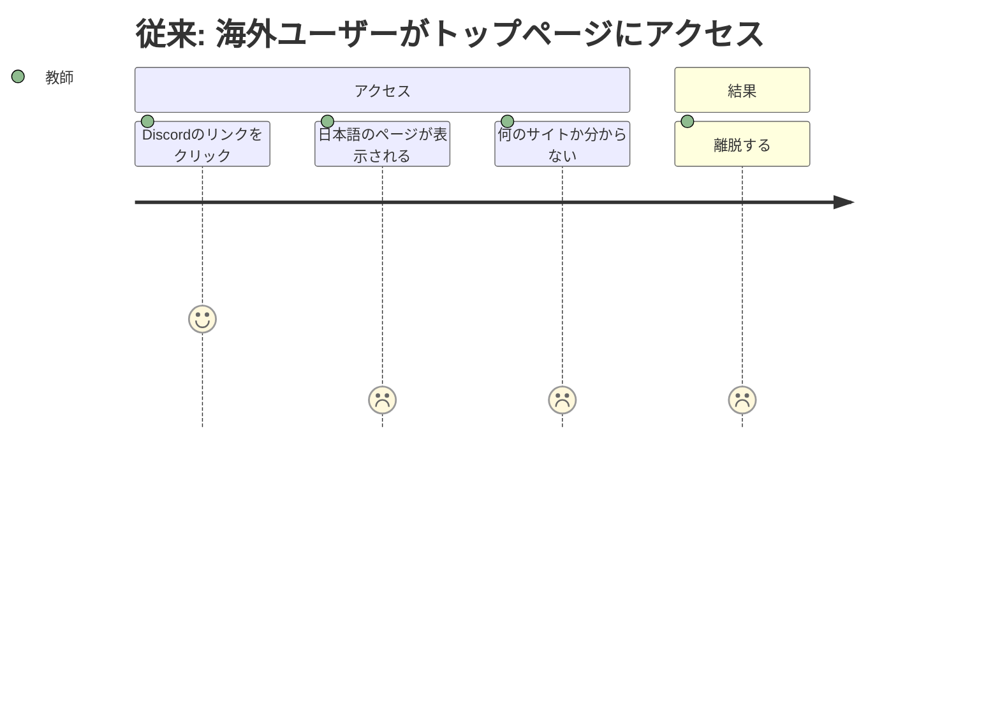
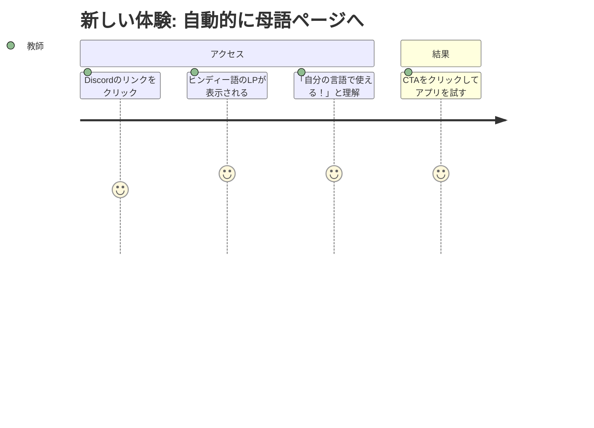

# LP言語自動リダイレクト — Requirements

## 概要

トップページ（`/`）にアクセスしたユーザーを、ブラウザの言語設定に基づいて自動的にその言語のLPに遷移させる。

## 背景

50言語のLPが `/en/`, `/hi/`, `/ar/` 等のパスに用意されているが、トップページ（`/`）は常に日本語LPを表示する。Discordで告知した `https://online-python.exe.xyz/` のリンクをクリックした海外ユーザーは、日本語ページが表示されて離脱してしまう。ブラウザの言語設定を読み取って自動的にその言語のLPに案内することで、「自分の言葉で書かれている」と感じてもらう必要がある。

## ユーザーストーリー

### ストーリー1: 海外ユーザーがリンクからアクセスする

| ユーザー | インドの教師（ヒンディー語話者） |
|---|---|
| ジョブ | DiscordやProduct Huntで見つけたツールを試す |
| 課題 | `https://online-python.exe.xyz/` をクリックすると日本語ページが出て、何のサイトか分からず離脱する |
| 従来のタスク | 日本語ページを見て混乱 → ブラウザの翻訳機能を使う or 離脱 |
| 従来のコスト | ほとんどのユーザーが離脱（数秒で判断される） |
| 新しいタスク | リンクをクリックすると自動的にヒンディー語のLPが表示される |
| 新しいコスト | ゼロ（意識せず母語ページに到達） |





### ストーリー2: 日本のユーザーは今まで通り

| ユーザー | 日本の保護者 |
|---|---|
| ジョブ | LPを見てプロダクトを理解する |
| 課題 | なし（現状のまま） |
| 従来のタスク | `/` にアクセスして日本語LPを見る |
| 新しいタスク | 変化なし。リダイレクトされない |
| 新しいコスト | ゼロ |

### ストーリー3: 対応外の言語のユーザー

| ユーザー | タイ語話者（仮にタイ語LPがない場合） |
|---|---|
| ジョブ | ツールを試す |
| 課題 | 自分の言語のLPが存在しない |
| 従来のタスク | 日本語ページが出て離脱 |
| 新しいタスク | 対応する言語がなければ日本語LPがそのまま表示される（フォールバック） |
| 新しいコスト | 変化なし（ただし、hreflangタグから他言語を見つけられる可能性はある） |

## 受け入れ条件（Gherkin形式）

### ブラウザの言語に合った LP に自動遷移する

```gherkin
Given ブラウザの言語設定がヒンディー語（hi）である
  And /hi/index.html が存在する
When  ユーザーが https://online-python.exe.xyz/ にアクセスする
Then  自動的に /hi/ にリダイレクトされる
  And ヒンディー語のLPが表示される
```

### 日本語ユーザーはリダイレクトされない

```gherkin
Given ブラウザの言語設定が日本語（ja）である
When  ユーザーが https://online-python.exe.xyz/ にアクセスする
Then  リダイレクトは発生しない
  And 日本語のLPがそのまま表示される
```

### 対応外の言語はフォールバックする

```gherkin
Given ブラウザの言語設定がタガログ語（tl）である
  And /tl/index.html が存在しない場合
When  ユーザーが https://online-python.exe.xyz/ にアクセスする
Then  リダイレクトは発生しない
  And 日本語のLPがそのまま表示される（フォールバック）
```

### リージョン付き言語コードを正しく処理する

```gherkin
Given ブラウザの言語設定が zh-TW である
  And /zh-TW/index.html が存在する
When  ユーザーが https://online-python.exe.xyz/ にアクセスする
Then  /zh-TW/ にリダイレクトされる
```

```gherkin
Given ブラウザの言語設定が en-US である
  And /en-US/ は存在しないが /en/ は存在する
When  ユーザーが https://online-python.exe.xyz/ にアクセスする
Then  /en/ にリダイレクトされる（言語部分のみでマッチ）
```

### 言語別LPにアクセスした場合もブラウザ言語にリダイレクトする

```gherkin
Given ブラウザの言語設定がヒンディー語（hi）である
When  ユーザーが https://online-python.exe.xyz/en/ にアクセスする
Then  自動的に /hi/ にリダイレクトされる
```

```gherkin
Given ブラウザの言語設定が英語（en）である
When  ユーザーが https://online-python.exe.xyz/en/ にアクセスする
Then  リダイレクトは発生しない（既に正しい言語ページ）
```

### 言語切り替えUIで手動切替ができる

```gherkin
Given ユーザーが /hi/ のLPを表示している
When  🌐ボタンをクリックし「English」を選択する
Then  /en/ に遷移する
```

### アプリページのフォールバックが英語になる

```gherkin
Given ブラウザの言語設定が対応外の言語である
When  ユーザーが /app/ にアクセスする
Then  英語のUIで表示される（日本語ではなく）
```

### ページ表示速度に影響しない

```gherkin
Given リダイレクトスクリプトが <head> に埋め込まれている
When  ページが読み込まれる
Then  リダイレクト判定は DOM 構築前に完了する（FOUC なし）
  And リダイレクト不要の場合、ユーザーに遅延を感じさせない
```

## 前提・制約

- 50言語のLPが `/{lang}/index.html` に配置済み
- `hreflang` タグが日本語LP（index.html）に全言語分記載済み
- サーバー（server.js）は `/{lang}/` → `/{lang}/index.html` のルーティング対応済み
- リダイレクトはクライアント側（JS）で行う（サーバー変更不要）
- SEOへの影響を最小限にする（Googlebotはリダイレクトされない）

## 成功指標

- 海外ユーザーがトップページまたは他言語LPにアクセスした際、自動的に母語LPに遷移すること
- 日本語ユーザーの体験に変化がないこと
- LPで言語を手動切り替えできること（🌐ボタン）
- アプリの対応外言語フォールバックが英語になること
- ページ表示速度（LCP）に有意な影響がないこと（リダイレクト判定は数ミリ秒以内）

## スコープ外

以下はこのフェーズでは実施しません:

- サーバーサイドでの `Accept-Language` リダイレクト
- `localStorage` による言語設定の記憶（リダイレクト先の保存）

## 参照ドキュメント

- `docs/i18n-problems.md` — P8: FOUC（翻訳ロード時のちらつき）
- `docs/steering/20260330-i18n-phase1/` — 多言語LP生成の実装
