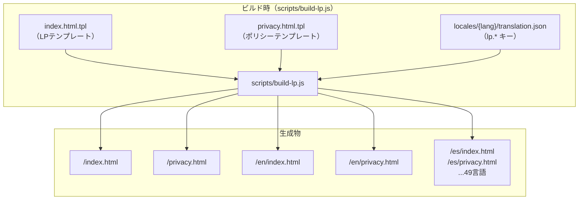
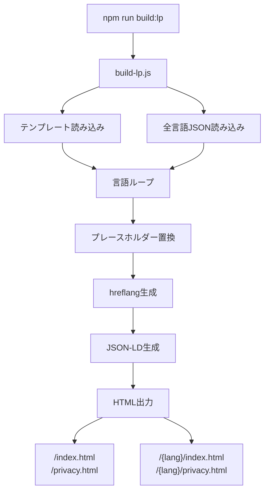
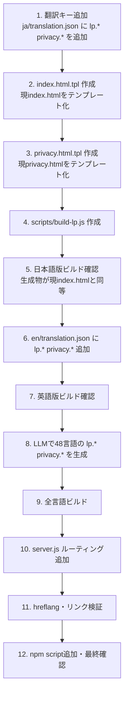

# 設計書

## アーキテクチャ概要

ビルド時にNode.jsスクリプト（`scripts/build-lp.js`）がテンプレートHTMLと翻訳JSONから各言語の静的HTMLを生成する。サーバーは静的ファイルを配信するのみ。



---

## コンポーネント設計

### 1. index.html.tpl（新規）

**責務**: ランディングページのHTMLテンプレート。`{{key}}` プレースホルダーを含む。

**実装の要点**:
- 現在の `index.html` をベースに、全日本語テキストを `{{lp.heroTitle}}` 等のプレースホルダーに置換
- `{{lang}}`, `{{dir}}`, `{{hreflangLinks}}`, `{{jsonLd}}` 等のメタ情報プレースホルダーも追加
- CTAリンクの `href="/app/"` を `href="/app/?lang={{langCode}}"` に変更（日本語の場合は `/app/` のまま）
- **コード例は言語ごとに差し替え**: `lp.example1Code`, `lp.example1Result` 等のキーで管理。日本語の「ドレミファソラシド」「はっしゃ！」は各言語の文化的同等物に置換
- **エラーデモのafter部分は言語別**: `lp.errorTranslated1`〜3 を各言語で翻訳。「英語エラー→母語翻訳」のペアで訴求力を維持
- フッターのプライバシーポリシーリンクを `/{{langCode}}/privacy.html` に

### 1.1 スクリーンショットの扱い

- **主要言語（en, es, ar, hi）**: Playwrightで `?lang=xx` のスクリーンショットを生成し、`assets/screenshots/{lang}/` に配置。テンプレートで `{{screenshotPath}}` を使用
- **その他の言語**: 英語版のスクリーンショットをフォールバックとして使用
- スクリーンショット生成は `scripts/screenshots.js` の拡張で対応

### 2. privacy.html.tpl（新規）

**責務**: プライバシーポリシーのHTMLテンプレート。

**実装の要点**:
- 現在の `privacy.html` をベースに、全日本語テキストをプレースホルダーに置換
- **i18n前にprivacy.htmlの内容を更新**: ローカルストレージの使用目的に「言語設定の保存（preferred-lang）」を追加
- `noindex` は維持（法務ページなのでSEO不要）
- トップへのリンクを `/{{langCode}}/` に変更

### 3. 翻訳キーの追加（locales/*/translation.json）

**責務**: `lp.*` と `privacy.*` ネームスペースの翻訳キーを各言語のJSONに追加。

**追加するキー（概算）**:

LPセクション別:
| セクション | キー数 | 例 |
|---|---|---|
| meta/SEO | ~6 | lp.title, lp.description, lp.ogTitle, lp.ogDescription |
| hero | ~4 | lp.heroTitle, lp.heroCatch, lp.heroSub, lp.ctaButton |
| problems | ~5 | lp.problemsTitle, lp.problem1〜4 |
| features | ~9 | lp.featuresTitle, lp.feature1Title〜4, lp.feature1Desc〜4 |
| error-demo | ~10 | lp.errorDemoTitle, lp.errorDemoIntro, lp.errorLabel*,  lp.errorTranslated* |
| scratch | ~5 | lp.scratchTitle, lp.scratchP1〜3, lp.scratchCta |
| examples | ~13 | lp.examplesTitle, lp.example1Title〜3, lp.example1Code〜3, lp.example1Result〜3, 結果テキスト |
| safety | ~9 | lp.safetyTitle, lp.safety1Title〜4, lp.safety1Desc〜4 |
| howto | ~7 | lp.howtoTitle, lp.step1Title〜3, lp.step1Desc〜3 |
| cta/share | ~3 | lp.ctaLarge, lp.ctaNote, lp.shareLabel |
| footer | ~3 | lp.footerOperator, lp.footerContact, lp.footerPrivacy |
| **合計** | **~80** | |

プライバシーポリシー:
| セクション | キー数 |
|---|---|
| タイトル + 各項目 | ~12 |

### 4. scripts/build-lp.js（新規）

**責務**: テンプレート + 翻訳JSON → 静的HTML生成。

**処理フロー**:
```
1. index.html.tpl と privacy.html.tpl を読み込む
2. 全言語の translation.json を読み込む
3. 各言語について:
   a. テンプレートの {{key}} をJSONの値で置換
   b. {{hreflangLinks}} を全言語分の<link>タグで置換
   c. {{jsonLd}} を言語別のJSON-LDで置換
   d. {{lang}}, {{dir}} を設定
   e. 日本語 → /index.html, /privacy.html に出力
      他言語 → /{lang}/index.html, /{lang}/privacy.html に出力
4. 生成されたHTMLの数を報告
```

**実装の要点**:
- テンプレートの置換は `str.replace(/\{\{(\w+(?:\.\w+)*)\}\}/g, ...)` で再帰的に解決
- hreflangは全言語分を生成（`<link rel="alternate" hreflang="en" href="https://online-python.exe.xyz/en/">`）
- `x-default` は日本語版を指す
- JSON-LDの `inLanguage` を言語ごとに設定
- 日本語版は `/index.html` に直接出力（既存URLを維持）

### 5. server.js の変更

**責務**: `/{lang}/` パスのルーティング追加。

**実装の要点**:
```javascript
// /en/ → /en/index.html
// /en/privacy.html → /en/privacy.html（そのまま）
if (url.match(/^\/([a-z]{2}(-[A-Z]{2})?)\/$/)) {
  url = `/${RegExp.$1}/index.html`;
}
```

既存の `/` → `/index.html` と `/app` → `/app/index.html` のルーティングは維持。

---

## データフロー

### ビルド時

```
1. npm run build:lp 実行
2. scripts/build-lp.js が起動
3. テンプレートファイル（.tpl）を読み込み
4. locales/ から全言語のtranslation.jsonを読み込み
5. 各言語ごとに:
   a. テンプレートのプレースホルダーを翻訳で置換
   b. hreflangリンクを挿入
   c. JSON-LDを言語別に生成
   d. HTMLファイルを出力
6. 日本語: /index.html, /privacy.html
   他言語: /{lang}/index.html, /{lang}/privacy.html
```



### リクエスト時

```
1. ユーザーが /en/ にアクセス
2. server.js が /en/index.html にマッピング
3. 事前生成された静的HTMLを配信
4. クローラーは完全にレンダリングされたHTMLをインデックス
```

---

## エラーハンドリング戦略

### 翻訳キーが不足している言語

- build-lp.js がキー不足を検出した場合、日本語のフォールバック値を使用
- 警告をコンソールに出力
- 部分的に翻訳されたHTMLでも生成は続行

### テンプレートの構文エラー

- 未置換の `{{key}}` が残った場合、ビルド完了後に警告を表示
- HTMLとしては有効（`{{key}}` がそのまま表示されるだけ）

---

## テスト戦略

### ビルド検証

- `npm run build:lp` が全言語分のHTMLを生成すること
- 生成されたHTMLが有効なHTML構文であること
- 未置換の `{{key}}` が残っていないこと

### hreflang検証

- 各言語のHTMLに全言語分の `<link rel="alternate">` が含まれること
- `x-default` が `/` を指すこと

### リンク整合性

- CTAボタンが正しい `?lang=` パラメータを持つこと
- フッターのプライバシーリンクが同言語のポリシーページを指すこと

---

## 依存ライブラリ

新規ライブラリ追加なし。`scripts/build-lp.js` は Node.js 標準モジュール（`fs`, `path`）のみ使用。

---

## ディレクトリ構造

```
index.html.tpl          ← 新規: LPテンプレート（ソース、git管理）
privacy.html.tpl        ← 新規: ポリシーテンプレート（ソース、git管理）
index.html              ← 生成物（.gitignore）
privacy.html            ← 生成物（.gitignore）
en/                     ← 生成物（.gitignore）
  index.html
  privacy.html
es/                     ← 生成物（.gitignore）
  index.html
  privacy.html
...（50言語分、すべて生成物）

scripts/
  build-lp.js           ← 新規: ビルドスクリプト

lp.css                  ← 変更: RTL対応追加
locales/*/translation.json  ← lp.* と privacy.* キーを追加
server.js               ← ルーティング追加
.gitignore              ← 生成物を除外するルール追加

assets/screenshots/
  en/                   ← 新規: 英語版スクリーンショット
  es/                   ← 新規: スペイン語版スクリーンショット
  ar/                   ← 新規: アラビア語版スクリーンショット
  hi/                   ← 新規: ヒンディー語版スクリーンショット
```

### .gitignore への追加

生成物はgit管理しない。デプロイ時に `npm run build:lp` が必須。

```gitignore
# LP generated files (built by scripts/build-lp.js)
/index.html
/privacy.html
/en/
/es/
# ... 全言語ディレクトリ（パターンで指定）
```

**注意**: 日本語の `index.html` と `privacy.html` もビルド生成物になるため、既存ファイルをgitから削除し、.tplをソースとする。

---

## 実装の順序



---

## lp.css RTL対応

LPのCSS（`lp.css`）にRTL対応を追加する。

**方針**:
- `text-align: left` → `text-align: start`
- `margin-left/right` → `margin-inline-start/end`
- `padding-left/right` → `padding-inline-start/end`
- `float: left/right` → `float: inline-start/end`
- flexboxの `direction` は `dir="rtl"` で自動反転されるため変更不要
- コード例（`<pre>`）は `dir="ltr"` を明示（Pythonコードは常にLTR）

---

## セキュリティ考慮事項

- 生成されるHTMLは全て静的ファイル。サーバーサイドの処理なし
- 翻訳JSONにHTMLタグが含まれる場合、テンプレートエンジンでエスケープが必要
  - ただし翻訳テキストにHTMLが含まれることは想定しない（プレーンテキストのみ）
  - テンプレートの `{{key}}` 置換は textContent 相当の安全な置換を使用

## パフォーマンス考慮事項

- 静的HTML配信のため、JSベースの翻訳と比べてTTFP（Time to First Paint）が高速
- 各言語のHTMLは約15-20KB。gzip圧縮で5KB程度
- 50言語 × 2ページ = 100ファイル。ディスク使用量は約2MB

## 将来の拡張性

- 言語追加時は translation.json に lp.* キーを追加して `npm run build:lp` を再実行するだけ
- OGP画像の多言語化は画像生成スクリプトの追加で対応可能
- LP内の言語切替ナビゲーションはテンプレートにUIを追加するだけ
