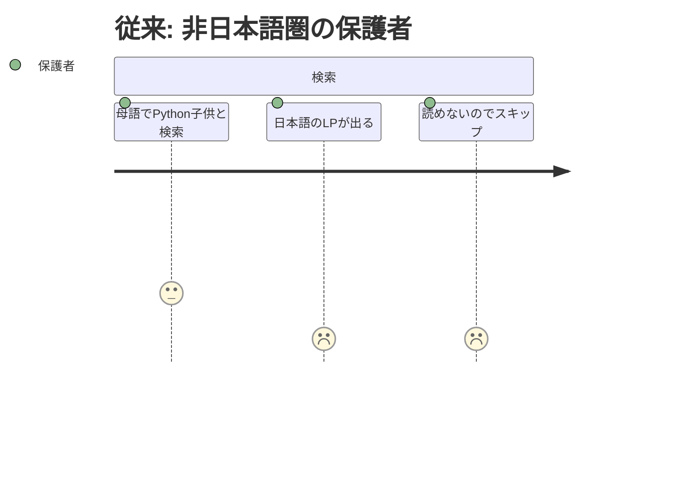
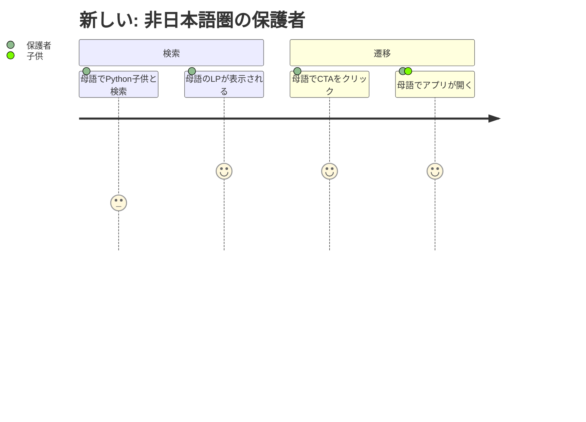

# 要求内容

## 概要

ランディングページ（`index.html`）とプライバシーポリシー（`privacy.html`）を多言語対応する。SEO対策のため、言語ごとに静的HTMLをビルド時に生成し、パスベースのURL（`/en/`, `/es/` 等）で配信する。

## 背景

i18n Phase 1 でアプリ本体（`/app/`）の50言語対応が完了した。しかしランディングページはすべて日本語のままであり、非日本語圏のユーザーがGoogle検索で発見できない。

ランディングページはアプリ本体と異なり、SEOが極めて重要。JSベースの動的翻訳ではクローラーが日本語しかインデックスしないため、言語ごとの静的HTMLを生成するビルド時アプローチが必要。

## ユーザーストーリー

### ストーリー1: 非日本語圏の保護者がGoogle検索で発見する

| ユーザー | 非日本語圏の保護者 |
|---|---|
| ジョブ | 母語で子供向けPython環境を見つけたい |
| 課題 | 母語で検索してもランディングページが日本語で表示される |
| 従来のタスク | 「Python kids」等で検索 → 日本語LPが出ても読めずスキップ |
| 従来のコスト | プロダクトの存在に気づけない |
| 新しいタスク | 母語で検索 → 母語のLPが表示される → CTAからアプリへ |
| 新しいコスト | ゼロ |





### ストーリー2: 非日本語圏のユーザーがプライバシーポリシーを確認する

| ユーザー | 非日本語圏の保護者・教育者 |
|---|---|
| ジョブ | 子供が使うツールの安全性を母語で確認したい |
| 課題 | プライバシーポリシーが日本語でしか読めない |
| 従来のタスク | 日本語のポリシーをブラウザ翻訳で読む |
| 従来のコスト | 不信感 |
| 新しいタスク | 母語のプライバシーポリシーページに直接アクセス |
| 新しいコスト | ゼロ |

## 受け入れ条件（Gherkin形式）

### 言語別ランディングページ

```gherkin
Given 英語圏のユーザーが
When  /en/ にアクセスする
Then  英語のランディングページが表示される
  And <html lang="en"> が設定されている
  And meta description が英語
  And OGタグが英語
  And CTAボタンが /app/?lang=en にリンクしている
```

### hreflangの設定

```gherkin
Given 任意の言語のランディングページで
When  HTMLソースを確認する
Then  全対応言語への <link rel="alternate" hreflang="xx"> が存在する
  And x-default が日本語版を指す
```

### 日本語版の維持

```gherkin
Given 日本語ユーザーが
When  / にアクセスする
Then  従来通り日本語のランディングページが表示される
  And 既存のSEO設定（canonical, JSON-LD等）が維持されている
```

### 言語別プライバシーポリシー

```gherkin
Given 英語のランディングページから
When  フッターの「Privacy Policy」リンクをクリックする
Then  /en/privacy.html が表示される
  And 英語のプライバシーポリシーが読める
```

### ビルドスクリプト

```gherkin
Given 開発者が
When  npm run build:lp を実行する
Then  全対応言語のindex.htmlとprivacy.htmlが生成される
  And 各HTMLに正しいlang属性、meta、hreflang、JSON-LDが含まれる
```

### server.jsのルーティング

```gherkin
Given ユーザーが
When  /en/ にアクセスする
Then  /en/index.html が配信される
  And /en/privacy.html もアクセス可能
```

### 構造化データの多言語対応

```gherkin
Given 英語のランディングページで
When  JSON-LDを確認する
Then  "name" が "Python Notebook" になっている
  And "inLanguage" が "en" になっている
```

## 成功指標

- 50言語分の静的ランディングページが生成されること
- 50言語分の静的プライバシーポリシーが生成されること
- 各言語のHTMLに正しい hreflang リンクが設定されていること
- server.js が /{lang}/ パスを正しくルーティングすること
- 日本語版（/）の既存SEO設定にデグレがないこと
- `npm run build:lp` でワンコマンド生成できること

## 設計方針の決定事項

ブレインストーミングで以下の方針を決定：

| # | 決定事項 | 方針 |
|---|---|---|
| 1 | LPのコード例（ドレミ、はっしゃ等） | **各言語で差し替え**。翻訳キーで管理 |
| 2 | エラーデモのafter部分 | **各言語版にする**。「英語エラー→母語翻訳」で訴求力維持 |
| 3 | スクリーンショット | **主要言語（en, es, ar, hi）のみ差し替え**。他は英語版フォールバック |
| 4 | privacy.htmlの内容 | **i18n前に更新**。preferred-langの保存を追記 |
| 5 | 生成物のgit管理 | **.gitignore**。.tplがソース、index.html/privacy.htmlは生成物 |
| 6 | lp.css RTL | **今回対応** |

## スコープ外

- 各言語のキーワード調査・SEO最適化（別ステアリング）
- Google Search Consoleへの各言語版登録（別ステアリング）
- OGP画像の多言語化（別ステアリング）
- 言語切替ナビゲーションのLP内設置（Phase 2で検討）

## 参照ドキュメント

- [i18n-problems.md](../../i18n-problems.md) — P18: ランディングページの多言語SEO、P19: LP i18n
- [customer-problems.md](../../customer-problems.md) — セクション10: 対象言語・展開戦略
- [steering/20260329-growth-p1/requirements.md](../20260329-growth-p1/requirements.md) — 元のLP要件
