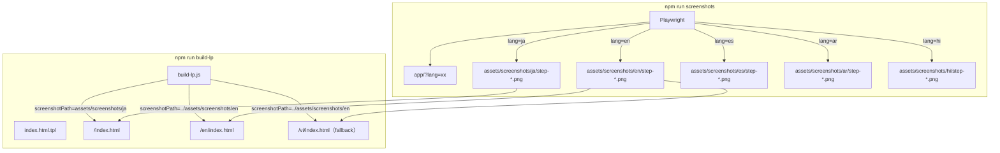
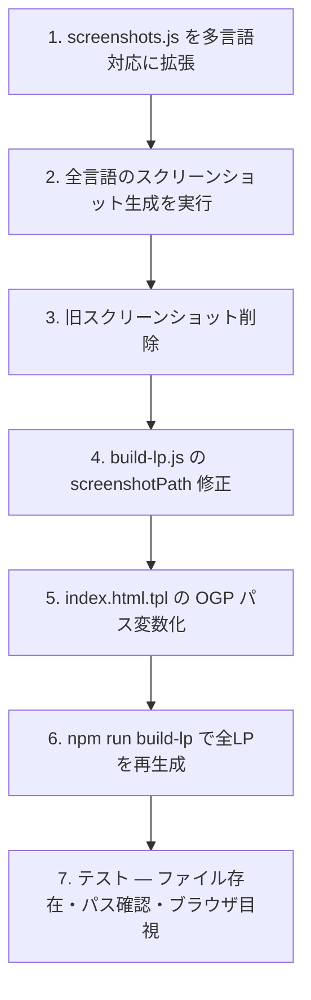

# LP スクリーンショット多言語化 — Design

## アーキテクチャ概要

Playwright で各言語のアプリUI をスクリーンショット撮影し、言語別ディレクトリに保存。build-lp.js が言語に応じたスクリーンショットパスをテンプレートに渡してLPをビルドする。



## コンポーネント設計

### 1. スクリーンショット保存先のディレクトリ構造

**設計判断: ファイル名サフィックス vs 言語別サブディレクトリ**

| 方式 | 例 | メリット | デメリット |
|---|---|---|---|
| ファイル名サフィックス | `step-run-en.png` | フラット構造 | ファイルが15個混在（5言語×3枚）。見通しが悪い |
| **言語別サブディレクトリ（採用）** | `screenshots/en/step-run.png` | 言語ごとに整理。パス構築が `{lang}/step-*.png` で統一的 | ディレクトリが増える |

→ 言語別サブディレクトリを採用。テンプレートの `{{screenshotPath}}` をそのまま活かせる。

**変更後のディレクトリ構造:**

```
assets/screenshots/
├── ja/
│   ├── step-open.png
│   ├── step-write.png
│   └── step-run.png
├── en/
│   ├── step-open.png
│   ├── step-write.png
│   └── step-run.png
├── es/
│   ├── ...
├── ar/
│   ├── ...
└── hi/
    ├── ...
```

**設計判断: 既存の `assets/screenshots/step-*.png`（ルート直下）はどうするか**

| 方式 | メリット | デメリット |
|---|---|---|
| **削除して ja/ に移行（採用）** | 構造が統一。古いパスへの参照が残らない | 既存の参照箇所を全て更新する必要あり |
| 残してフォールバックにする | 移行リスク低 | 二重管理。どちらが正なのか曖昧 |

→ 削除。テンプレートの `{{screenshotPath}}` で全てカバーされているため、ルート直下のファイルは不要になる。

### 2. screenshots.js の拡張

**責務:**
- `SCREENSHOT_LANGUAGES` の全言語について、アプリのスクリーンショットを撮影
- 各言語のOGP画像を生成

**設計判断: 各言語のアプリUIをどう切り替えるか**

| 方式 | メリット | デメリット |
|---|---|---|
| **`?lang=xx` クエリパラメータ（採用）** | アプリ既存のi18n機能をそのまま利用。コード変更不要 | アプリ側のi18nが正常動作していることが前提 |
| localStorageを事前設定 | 確実 | Playwright で localStorage 操作が必要。やや複雑 |
| HTMLを直接書き換え | 完全制御 | アプリの実際の見た目と乖離するリスク |

→ `?lang=xx` が最もシンプル。アプリは既に `?lang=xx` で言語切替可能。

**設計判断: 各言語で入力するコード例は何にするか**

現状（日本語）: `print("こんにちは！")`

各言語で同等の「Hello」コードを入力する:

| 言語 | コード例 | 出力 |
|---|---|---|
| ja | `print("こんにちは！")` | こんにちは！ |
| en | `print("Hello!")` | Hello! |
| es | `print("¡Hola!")` | ¡Hola! |
| ar | `print("!مرحبا")` | !مرحبا |
| hi | `print("नमस्ते!")` | नमस्ते! |

→ これらはスクリプト内にハードコードする（翻訳JSONから取得する方式もあるが、5言語だけなのでオーバーエンジニアリング）。

**設計判断: ハードコード vs 翻訳JSONから取得**

| 方式 | メリット | デメリット |
|---|---|---|
| **ハードコード（採用）** | シンプル。言語追加時に明示的に更新する | SCREENSHOT_LANGUAGES を増やすとき更新忘れリスク |
| 翻訳JSONから取得 | 自動的に全言語対応 | JSONにスクリーンショット用コード例キーを追加する必要。50言語分のコードが必要になり現時点ではオーバー |

→ 5言語なのでハードコード。将来SCREENSHOT_LANGUAGESを増やす場合にこのマッピングも更新する旨をコメントに明記。

**設計判断: 出力の待機方法**

各言語でコードを実行後、出力エリアにテキストが表示されるのを待つ必要がある。

| 方式 | メリット | デメリット |
|---|---|---|
| **出力テキストを言語ごとに待機（採用）** | 確実に出力完了を検知 | 言語ごとに期待テキストを指定する必要あり（上のコード例マッピングと同じ） |
| 固定 sleep（3秒等） | シンプル | 不確実。Pyodideのロード時間はばらつく |
| 出力エリアが空でないことを待機 | 言語非依存 | 既存のテキスト（プレースホルダ等）があると誤検知 |

→ 言語ごとの期待テキストで待機。コード例マッピングに出力テキストも含める。

### 3. build-lp.js の修正

**責務:**
- `screenshotLang` をスクリーンショットパスに反映する（現在は未使用変数）

**変更箇所（2行）:**

```js
// 変更前（L109）
const screenshotPath = `${assetsPath}/screenshots`;

// 変更後
const screenshotPath = `${assetsPath}/screenshots/${screenshotLang}`;
```

これだけで全言語のLPに正しいスクリーンショットパスが入る。`screenshotLang` は既にL104で計算済み。

**設計判断: OGP画像のパスも言語別にするか**

現状のテンプレート（L11）:
```html
<meta property="og:image" content="/assets/ogp.png">
```

| 方式 | メリット | デメリット |
|---|---|---|
| **言語別OGP（`/assets/ogp-{lang}.png`）（採用）** | SNSシェア時にその言語のプロダクト名が表示される | OGP画像の生成・管理が増える |
| 全言語共通（現状のまま） | 管理が楽 | 日本語OGPが全言語で表示される |

→ 言語別OGP を採用。テンプレートとbuild-lp.jsにOGPパス変数を追加。

### 4. index.html.tpl の修正

**変更箇所:**

OGP画像のパスをテンプレート変数化（L11）:

```html
<!-- 変更前 -->
<meta property="og:image" content="/assets/ogp.png">

<!-- 変更後 -->
<meta property="og:image" content="{{ogpImageUrl}}">
```

build-lp.js で `ogpImageUrl` を計算:

```js
ogpImageUrl: `${BASE_URL}/assets/ogp-${screenshotLang}.png`,
```

## データフロー

### スクリーンショット生成フロー

```
1. screenshots.js が SCREENSHOT_LANGUAGES をループ
2. 各言語について:
   a. Playwright で /app/?lang={lang} を開く
   b. Pyodide ロード完了を待つ
   c. step-open スクリーンショットを撮影 → assets/screenshots/{lang}/step-open.png
   d. コード例を入力（言語別マッピング参照）
   e. step-write スクリーンショットを撮影
   f. 実行ボタンをクリック
   g. 出力テキストを待機（言語別の期待テキスト）
   h. step-run スクリーンショットを撮影
3. 各言語のOGP画像を生成 → assets/ogp-{lang}.png
```

### LPビルドフロー

```
1. build-lp.js が全言語をループ
2. screenshotLang = SCREENSHOT_LANGUAGES に含まれる → その言語 / 含まれない → "en"
3. screenshotPath = assets/screenshots/{screenshotLang}
4. ogpImageUrl = https://online-python.exe.xyz/assets/ogp-{screenshotLang}.png
5. テンプレートに変数を渡してHTMLを生成
```

## テスト戦略

### 自動確認（スクリプト実行後）

| チェック | 方法 | 期待値 |
|---|---|---|
| 全言語のスクリーンショットが存在 | `ls assets/screenshots/{ja,en,es,ar,hi}/step-*.png` | 15ファイル（5言語×3枚） |
| ファイルサイズがゼロでない | `find assets/screenshots -name "*.png" -empty` | 結果なし |
| OGP画像が存在 | `ls assets/ogp-{ja,en,es,ar,hi}.png` | 5ファイル |
| ビルドが通る | `npm run build-lp` | エラーなし |
| 生成されたHTMLのスクリーンショットパス | `grep "screenshots/en" en/index.html` | マッチあり |
| フォールバック（vi → en） | `grep "screenshots/en" vi/index.html` | マッチあり（en にフォールバック） |
| ar のスクリーンショットがRTL | 目視確認（Playwright スクリーンショット内のUIがRTL） | RTLレイアウト |

### 手動確認（ブラウザ）

- `https://online-python.exe.xyz/` → 日本語スクリーンショット
- `https://online-python.exe.xyz/en/` → 英語スクリーンショット
- `https://online-python.exe.xyz/ar/` → アラビア語スクリーンショット（RTL）
- `https://online-python.exe.xyz/vi/` → 英語スクリーンショット（フォールバック）

## ディレクトリ構造

```
（変更・追加のみ）
assets/
├── screenshots/
│   ├── step-open.png      ← 削除（ja/ に移行）
│   ├── step-write.png     ← 削除
│   ├── step-run.png       ← 削除
│   ├── ja/                ← 新規
│   │   ├── step-open.png
│   │   ├── step-write.png
│   │   └── step-run.png
│   ├── en/                ← 新規
│   │   ├── ...
│   ├── es/                ← 新規
│   ├── ar/                ← 新規
│   └── hi/                ← 新規
├── ogp.png                ← 削除（ogp-ja.png に移行）
├── ogp-ja.png             ← 新規
├── ogp-en.png             ← 新規
├── ogp-es.png             ← 新規
├── ogp-ar.png             ← 新規
└── ogp-hi.png             ← 新規
scripts/
└── screenshots.js         ← 変更（多言語対応）
index.html.tpl             ← 変更（OGP パス変数化）
scripts/
└── build-lp.js            ← 変更（screenshotPath にscreenshotLang反映、ogpImageUrl追加）
```

## 実装の順序



1-3 はスクリーンショット側、4-6 はビルド側。7 は統合テスト。

## セキュリティ考慮事項

- スクリーンショットにユーザーデータは含まれない（固定のコード例のみ）
- OGP画像にも機密情報なし

## パフォーマンス考慮事項

- スクリーンショット画像が5倍に増える（3枚→15枚）。1枚約22KBなので合計約110KB増。LPの表示パフォーマンスへの影響はゼロ（各LPは3枚のみ参照）
- OGP画像が5枚に増えるが、各LPは1枚のみ参照するため影響なし
- Playwrightの実行時間は5倍になる（各言語でPyodideロードを待つため）。推定5分→25分。CI化はスコープ外のため許容

## 将来の拡張性

- `SCREENSHOT_LANGUAGES` に言語を追加するだけで、screenshots.js のコード例マッピングを追加すれば対応可能
- 翻訳JSONからコード例を取得する方式への移行は、対応言語が10を超えたタイミングで検討
