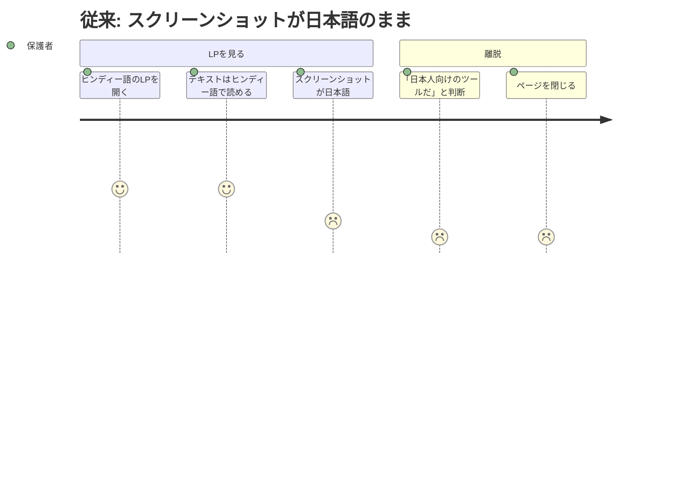
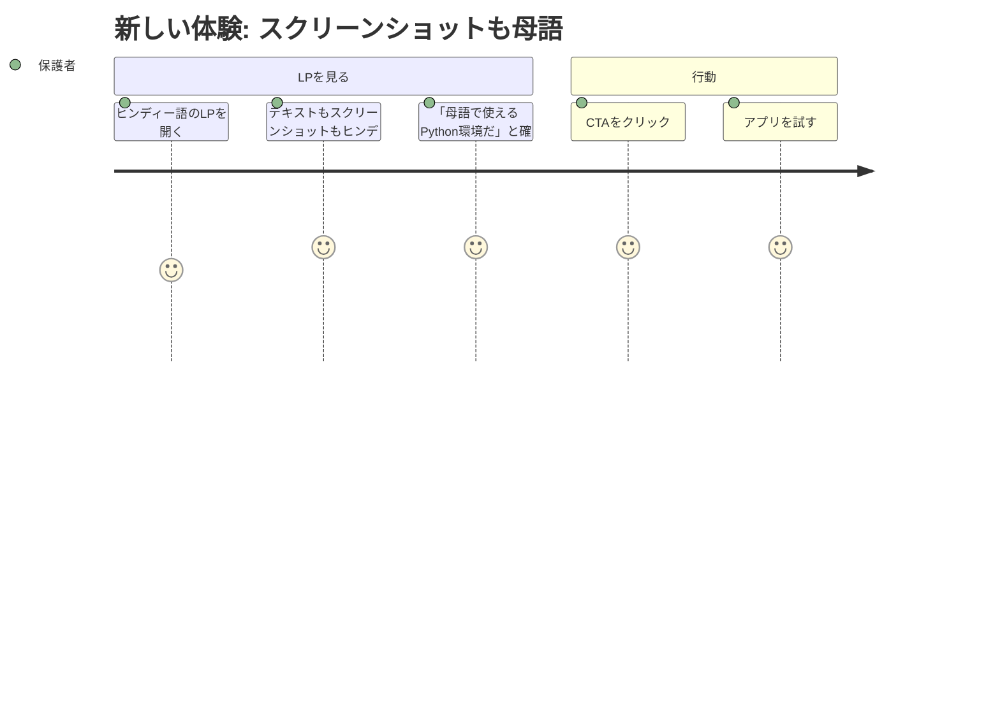

# LP スクリーンショット多言語化 — Requirements

## 概要

LPのスクリーンショット（step-open, step-write, step-run）を訪問者の言語に合わせた版に差し替え、「自分の言語で使えるツールだ」と一目で伝わるようにする。

## 背景

LP は50言語に多言語化済みだが、スクリーンショットは全て日本語版のまま。ヒンディー語のLPを開いても、スクリーンショットには `print("こんにちは！")` と日本語UIが表示される。これでは「このツールは日本語用だ」と思われ、離脱される。

build-lp.js には `SCREENSHOT_LANGUAGES = ["ja", "en", "es", "ar", "hi"]` と5言語分の定義が既にあるが、実際のスクリーンショット画像は日本語版1セットしか存在せず、`screenshotLang` 変数もテンプレートに渡されていない（未使用）。

## ユーザーストーリー

### ストーリー1: 非日本語圏の保護者がLPを見る

| ユーザー | ヒンディー語圏の保護者 |
|---|---|
| ジョブ | 子どものプログラミング学習環境を見つける |
| 課題 | LPのテキストはヒンディー語だが、スクリーンショットが日本語のまま。「日本人向けのツールでは？」と不安になる |
| 従来のタスク | スクリーンショットを見て日本語だと気づき、ページを閉じる |
| 従来のコスト | 離脱（プロダクトを試す前に失う） |
| 新しいタスク | スクリーンショットにヒンディー語のUI・コード例が表示され、「母語で使える」と確信してCTAをクリック |
| 新しいコスト | ゼロ（自然に伝わる） |





### ストーリー2: アラビア語圏の教師がLPを同僚に見せる

| ユーザー | アラビア語圏の教師 |
|---|---|
| ジョブ | 同僚にプロダクトを紹介する |
| 課題 | LPを見せても、スクリーンショットが日本語なので「これアラビア語で使えるの？」と疑問を持たれる |
| 従来のタスク | 「アプリを開けばアラビア語になる」と口頭で説明する必要がある |
| 従来のコスト | 説得のための余分な手間。説得力が弱い |
| 新しいタスク | LPのスクリーンショットにアラビア語UI（RTL）が表示され、一目で「アラビア語対応」が伝わる |
| 新しいコスト | ゼロ（スクリーンショットが証拠になる） |

## 受け入れ条件（Gherkin形式）

### 各言語のLPに対応するスクリーンショットが表示される

```gherkin
Given ユーザーがヒンディー語版LP（/hi/）を開く
When  ページが表示される
Then  Hero セクションのスクリーンショットにヒンディー語のUI・コード例が表示されている
  And 「使い方3ステップ」のスクリーンショットもヒンディー語版である
  And alt テキストもヒンディー語である
```

### SCREENSHOT_LANGUAGES 以外の言語は英語版にフォールバックする

```gherkin
Given ユーザーがベトナム語版LP（/vi/）を開く
  And ベトナム語は SCREENSHOT_LANGUAGES に含まれない
When  ページが表示される
Then  スクリーンショットは英語版が表示される（日本語版ではない）
```

### RTL言語のスクリーンショットはRTLのUIが反映されている

```gherkin
Given ユーザーがアラビア語版LP（/ar/）を開く
When  スクリーンショットが表示される
Then  スクリーンショット内のアプリUIがRTLレイアウトになっている
  And コード例のテキストはアラビア語である
```

### スクリーンショットはPlaywrightで自動生成できる

```gherkin
Given 開発者が `npm run screenshots` を実行する
When  スクリプトが完了する
Then  SCREENSHOT_LANGUAGES の全言語分のスクリーンショットが生成される
  And 各言語の assets/screenshots/{lang}/step-open.png, step-write.png, step-run.png が存在する
```

### OGP画像も各言語版が生成される

```gherkin
Given 開発者が `npm run screenshots` を実行する
When  スクリプトが完了する
Then  各言語の OGP 画像（assets/ogp-{lang}.png）が生成される
  And OGP画像にはその言語のプロダクト名とキャッチコピーが表示されている
```

## 前提・制約

- スクリーンショット生成: Playwright（既存の screenshots.js を拡張）
- 対象言語（Phase 1）: ja, en, es, ar, hi（`SCREENSHOT_LANGUAGES` で定義済み）
- アプリの i18n: i18next で実装済み。`?lang=xx` クエリパラメータで言語を切り替え可能
- LP ビルド: build-lp.js のテンプレート展開（`screenshotLang` 変数は存在するがテンプレートに未接続）
- RTL 対応: アプリ側は ar, fa, ur, he で RTL 対応済み

## 成功指標

- SCREENSHOT_LANGUAGES の5言語全てで、対応するスクリーンショットが生成されること
- 各言語のLPで、その言語のスクリーンショットが表示されること
- SCREENSHOT_LANGUAGES 以外の言語では英語版スクリーンショットにフォールバックすること
- `npm run screenshots` 1コマンドで全言語分が再生成できること

## スコープ外

以下はこのフェーズでは実施しません:

- 6言語目以降のスクリーンショット追加（Phase 1の5言語で効果検証後）
- スクリーンショットの自動更新CI（手動実行で十分）
- マスコット画像の多言語化（別課題）
- LP本文のスクリーンショット以外のビジュアル変更

## 参照ドキュメント

- `scripts/screenshots.js` — 現行のスクリーンショット生成スクリプト（日本語のみ）
- `scripts/build-lp.js` — LPビルドスクリプト（`SCREENSHOT_LANGUAGES`, `screenshotLang` 定義あり）
- `index.html.tpl` — LPテンプレート（`{{screenshotPath}}` でスクリーンショットを参照）
- `docs/steering/20260330-i18n-phase1/` — i18n Phase 1 ステアリング
