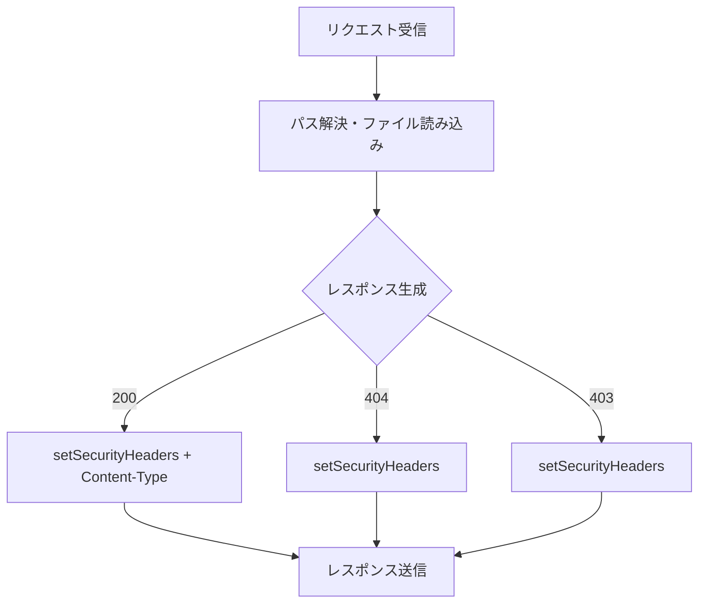
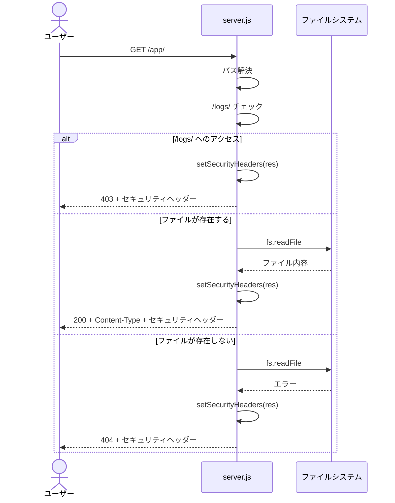
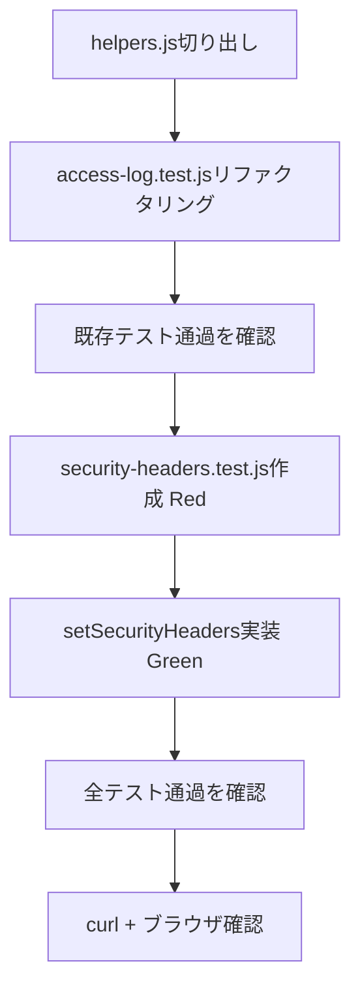

# 設計書: 共通セキュリティヘッダー追加

## アーキテクチャ概要

`server.js` のレスポンス生成箇所にセキュリティヘッダーを付与するヘルパー関数を追加する。200/404/403すべてのレスポンスで共通のヘッダーセットを返す。



## コンポーネント設計

### 1. setSecurityHeaders 関数

**責務**:
- `res` オブジェクトに4種のセキュリティヘッダーを設定する

**実装の要点**:
- `res.writeHead` の前に呼び出す
- 既存の `res.writeHead` 呼び出しは3箇所（200, 404, 403）あり、すべての直前で呼ぶ

```javascript
function setSecurityHeaders(res) {
  res.setHeader("X-Content-Type-Options", "nosniff");
  res.setHeader("X-Frame-Options", "DENY");
  res.setHeader("Referrer-Policy", "strict-origin-when-cross-origin");
  res.setHeader("Permissions-Policy", "camera=(), microphone=(), geolocation=()");
}
```

> `res.setHeader` は `res.writeHead` の前に呼べば `writeHead` のヘッダーとマージされる。既存の `Content-Type` 設定と干渉しない。

## データフロー

### リクエスト処理フロー（変更後）



## テスト戦略

### テストヘルパーの共有化

既存の `test/access-log.test.js` にある `request()` 関数やサーバー起動/停止のボイラープレートを `test/helpers.js` に切り出し、全テストファイルで共有する。今後テストファイルが増えるため、重複を避ける。

```javascript
// test/helpers.js のイメージ
function request(port, urlPath, headers = {}) { /* ... */ }
function startServer() { /* ... */ }
function stopServer(server) { /* ... */ }
module.exports = { request, startServer, stopServer };
```

既存の `access-log.test.js` も `helpers.js` を使うようにリファクタリングする。

### ユニットテスト

テストファイル: `test/security-headers.test.js`

- 200レスポンスにヘッダー4種が含まれること
- 404レスポンスにヘッダー4種が含まれること
- 403レスポンスにヘッダー4種が含まれること
- 既存のContent-Typeヘッダーが上書きされないこと

## 依存ライブラリ

新規ライブラリの追加なし。Node.js標準の `res.setHeader` を使用。

テストフレームワーク:

```json
{
  "devDependencies": {
    "node:test": "(Node.js組み込み)"
  }
}
```

> Node.js v22+の組み込みテストランナー (`node:test`) を使用。外部依存なし。

## ディレクトリ構造

```
online-python/
  server.js                        ← 変更: setSecurityHeaders関数追加 + 3箇所で呼び出し
  test/
    helpers.js                     ← 新規: request(), startServer(), stopServer() を共有
    access-log.test.js             ← 変更: helpers.js を使うようにリファクタリング
    security-headers.test.js       ← 新規: ヘッダー検証テスト
```

## 実装の順序

1. `test/helpers.js` を切り出し、`access-log.test.js` をリファクタリング
2. `security-headers.test.js` を作成（Red）
3. `server.js` に `setSecurityHeaders` を実装（Green）
4. 既存テストが壊れていないことを確認
5. `curl -I` + ブラウザで動作確認



## セキュリティ考慮事項

### データアクセス認可チェック

該当なし。この変更はレスポンスヘッダーの追加のみで、データの取得・保存は行わない。

### その他

- `Permissions-Policy` の値にタイポがあると無効になるため、テストで値を検証する
- 将来CSPを追加する際、`setSecurityHeaders` に追加するか新たな関数を作るかは次回のステアリングで決定

## パフォーマンス考慮事項

- `res.setHeader` は4回の関数呼び出しのみ。パフォーマンスへの影響は無視できる

## 将来の拡張性

- CSP追加時: この関数に追加するか、パス分岐用の別関数を作る（`docs/steering/20260402-csp-policy/` で設計）
- HSTS追加時: リバースプロキシ層で対応するため、この関数のスコープ外
