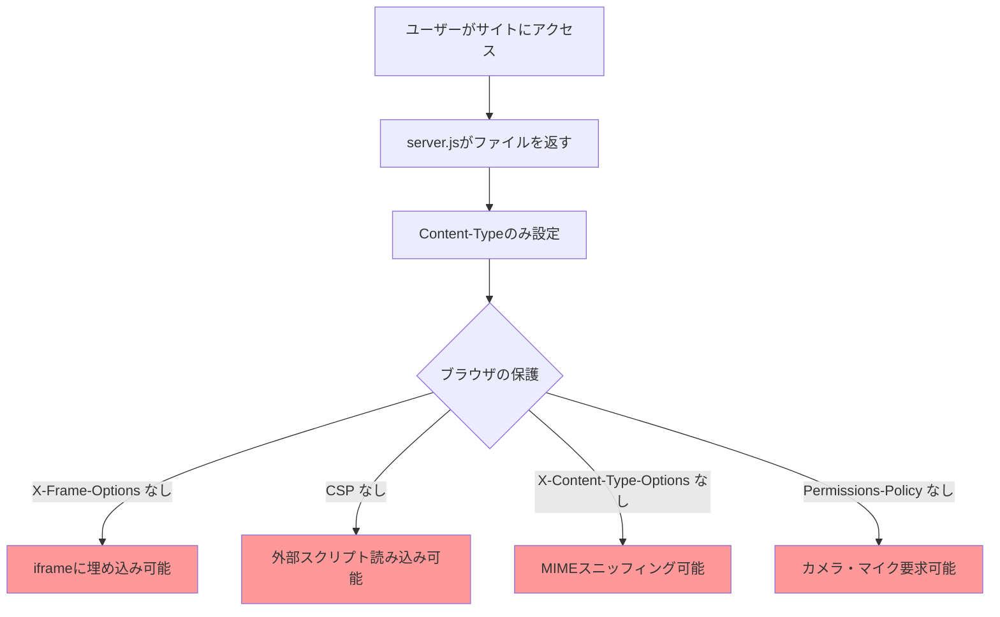
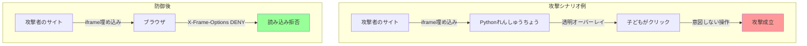
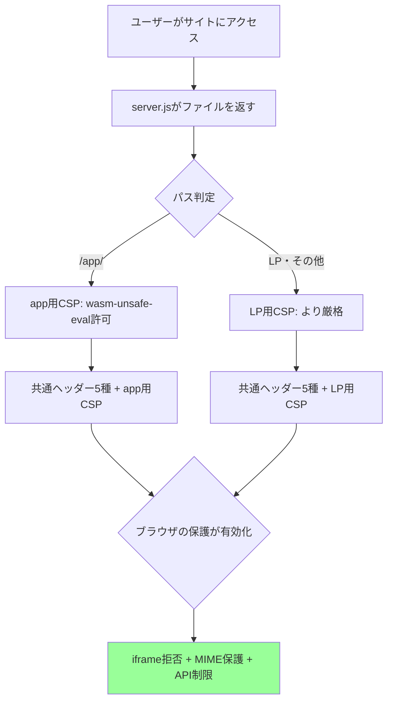

# 問題定義

<!-- 解決すべき問題を構造化する。実装前に「何が問題か」を整理するためのファイル。 -->

## 問題の概要

子ども向けPythonエディタのHTTPレスポンスにセキュリティヘッダーが一切設定されておらず、ブラウザが持つ保護機能（iframe埋め込み拒否、MIMEスニッフィング防止等）が有効化されていない。

## 潜在的にリスクを負っている人

- **保護者**: 子どもに安全なWebサービスを使わせたい。セキュリティヘッダーの欠如を直接認識することはないが、攻撃が成立した場合に子どもが被害を受ける立場にある。
- **教師**: GIGAスクール構想等でクラス全員に使わせる際、学校のIT管理者がセキュリティ評価を行う可能性がある。ヘッダー未設定は導入の障壁になりうる。
- **サービス運営者**: セキュリティインシデントが発生した場合、子ども向けサービスとしての信頼を失う。法的リスクもある。

## ジョブ

- **保護者のジョブ**: 子どもが使うWebサービスの安全性を確認し、安心して使わせる
- **教師のジョブ**: 学校のセキュリティ基準を満たすツールを選定し、クラスに導入する
- **運営者のジョブ**: 子ども向けサービスとして最低限のセキュリティ水準を満たし、攻撃面を最小化する

## 従来のタスク

運営者はセキュリティヘッダーを設定せず、ブラウザのデフォルト挙動に完全に依存している。保護者・教師はサイトのセキュリティ状態を知る手段がない。

## 具体的な困りごと（症状）

### 現実的なリスク

- **クリックジャッキング**: 攻撃者がサイトをiframeに埋め込み、透明なレイヤーを被せて子どもに意図しない操作をさせることができる（例: 「実行」ボタンを押させ、不適切な出力を生成するコードを実行させる）
- **不要なブラウザAPI**: カメラ・マイク・位置情報など、Pythonエディタに不要なAPIへのアクセス要求をブロックする手段がない。悪意あるiframe埋め込みと組み合わせるとリスクが高まる

### 多層防御としてのベストプラクティス

現在のアーキテクチャ（静的配信のみ、ユーザー入力をサーバーに送信しない）では直接的な攻撃経路は限定的だが、防御層として設定すべき項目:

- **MIMEスニッフィング**: ブラウザがContent-Typeを無視してファイル内容からタイプを推測し、悪意あるスクリプトが実行される可能性がある
- **外部スクリプト注入**: CSPがないため、万が一XSS脆弱性が将来導入された場合に外部スクリプトの読み込みを制限する防御層がない
- **リファラー情報の制御**: LP（ランディングページ）から外部リンクに遷移する際、URLパスに含まれる言語コード等がリファラーとして送信される（共有URLのコード部分は `#` ハッシュフラグメントのため仕様上リファラーには含まれない）

## 解決の方向性（仮）

<!-- requirements.md に渡す前の仮説。詳細は requirements.md で詰める -->

- **アプローチ1**: `server.js` のレスポンス生成箇所でパスに応じてセキュリティヘッダーを付与する。appページ（WASM実行あり）とLP（静的HTML）でCSPポリシーを分岐する
- **アプローチ2**: ヘッダー設定を外部設定ファイルに切り出し、環境ごとに変更可能にする（過剰設計の可能性あり）

→ アプローチ1が適切。サーバーが単一の `server.js` で完結しており、設定の複雑化は不要。CSPのみパスで分岐すれば十分。

## 次のステップ

- [ ] requirements.md で受け入れ条件を定義する
