# 2026年4月10日 Googleアナリティクス導入

> 状態：① Journey ② Gherkin ③ Design ④ Tasklist ⑤ Discussion
> 次のゲート：（ユーザー）Gherkin の内容を確認・承認 →「Design」と指示

---

## 1) Journey（どこへ行くか）

- **深層的目的**：ユーザーの反応を知り改善に活かす
- **やらないこと**：複雑なカスタムイベント設計（まずは基本導入）

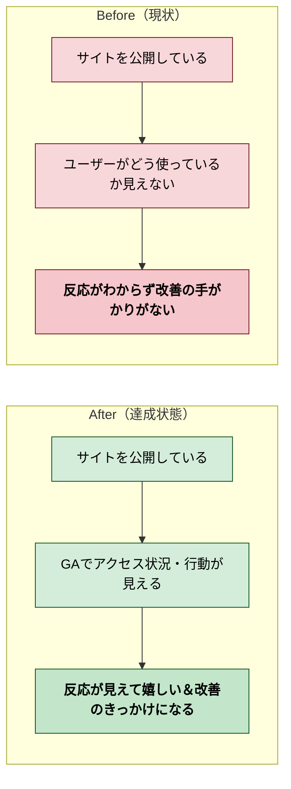

---

## 2) Gherkin（完了条件）

### シナリオ1：正常系（GAがデータを収集できる）

> {GAタグがLP・アプリ両方に埋め込まれた状態} で {ページにアクセス} すると {GAリアルタイムレポートにアクセスが表示される}

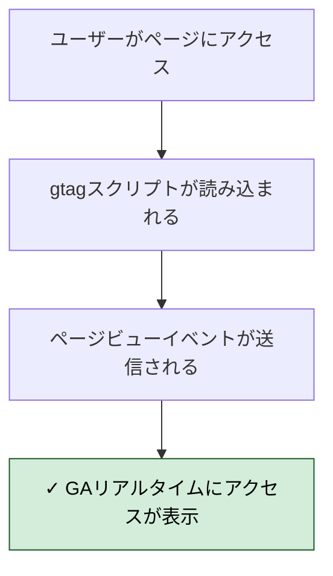

### シナリオ2：正常系（LP・アプリ両方で計測される）

> {GAタグ導入済み} で {LPとアプリそれぞれにアクセス} すると {両方のページビューがGAに記録される}

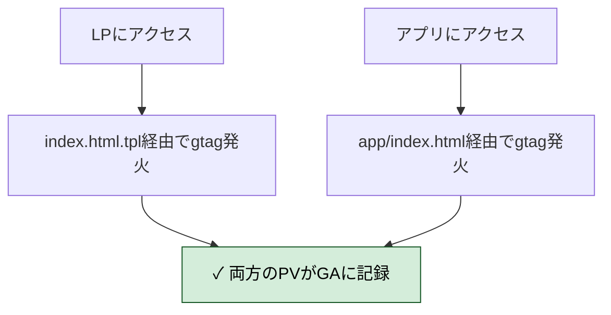

### シナリオ3：リスク確認（既存機能に悪影響がない）

> {GAタグ追加後} で {エディタでPython実行・保存・全画面切替} すると {既存機能が正常に動作する}

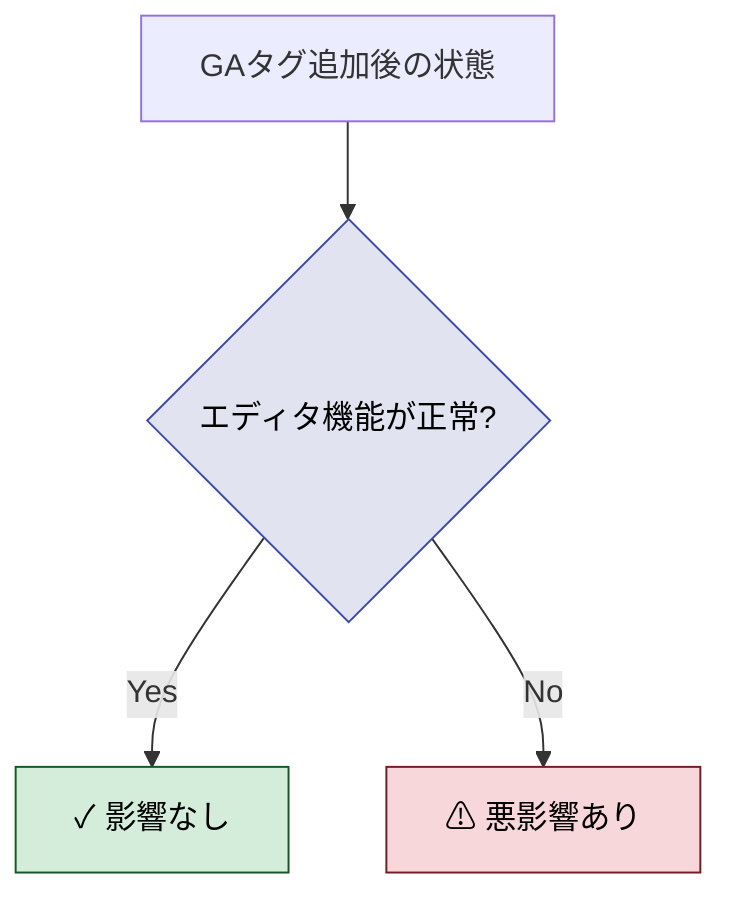

### シナリオ4：リスク確認（CSP導入時に備える）

> {CSPは現在未実装だが} で {将来CSP導入時にGAが必要とするドメインを} すると {Designにメモとして残しておく}

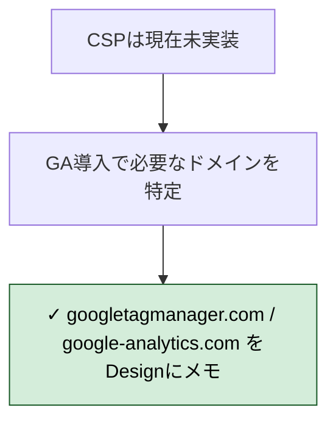

### シナリオ5：正常系（子ども向けプライバシー設定が有効）

> {GA4プロパティ設定済み} で {gtagの設定を確認} すると {広告パーソナライズ無効・COPPA対応フラグが設定されている}

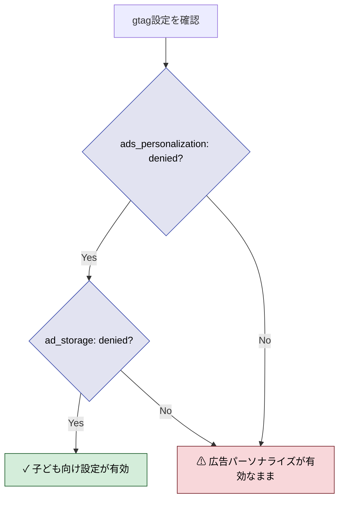

### シナリオ6：正常系（EU圏ユーザーはトラッキングしない）

> {EU圏からのアクセス} で {ページを開く} すると {GAタグが発火せずトラッキングされない}

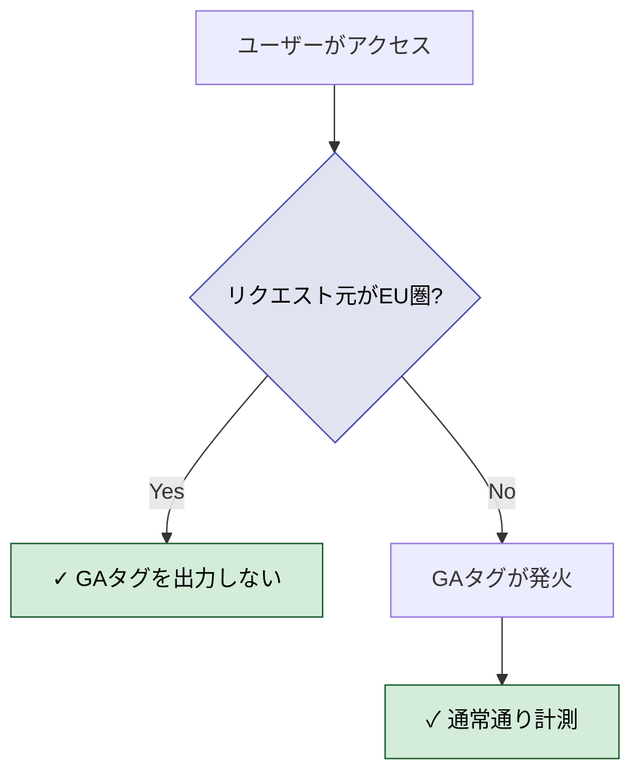

---

## 3) Design（どうやるか）

- **関連スキル・MCP**：なし（バニラJS + server.js の修正のみ）

### 全体構成図

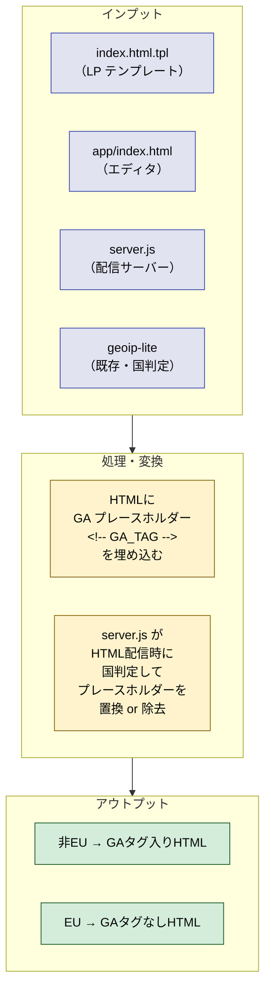

### リクエスト処理フロー

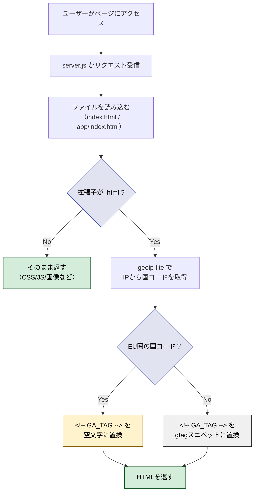

### gtagスニペットの構成

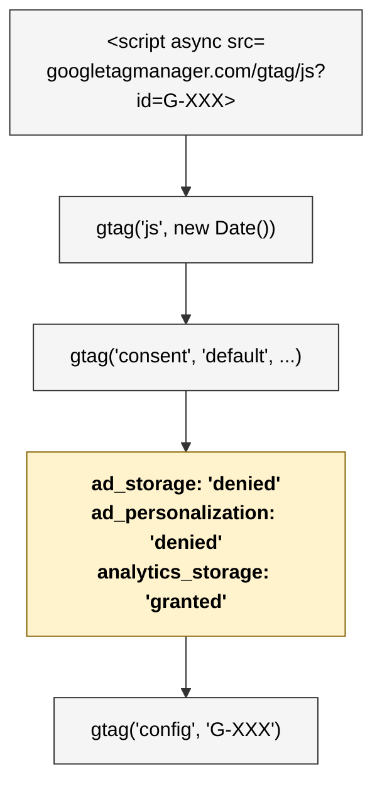

### 変更対象ファイル一覧

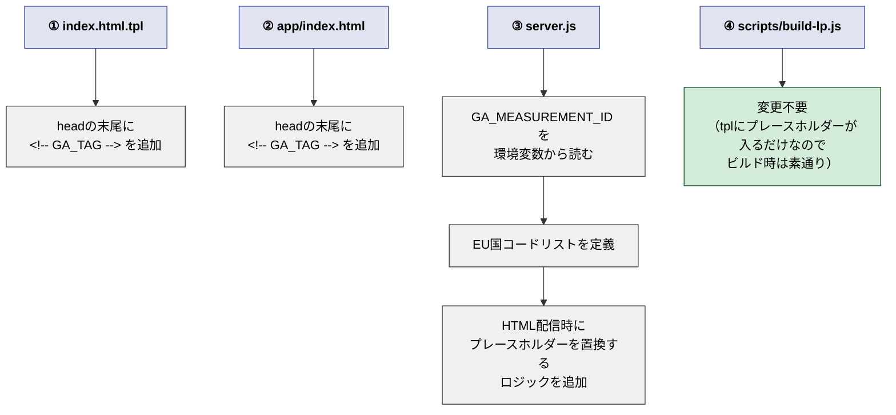

### CSPメモ（将来のCSP導入時に参照）

GA4に必要な許可ドメイン：
- `script-src`: `https://www.googletagmanager.com`
- `connect-src`: `https://www.google-analytics.com`, `https://analytics.google.com`
- `img-src`: `https://www.google-analytics.com`

---

## 4) Tasklist

<!-- フェーズ4で記入 -->

---

## 5) Discussion（記録・反省）

### 2026年4月10日（Design確認・GA4プロパティ作成）

**Observe**：GA4プロパティを作成し、測定ID `G-ND7RDEHXPK` を取得。管理方法は環境変数 `GA_MEASUREMENT_ID` に決定。
**Think**：IDが確定したので実装に進める状態。
**Act**：Designセクション記入完了、測定ID記録。
